## Getting Started with Lab

Welcome to your Autonomous IT Troubleshooting Agent Lab! We've prepared a seamless environment for you to explore and learn. Let's begin by making the most of this experience.

### Accessing Your Lab Environment

Once you're ready to dive in, your virtual machine and lab guide will be right at your fingertips within your web browser.

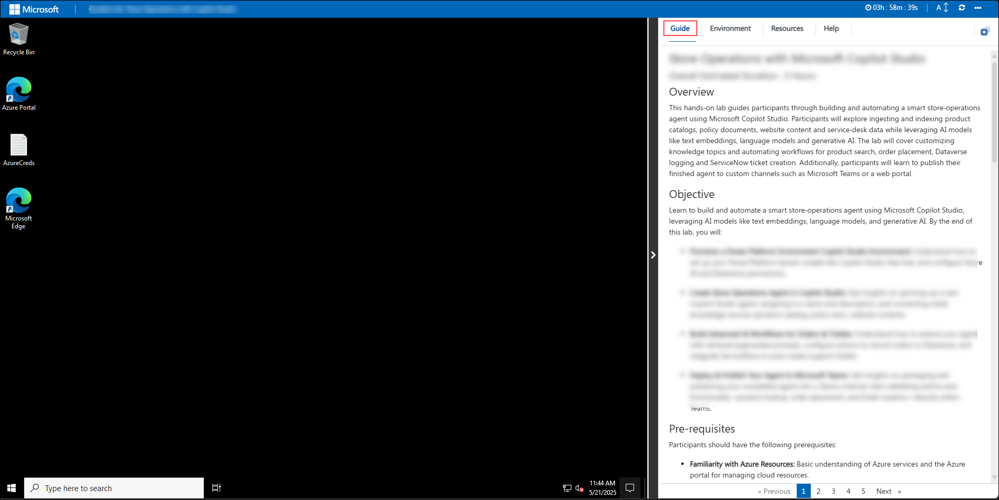

### Exploring Your Lab Resources

To get a better understanding of your lab resources and credentials, navigate to the Environment tab.


### Utilizing the Split Window Feature

For convenience, you can open the lab guide in a separate window by selecting the Split Window button from the top right corner.


### Managing Your Virtual Machine

Feel free to start, stop, or restart your virtual machine as needed from the Resources tab. Your experience is in your hands!


## Let's Get Started with Copilot Studio and Microsoft 365

1. In the JumpVM, click on **Microsoft Edge** browser which is created on desktop.

   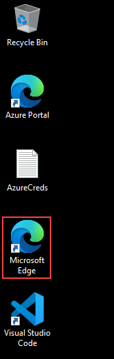

1. Open a new browser tab and navigate to the Power Apps portal using the link below:

   ```
   https://make.powerapps.com/
   ```

1. On the **Sign into Microsoft** tab, you will see the login screen. Enter the provided email or username, and click **Next** to proceed.

   - Email/Username: **<inject key="AzureAdUserEmail"></inject>**

     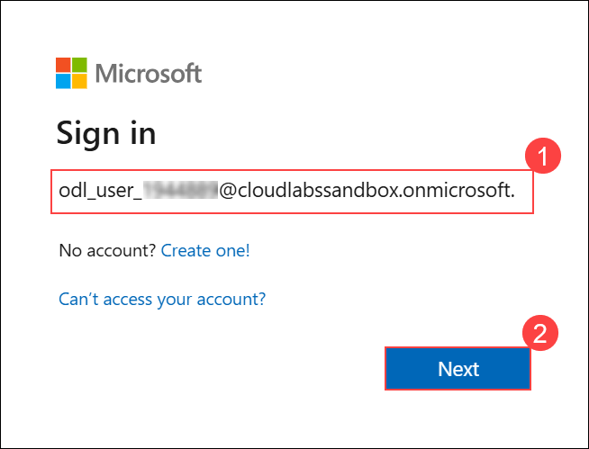

1. Now, enter the following password and click on **Sign in**.

   - Password: **<inject key="AzureAdUserPassword"></inject>**

     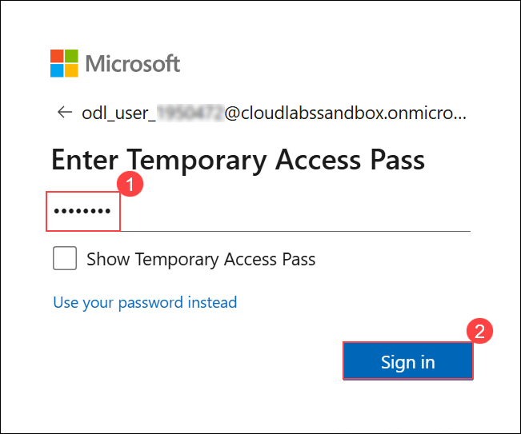

     > **Note:** If you see the Action Required dialog box, then select **Ask Later** option.
     
1. If you see the pop-up **Stay Signed in?**, click **No**.

   

1. If the **Welcome to Power Apps** pop-up appears, leave the default country/region selection and click **Get started**.

   

1. You have now successfully logged in to the Power Apps portal. Keep the portal open, as you will be using it later in the lab.

   

1. Inside the **Power Apps** portal, select **Tables (1)** from the left navigation menu and click **Create with Excel or .CSV file (2)** to begin importing the lab dataset.

   

   > **Environment Foundation:** This step creates the foundational environment that will support your agents with company-specific data and knowledge sources.

1. In the **Create in new environment?** dialog, click **Create** to provision a environment.

   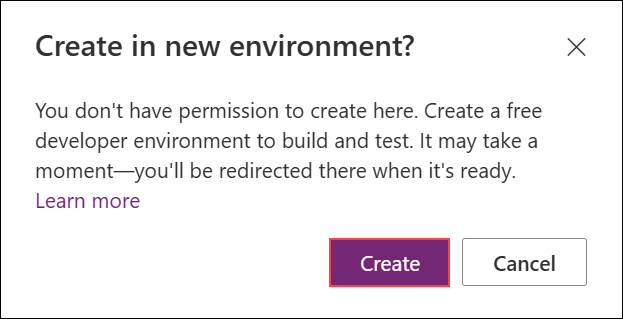

1. When the upload screen appears, click **Cancel**.

   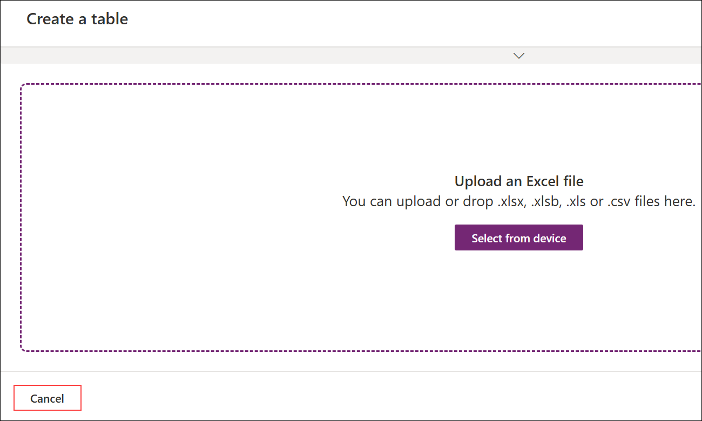

1. Once done, please navigate to power platform admin center by using the below URL:

   ```
   https://admin.powerplatform.microsoft.com/
   ```

1. Once you are in the power **platform admin center**, select **Manage** from left menu and click on the environmnet with the name, ODL_User <inject key="Deployment ID" enableCopy="false"></inject>'s Environment.

   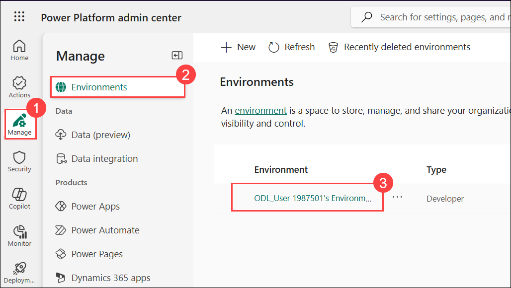

1. In the environmnet page, click on **See all** under **S2S apps**.

   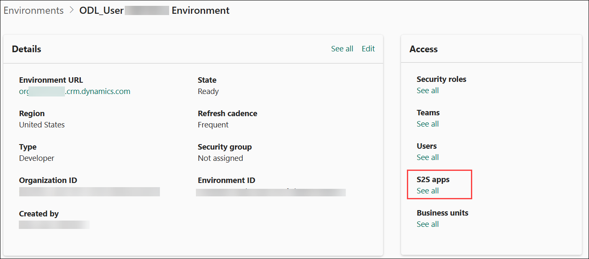

1. In the next pane, click on **+ New app user**.

   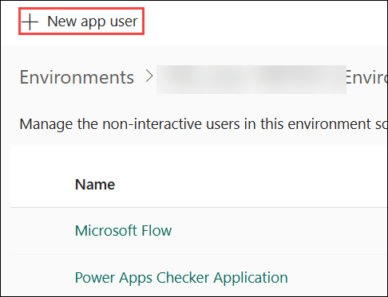

1. In the create a new app user pane, under **App**, click on **+ Add an app**.

   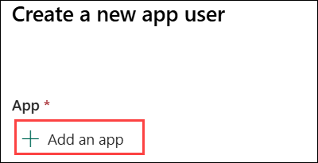

1. From the list of apps, search for `https://cloudlabssandbox.onmicrosoft.com/cloudlabs.ai/` and select it.

   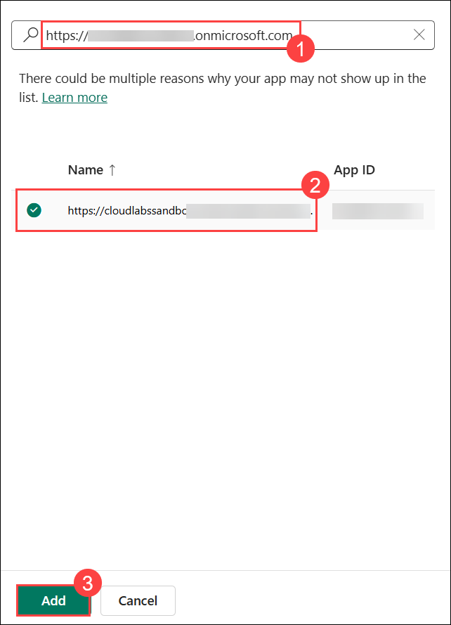

1. Once done, under **Business unit** search for **org** and select the only business unit that comes in the list.

   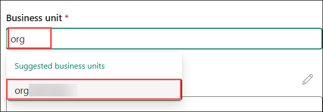

1. Beside **Security roles** click on **Edit** icon.

   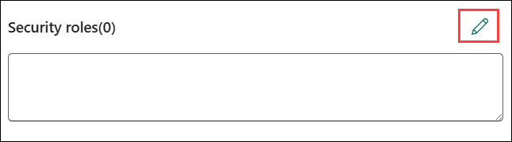

1. From the list of roles, search and select **System Administrator** and click on **Save**.

   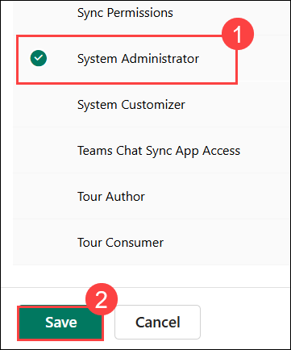

1. In the pop-up window, select **save**.

   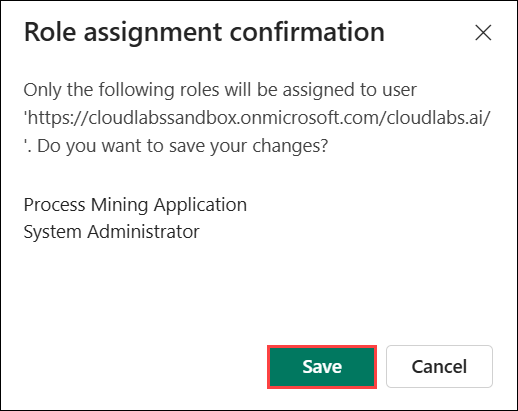

1. Review all the details and click on **Create**.

   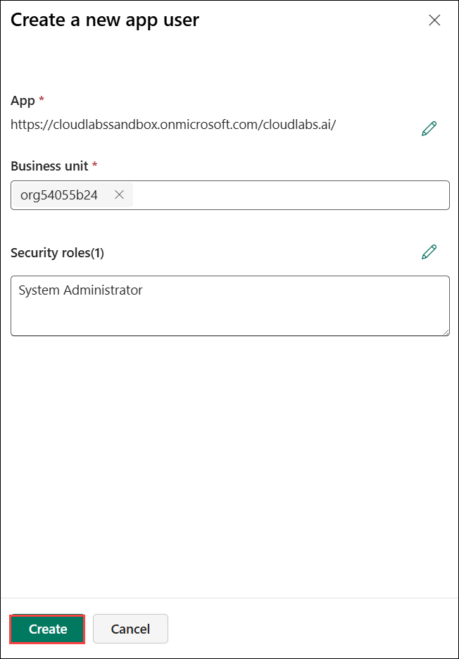

1. Navigate to **Microsoft Copilot Studio** by opening a new browser tab and using the link below:

   ```
   https://copilotstudio.microsoft.com
   ```

1. On the **Welcome to Microsoft Copilot Studio** screen, keep the default **country/region** selection and click **Get Started** to continue.

   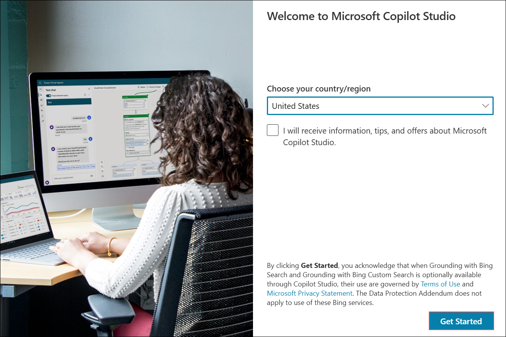

1. If the **Welcome to Copilot Studio!** pop-up appears, click **Skip** to continue to the main dashboard.

   

1. If you are directly taken to the **agent creation** screen, click the **ellipsis (1)** icon beside the **Create** button, then select **Cancel agent creation (2)** to return to the main dashboard.

   

1. In Copilot Studio, open the environment picker **(1)**, expand **Supported environments (2)**, and select **ODL_User <inject key="Deployment ID" enableCopy="false"></inject>'s Environment (3)** to switch.

   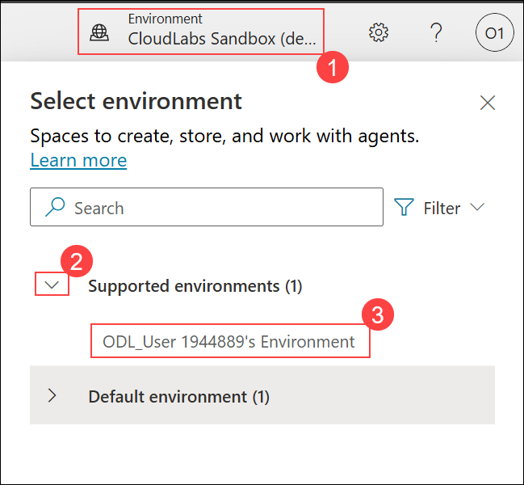

1. If you are not able to see the environment under **Supported environments**, follow the below steps.

   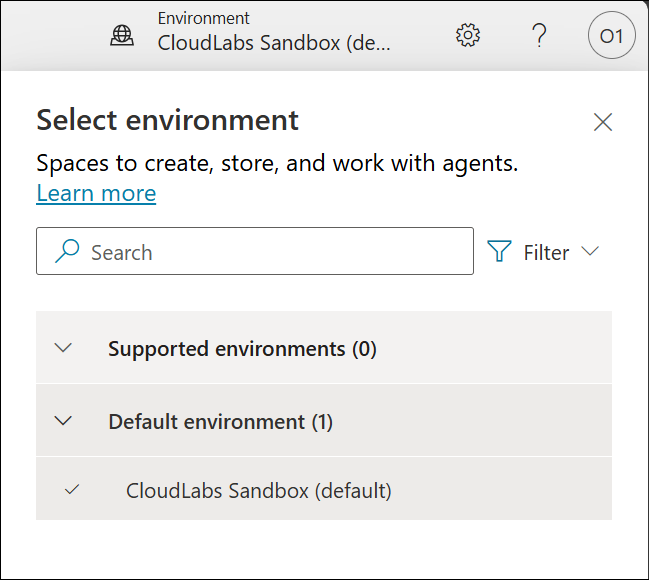

1. Go back to the **Power Apps** portal, on your **ODL_User <inject key="Deployment ID" enableCopy="false"></inject>’s Environment** copy the **Environment ID** from the browser URL as highlighted.

   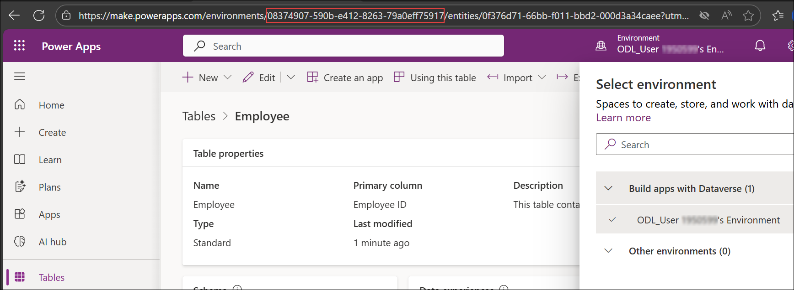
   
1. Open a **new browser tab**, and paste the copied **Environment ID** at the end of the following URL to verify access:

   ```
   https://copilotstudio.microsoft.com/environments/(Environment ID)
   ```

   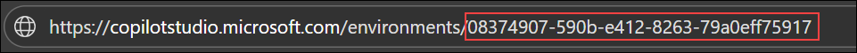

   > **Note:** Replace **(Environment ID)** with the ID you copied in the previous step.
   
1. You will be navigated to the **Copilot Studio** portal. Verify that **ODL_User <inject key="Deployment ID" enableCopy="false"></inject>’s Environment** is visible and selected under **Supported environments**.

   

1. You are now ready to start building your **IT Support Copilot** using Microsoft Copilot Studio! This copilot will help employees with common IT issues like credential resets, VPN connectivity problems, hardware troubleshooting (laptops, printers, monitors, keyboards), and will integrate with Freshdesk for automated ticket creation.

Now, click on the **Next** from lower right corner to move on next page.

## Happy Learning!!