# Exercise 2: Agent Flows and Multi-Agent Orchestration

### Estimated Duration: 30 Minutes

## Overview

In this exercise, you'll enhance your Safe Travels agent with business process automation and experience multi-agent orchestration capabilities. You'll create a comprehensive travel approval workflow that integrates with Microsoft Teams and build a specialized Leave Manager agent that works seamlessly with your existing travel assistant.

This exercise demonstrates the power of conversational AI in real business scenarios. You'll see how agents can trigger actual business processes, collaborate with each other, and provide end-to-end automation solutions. By the end, you'll have a sophisticated multi-agent system where your Safe Travels agent can automatically route leave-related queries to a specialized Leave Manager agent while handling travel approvals through automated Teams notifications.

## Objectives

You will be able to complete the following tasks:

- Task 1: Set up Teams workspace and initialize agent flow trigger
- Task 2: Configure flow actions and Teams message posting
- Task 3: Integrate Travel Approval flow into agent and test end-to-end
- Task 4: Build Leave Manager agent and establish multi-agent orchestration

## Prerequisites

- Completed **Exercise 1** with published Safe Travels agent
- Access to **Microsoft Teams** with team and channel creation permissions
- Understanding of basic workflow concepts and business process automation
- **Safe Travels agent** available in your Copilot Studio environment

## Task 1: Set Up Teams Workspace and Initialize Agent Flow Trigger

In this task, you will build the foundation for the travel approval workflow: create the Teams workspace and initialize the agent flow trigger with required inputs. This sets the stage for later automation and integration.

1. Navigate to **Microsoft Teams** and go to the **Chat (1)** section, click the **New (2)** dropdown, and select **New team (3)** to create a dedicated workspace for travel approvals.

   

   >**Teams Integration Foundation:** Creating a dedicated team and channel structure ensures that travel approval requests are organized and routed to the appropriate stakeholders for review and processing.

1. Configure your new team with the following details:
   - **Team name:** Enter **HR Team (1)** 
   - **First channel:** Type **Travel Approvals (2)** 
   - Click **Create (3)** to establish the team structure.

      

1. In the **Add members to HR Team** window, select **Skip** to continue without adding members for this demonstration.

   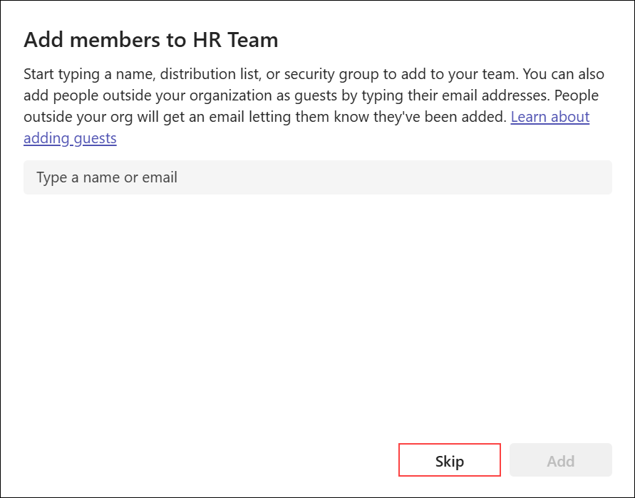

1. Navigate to **Power Automate** by going to the **Flows (1)** section and click **New agent flow (2)** to create a new automated workflow.

   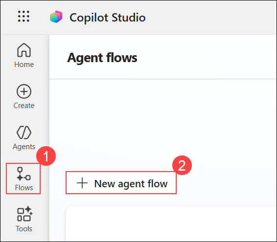

1. Under **AI capabilities**, select **When an agent calls the flow** as the trigger mechanism to enable agent-initiated workflows.

   

   > **Workflow Foundation:** This trigger allows your agent to initiate business processes automatically based on user conversations, creating seamless integration between conversational AI and business operations.

1. Click **Add an input** under the trigger node to define the data parameters that your agent will pass to the workflow.

   

1. Choose **Number** as the data type for the first input parameter to capture employee identification.

   

1. Configure the first input parameter:
   - **Name:** Enter **Employee ID (1)**
   - Click **Add an input (2)** to create the second parameter.

      

1. Select **Text** as the data type for the second input parameter to capture travel details.

   

1. Configure the second input parameter by naming it **Purpose** to capture the business reason for travel requests.

   

## Task 2: Configure Flow Actions and Teams Message Posting

In this task, you will add Microsoft Teams actions, dynamic content, response handling, and publish and name the Travel Approval flow.

1. Click the **Add (1)** icon below the trigger node to insert a new action step in the workflow automation.

   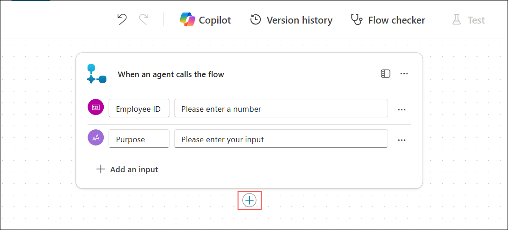

1. Search for Microsoft Teams integration by typing **Post message in a chat or channel (1)** and **select (2)** it from the available Microsoft Teams actions.

   

1. Establish the Microsoft Teams connection by selecting **Sign in** to authenticate and authorize the workflow integration.

   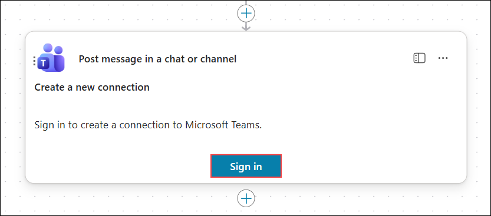

1. Choose your **ODL_User (1)** account credentials to authenticate and establish the Microsoft Teams connection.

   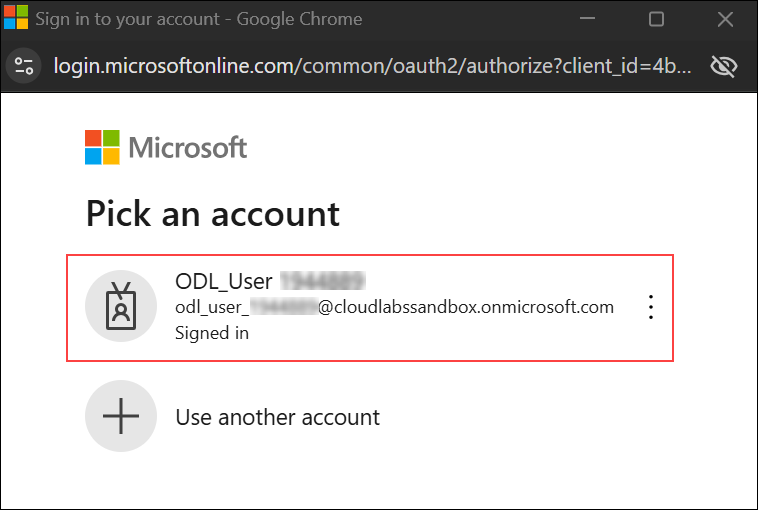

1. Configure the Teams message posting action with the following parameters:  
   - **Post as (1):** Flow bot  
   - **Post in (2):** Channel  
   - **Team (3):** HR Team  
   - **Channel (4):** Travel Approvals  
   - **Message (5):** `Travel request from Employee ID: [Employee ID], Purpose: [Purpose]`

      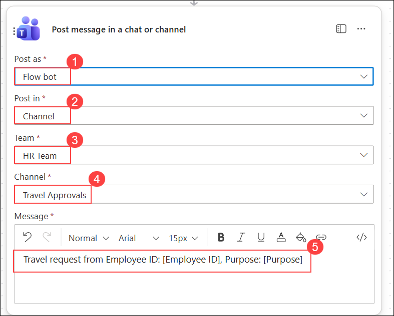

   > **Teams Integration Benefits:** This configuration ensures that travel approval requests are automatically posted to the designated HR team channel, creating a centralized approval workflow with proper audit trails.

1. Highlight **[Employee ID] (1)** in the message box and click the **Dynamic content (2)** icon to insert the Employee ID variable.

   

1. From the **Dynamic content** panel, select **Employee ID** under the “When an agent calls the flow” section.

   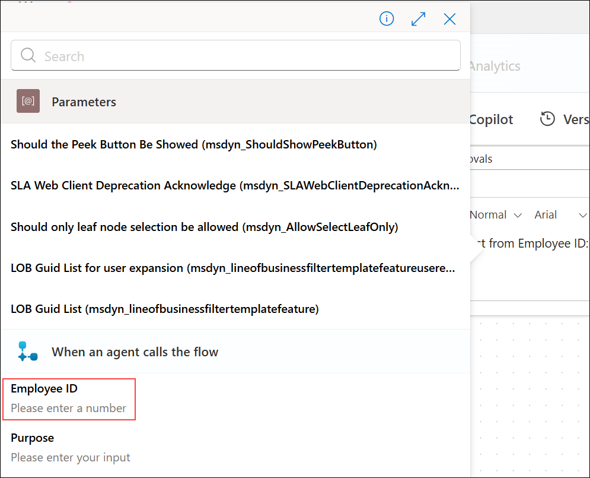

1. Highlight **[Purpose] (1)** in the message and click the **Dynamic content (2)** icon to insert the Purpose variable.

   

1. Verify that both dynamic values **Employee ID** and **Purpose (1)** are added correctly, then click the **Add (2)** icon to insert the next action.

   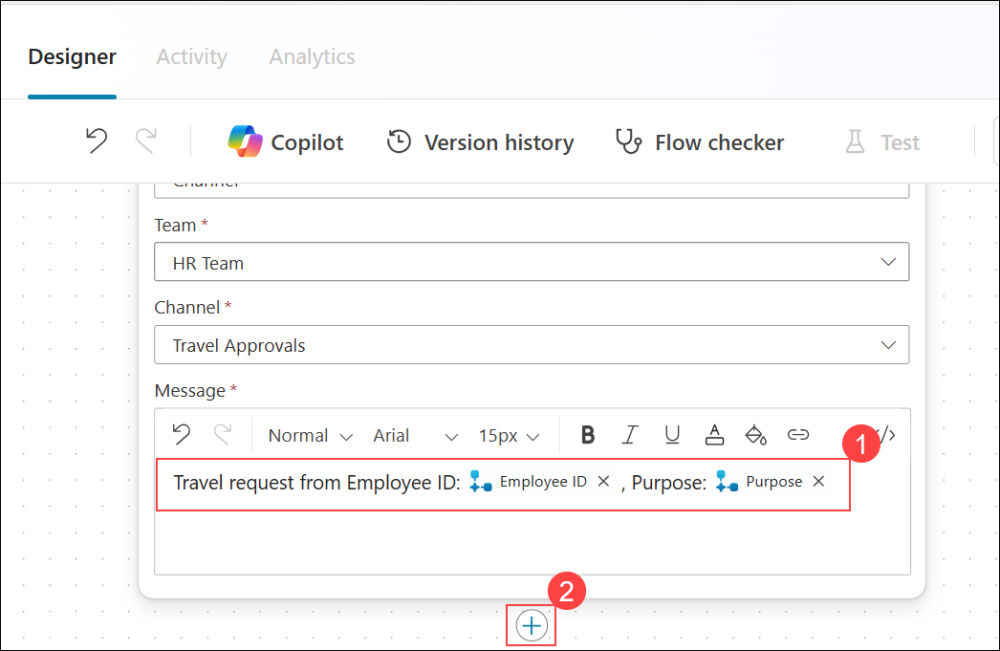

1. In the search box, type **Respond to agent (1)** and select **Respond to the agent (2)** under the Skills section.

   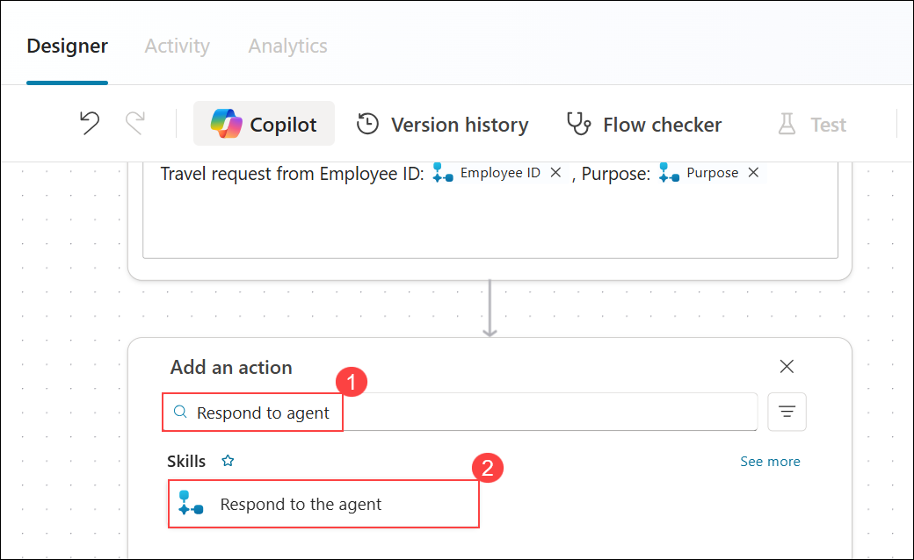

1. Click **Add an output (1)** under the **Respond to the agent** action to define the return message.

   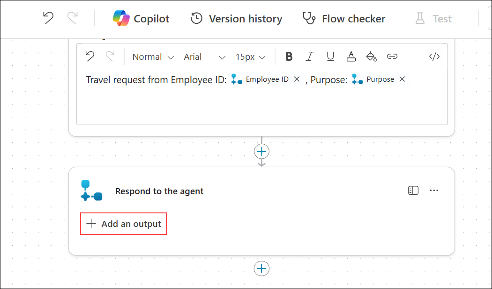

1. Select **Text (1)** as the type of output for the agent response.

   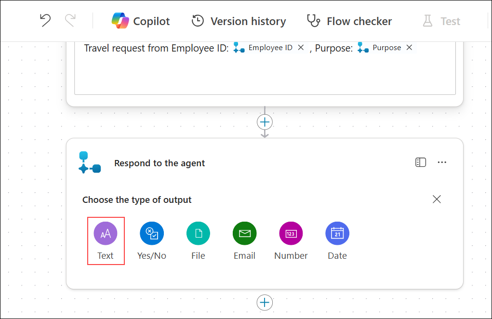

1. Enter **Output (1)** as the name, type **Request submitted (2)** as the value, and provide a description **Confirmation message for travel request (3)**.

   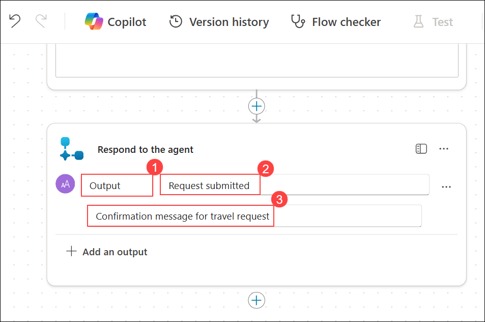

1. Click **Save draft (1)** to save the current flow configuration before publishing.

   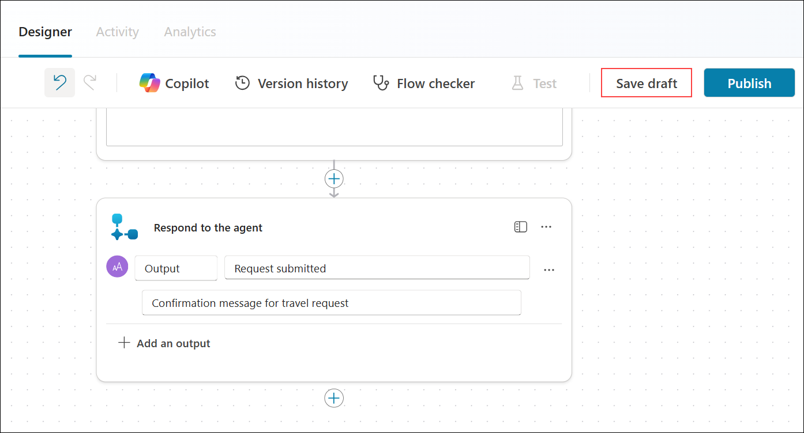

1. Verify the confirmation message **“We saved your draft flow. You can test and run it after you publish.”** appears at the top of the page.

   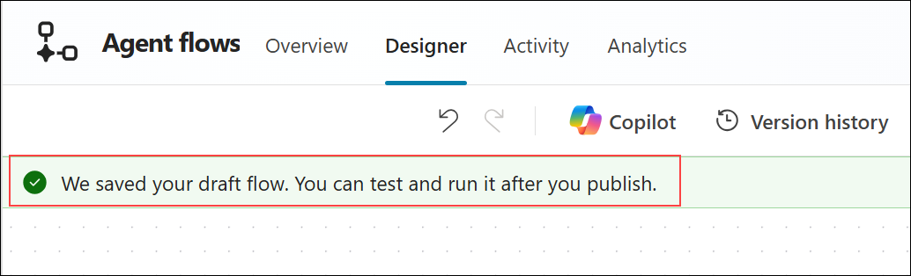

1. Click **Publish** to make the agent flow available for use.

   

1. Go to the **Overview (1)** tab and click **Edit (2)** to modify the agent flow details.

   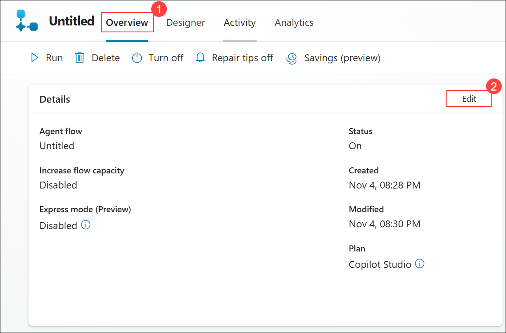

1. Enter **Travel Approval Flow (1)** as the Flow name and click **Save (2)** to apply the changes.

   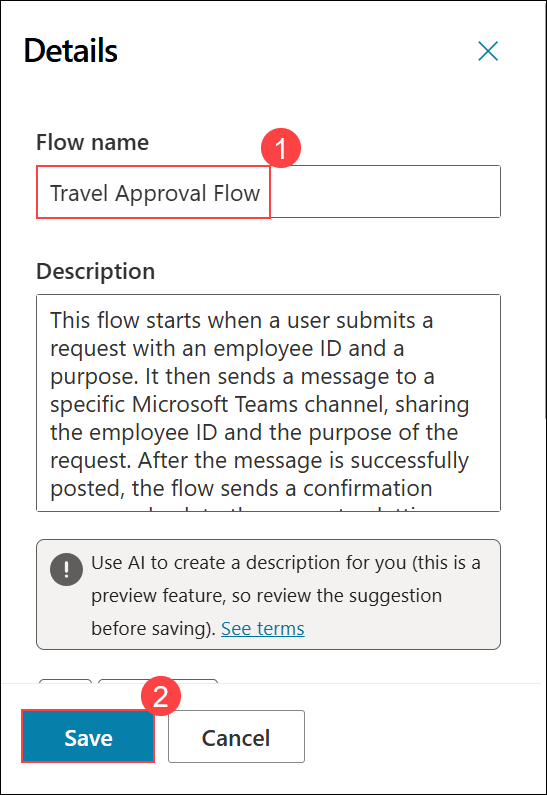

## Task 3: Integrate Travel Approval Flow into Agent and Test

In this task, you will connect the published flow to a new topic in the Safe Travels agent, map variables, publish updates, and test end-to-end execution including Teams validation.

1. In **Copilot Studio**, open the **Safe Travels Agent** and select **Topics (1)** from the dropdown menu.

   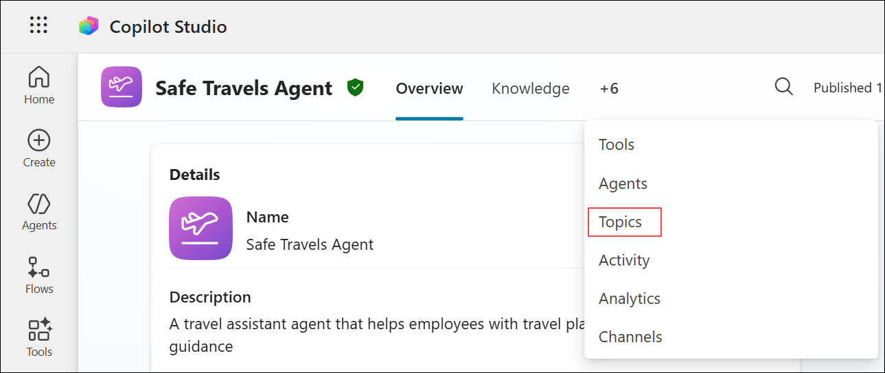

1. On the **Topics** tab, click **Add a topic (1)** and then select **Add from description with Copilot (2)** from the dropdown menu.

   

1. Create the Travel Approval topic as follows:  
   - **Name your topic (1):** Enter **Travel Approval**.  
   - **Create a topic to... (2):** Type `This topic should get the Employee ID (Number) and Purpose of travel (Text) details from the user and invoke the Tool "Request Travel Approval Flow"`.  
   - **Create (3):** Click **Create** to generate the topic.  

      

1. Delete the existing message node as follows:  
   - **More options (1):** Click the **ellipsis (…)** icon on the Message node.  
   - **Delete (2):** Select **Delete** to remove the message from the topic flow.  

      

1. In the topic authoring canvas, click the **plus (+)** icon below the **Question** node to add a new action.

   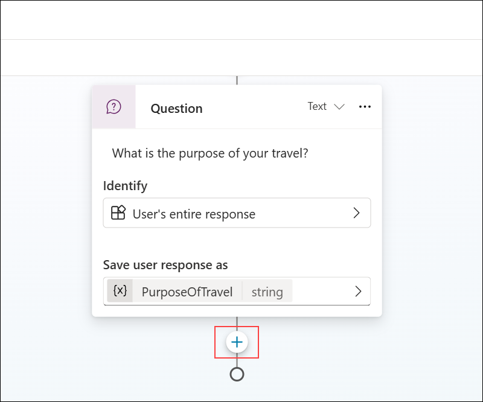

1. Add the Travel Approval Flow tool as follows:  
   - **Add a tool (1):** From the options menu, select **Add a tool**.  
   - **Travel Approval Flow (2):** In the list of tools, choose **Travel Approval Flow** to link it with the topic.  

      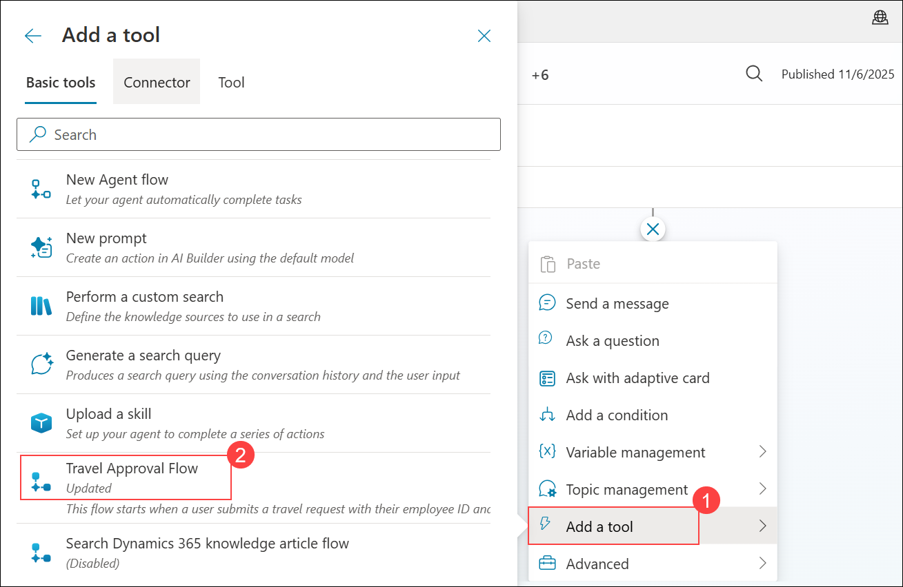

1. In the **Power Automate inputs (2)** section, click the variable picker **(1)** next to **Employee ID (Number)**, and from the **Select a variable** panel, choose **EmployeeID (2)**.

      

1. Perform the same step and select **PurposeOfTravel** for the **Purpose (String)** field.

1. Once both variables are mapped correctly, the configuration should appear as shown in the image — **Employee ID (Number)** mapped to **EmployeeID** and **Purpose (String)** mapped to **PurposeOfTravel**.

   

1. After mapping the outputs, click the **plus (+)** icon below the **Action** node to add the next step.
 
   

1. From the action menu, select **Send a message** to display a confirmation message to the user.
 
   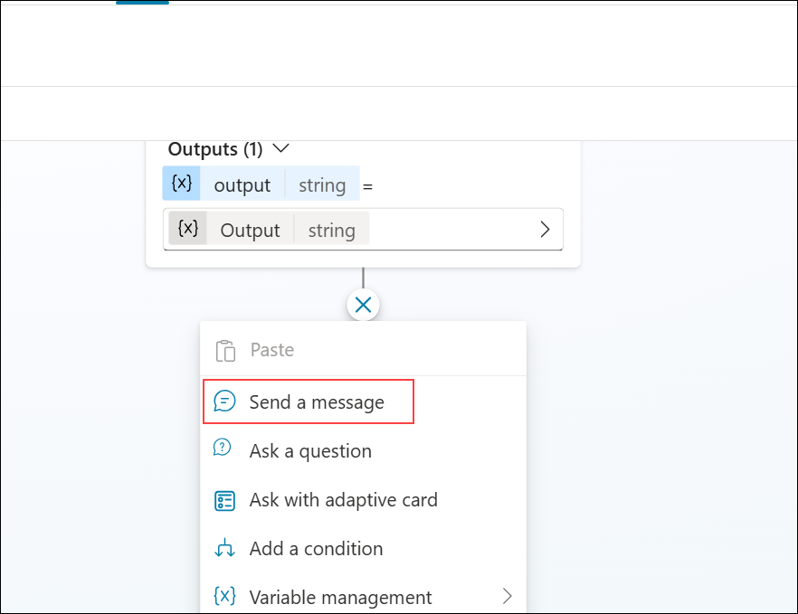

1. In the **Message** box, click on the **variable picker (1)** and select **Output (2)** from the list to insert it into the message.  

   

1. Click on the **Save** button to save the topic configuration.  

   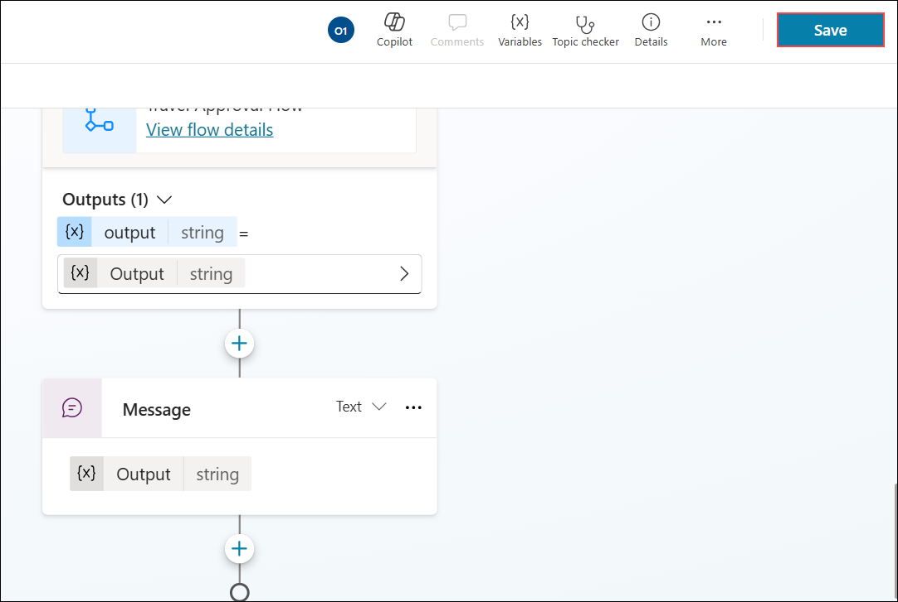

1. Navigate to the **Overview (1)** tab and click **Publish (2)** to make the agent updates live.  

   

1. In the **Publish this agent** dialog box, click **Publish** to confirm and deploy the agent.  

   

1. Once the agent is successfully published, click **Test** to verify and interact with your Copilot agent.  

   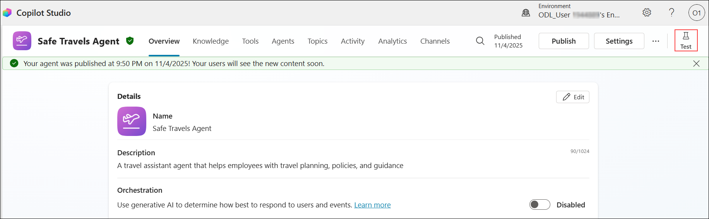

1. In the **Test your agent** panel, type **I need travel approval (1)** and click the **Send (2)** icon to initiate the travel approval request flow.  

   

1. When prompted with **What is your Employee ID?**, enter **117 (1)** and click the **Send (2)** icon to submit your response.   

   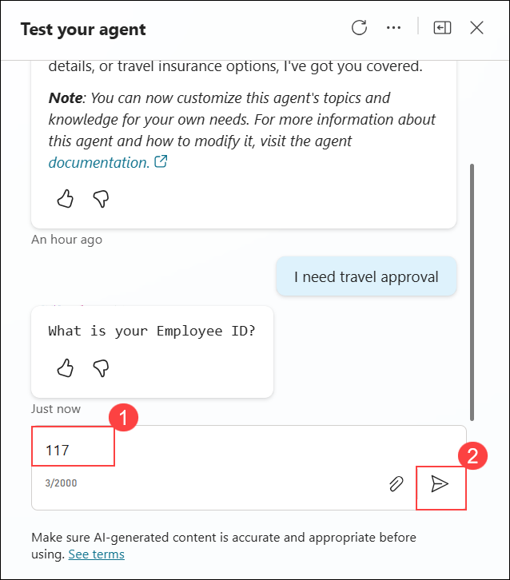

1. When asked **What is the purpose of your travel?**, enter **Client meeting (1)** and click the **Send (2)** icon to continue the process.  

   

1. When prompted for Microsoft Teams connection access, click **Allow** to authorize the integration and enable the flow to post travel requests in Teams.

   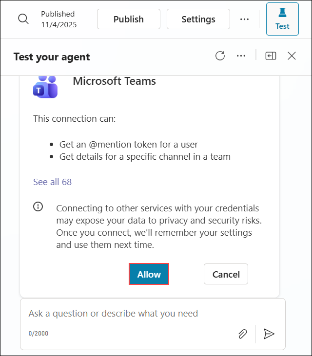

1. Once the Microsoft Teams connection is authorized, verify that the confirmation message **Request submitted** is displayed — indicating the travel approval request was successfully processed.

   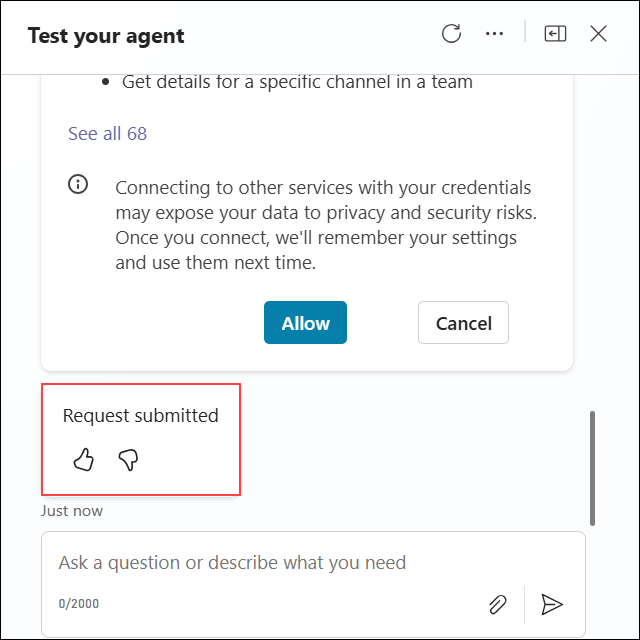

1. Verify the message is posted in Microsoft Teams as follows:  
   - **Chat (1):** Open the **Chat** tab.  
   - **Team (2):** Select **HR Team**.  
   - **Channel (3):** Open **Travel Approvals**.  
   - **Message (4):** Confirm the post appears as  
     `Travel request from Employee ID: 117, Purpose: Client meeting`.  

      

      > **Flow Validation:** Successfully testing the travel approval flow confirms that your agent can trigger real business processes and integrate with enterprise collaboration tools.

## Task 4: Establish Multi-Agent Orchestration

In this task, you will learn how the power of distributed AI systems where specialized agents handle specific business domains while maintaining a unified user experience through intelligent routing and collaboration.

1. Test the current limitation by typing **Check my leave balance (1)** and click **Send (2)** in your Safe Travels agent.

   

1. Observe that the agent's response displays a message indicating that no leave balance information is available, demonstrating the need for a specialized agent.

   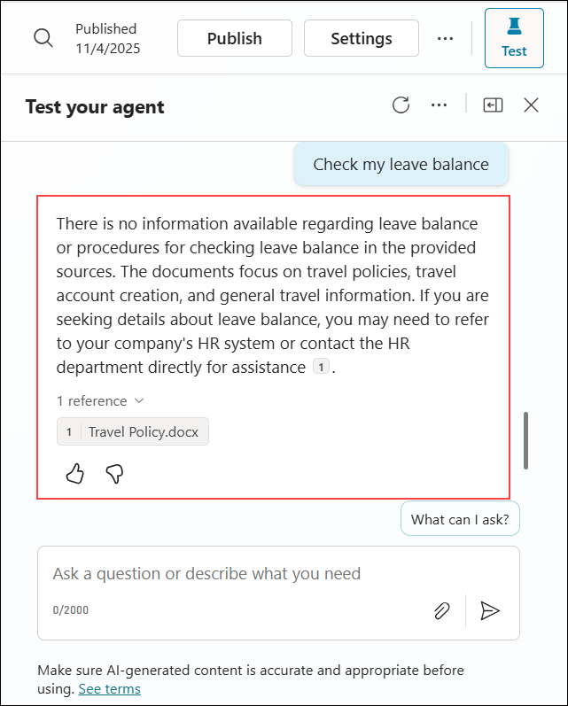

   > **Agent Specialization:** This limitation demonstrates why multi-agent orchestration is valuable - different agents can specialize in specific business domains while working together seamlessly.

1. From the **menu**, select **Topics** to create or manage conversation topics for your agent.  

   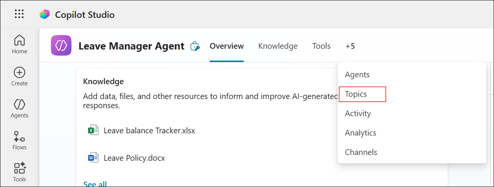

1. Click **Add a topic (1)** and choose **Add from description with Copilot (2)** to generate a topic automatically from a natural language description.  

   

1. Create the **Leave Balance Checker** topic as follows:  
   - **Name your topic (1):** Enter **Leave Balance Checker**.  
   - **Create a topic to... (2):** Type `Get the Employee ID from the user and check and reply with the leave balance based on the tracker added as knowledge source.`  
   - **Create (3):** Click **Create** to generate the topic automatically.   

      

1. Review the topic flow (1) to ensure all steps are correctly configured, then click **Save (2)** to store the changes.  

   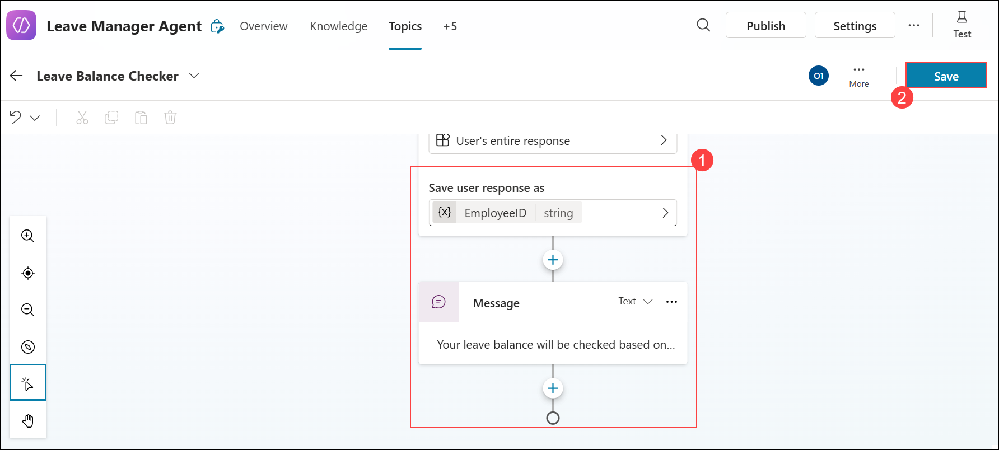

1. After saving the topic successfully, click **Test** to open the testing pane and verify your Leave Manager Agent’s response flow.  

   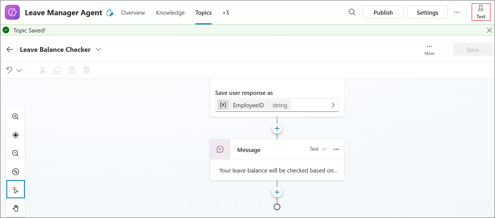

1. In the **Test your agent** pane, type **Check Leave balance (1)** in the chat box and click the **Send (2)** icon to trigger the Leave Balance Checker topic.  

   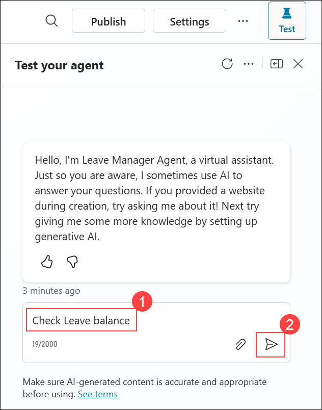

1. When prompted, enter your **Employee ID (1)** in the chat box and click the **Send (2)** icon to continue the conversation flow.  

   

1. See how the Leave Manager responds agent displays that Employee ID 1234 (John Doe) has **2 days** leave balance remaining, demonstrating multi-agent orchestration in action where specialized agents work together seamlessly **(1)**.

   

1. Click **Publish (1)** to publish the agent.

   

1. Click again on **Publish** in the dialog box.

   

1. Once published, you can see your **Safe Travels Agent (2)** listed in the Agents page. Click on **New agent (1)** to create additional agents if needed.

   

1. Click on the **+5 (1)** menu to access additional options. Select **Agents (2)** to manage your agents or access other features like Topics, Activity, Analytics, and Channels.

   

1. Click **Add** to create a new agent that will collaborate with your existing Safe Travels Agent.

   

1. Next to connect our existing agent click on **Copilot Studio**.

   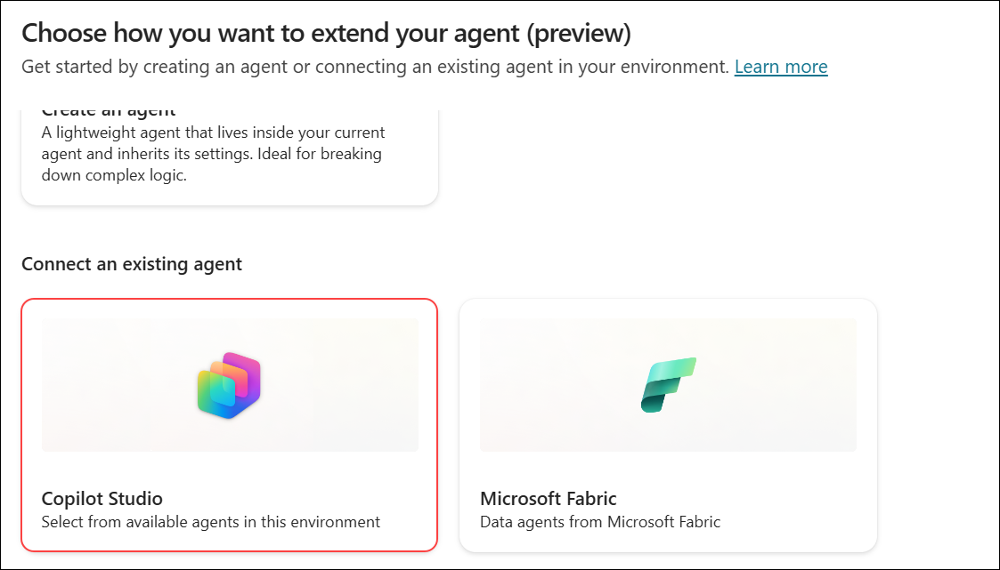

1. Select the **Leave Manager Agent** from the available agents to connect.

   

1. Review the agent configuration and click **Add agent** to complete the connection.

   

1. In the **Safe Travels Agent** interface, go to the **Agents** tab and click **Settings** to configure the agent settings.

   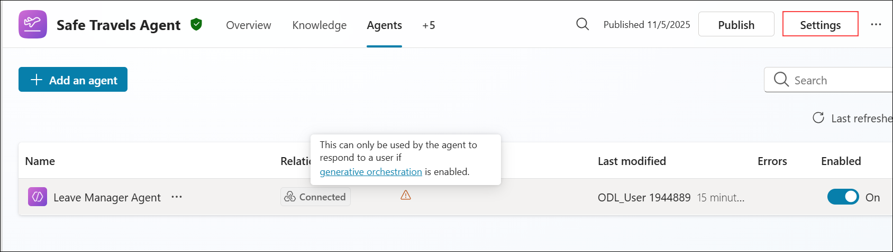

1. Navigate to **Generative AI (1)** settings, ensure **Yes (2)** is selected for orchestration, and click **Save (3)**.

   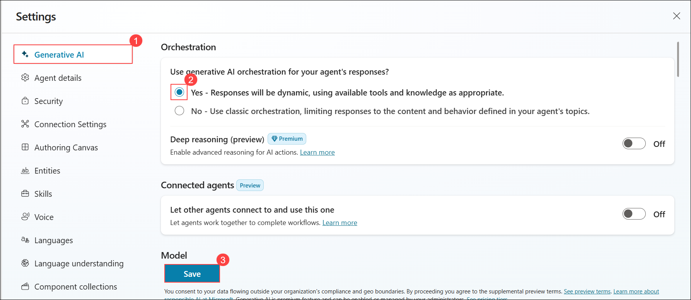

1. Now on **Agent (1)** tab, select the **Leave Manager Agent (2)**.

   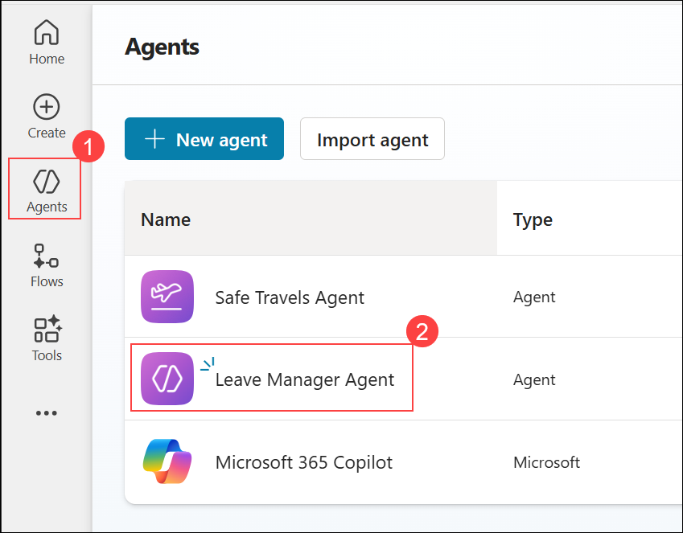

1. Click **Publish** to publish the Leave Manager Agent.

   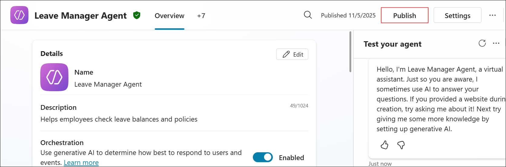

1. In the publish dialog, click **Publish** to confirm.

   

1. Navigate back to the **Safe Travels Agent (2)** from the agents list.

   

1. Click **Publish** to publish the Safe Travels Agent with the connected Leave Manager Agent.

   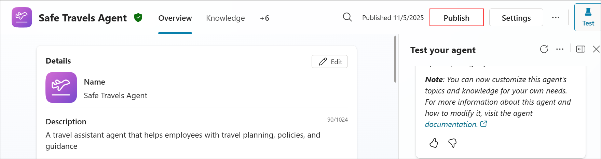

1. In the publish dialog, click **Publish** to confirm.

   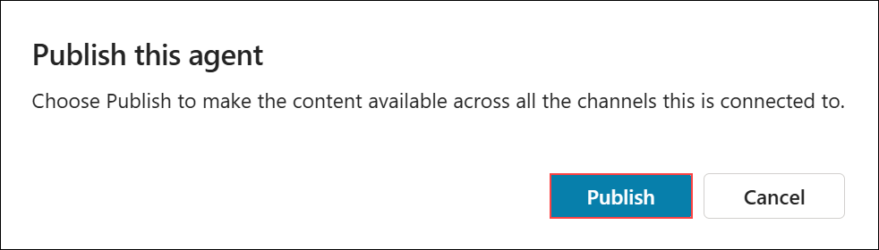

1. Click **Test** to test the agent functionality.

   

1. Type **Check Leave balance (1)** and click the **send button (2)** to test the Leave Manager Agent integration.

   

1. Enter **1234 (1)** as the Employee ID and click **send (2)**.

   

   > **Multi-Agent Success:** The seamless handoff between your Safe Travels agent and Leave Manager agent demonstrates successful orchestration, where specialized agents collaborate to provide comprehensive business solutions.

## Summary

In this exercise, you successfully enhanced your conversational AI system with advanced business automation capabilities. You have accomplished:

- **Created comprehensive travel approval workflows** that integrate with Microsoft Teams for real-time business process automation
- **Built a specialized Leave Manager agent** with organizational knowledge sources and domain-specific expertise
- **Established multi-agent orchestration** enabling seamless collaboration between different AI agents
- **Implemented end-to-end business processes** from conversation initiation to Teams notification and cross-agent routing

### You have successfully completed the Lab!