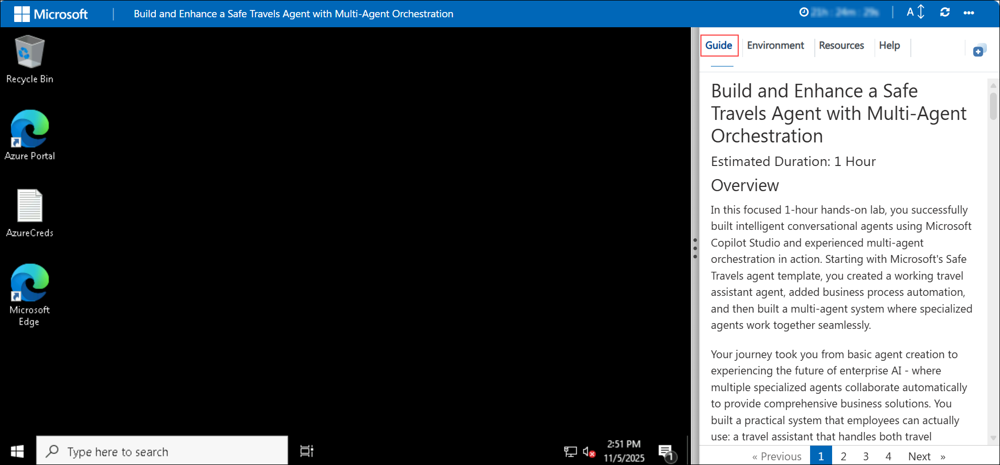
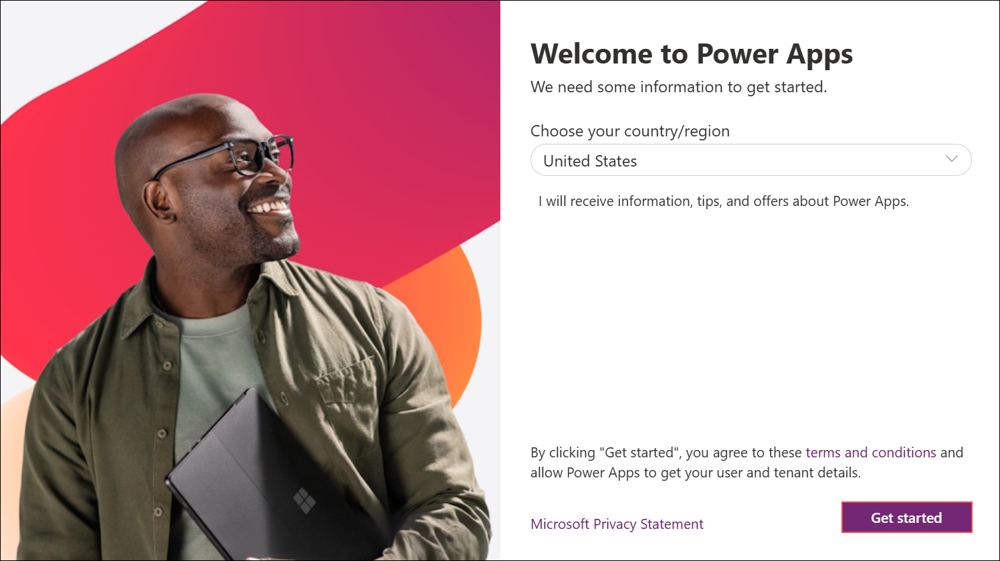

# Build and Enhance a Safe Travels Agent with Multi-Agent Orchestration

### Overall Estimated Duration: 1 Hour

## Overview

In this hands-on lab, you will build and configure a Safe Travels Agent using Microsoft Copilot Studio to assist employees with travel planning, policy queries, and approval workflows. The agent leverages multi-agent orchestration to seamlessly delegate specialized tasks, such as leave balance inquiries, to a dedicated Leave Manager Agent. By integrating with Microsoft Teams and Power Automate, you will create an intelligent, automated system that enhances employee experience and streamlines business processes.

## Objectives

By the end of this lab, you will be able to:

- **Create and Deploy Safe Travels Agent:** Build a travel assistance agent using templates, integrate knowledge sources, and deploy to Microsoft Teams.

- **Implement Agent Flows for Business Automation:** Design and configure Power Automate flows that trigger travel approval processes and post notifications to Teams channels.

- **Build Multi-Agent Orchestration:** Create a specialized Leave Manager Agent and enable collaboration between multiple agents for comprehensive business solutions.

- **Test End-to-End Workflows:** Validate agent responses, flow executions, and cross-agent handoffs to ensure reliable operation.

## Prerequisites

Participants should have:

- Basic Understanding of Conversational AI and Agentic AI Concepts
- Working Knowledge of Microsoft Copilot Studio
- Familiarity with Microsoft Teams and Power Platform

## Explanation of Components

- **Microsoft Copilot Studio:** Platform to build, configure, and manage conversational AI agents.

- **Dataverse:** Central data store for employee information, leave balances, and travel policies.

- **Power Platform Environment:** Secure workspace hosting agents, data tables, and workflows.

- **Power Automate:** Workflow automation engine for travel approval processes and Teams integration.

- **Microsoft Teams:** Collaboration hub where users interact with agents and receive approval notifications.

- **Multi-Agent Orchestration:** Framework enabling specialized agents to work together and route requests intelligently.

## Getting Started with the Lab

Welcome to your Build and Enhance a Safe Travels Agent with Multi-Agent Orchestration lab! We've prepared a seamless environment for you to explore and learn how to build, configure, and test intelligent travel assistance agents. This lab will guide you through creating AI agents, implementing business automation workflows, and establishing multi-agent orchestration to deliver a secure and efficient experience. Let's begin by making the most of this workshop!

### Accessing Your Lab Environment

Once you're ready to dive in, your virtual machine and Lab guide will be right at your fingertips within your web browser.



### Exploring Your Lab Resources

To get a better understanding of your Lab resources and credentials, navigate to the Environment tab.


### Utilizing the Split Window Feature

For convenience, you can open the Lab guide in a separate window by selecting the Split Window button from the Top right corner


### Managing Your Virtual Machine

From the **Resources (1)** tab, you can easily **start, stop, restart, or connect (2)** to your virtual machine—your experience is in your hands!


## Let's Get Started with Power Apps Portal

1. In the JumpVM, click on **Microsoft Edge** shortcut of Microsoft Edge browser which is created on desktop.

   

1. Open a new browser tab and navigate to the Power Apps portal using the link below:

   ```
   https://make.powerapps.com/
   ```

   >Note: Since you are working within a VM, please copy the above link and open it in the browser inside the VM.

1. On the **Sign into Microsoft** tab, you will see the login screen. Enter the provided email or username, and click **Next** to proceed.

   - Email/Username: <inject key="AzureAdUserEmail"></inject>

     

1. Now, enter the following password and click on **Sign in**.

   - Password: <inject key="AzureAdUserPassword"></inject>

     

     >**Note:** If you see the Action Required dialog box, then select Ask Later option.
     
1. If you see the pop-up **Stay Signed in?**, click **No**.

   

1. If the **Welcome to Power Apps** pop-up appears, leave the default country/region selection and click **Get started**.

   

1. You have now successfully logged in to the Power Apps portal. Keep the portal open, as you will be using it later in the lab.

   

## Support Contact

The CloudLabs support team is available 24/7, 365 days a year, via email and live chat to ensure seamless assistance at any time. We offer dedicated support channels tailored specifically for both learners and instructors, ensuring that all your needs are promptly and efficiently addressed.Learner Support Contacts:

- Email Support: cloudlabs-support@spektrasystems.com
- Live Chat Support: https://cloudlabs.ai/labs-support

Now, click on the **Next** from lower right corner to move on next page.

   


## Happy Learning!!
