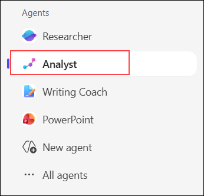
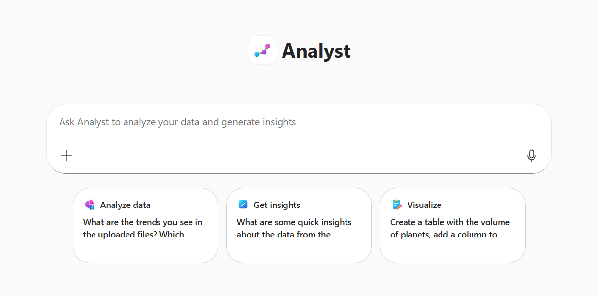
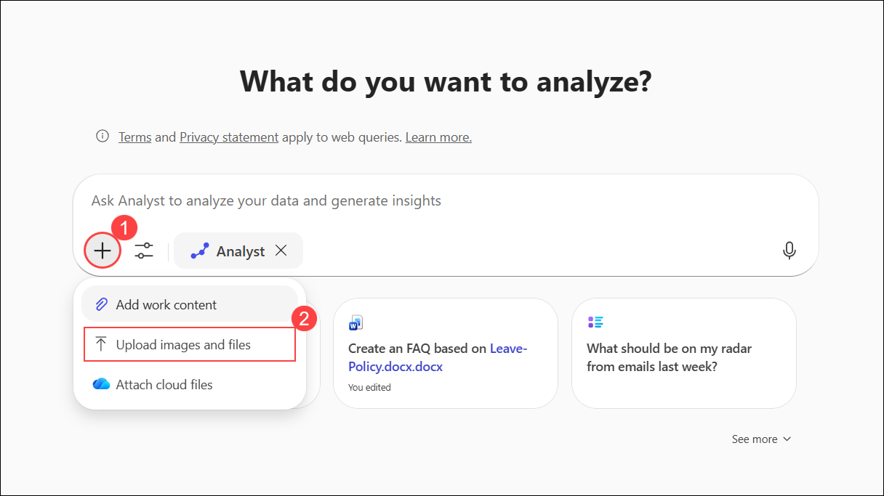
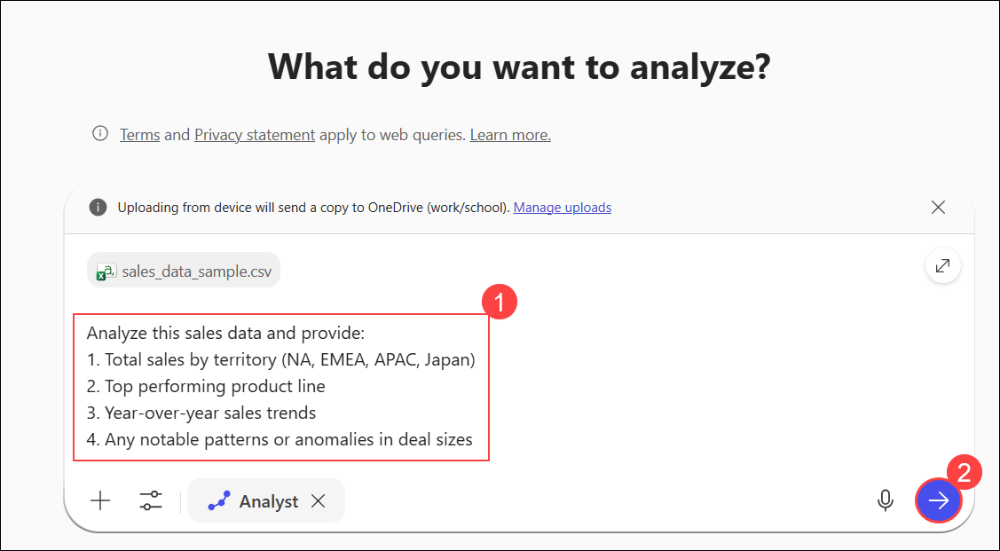
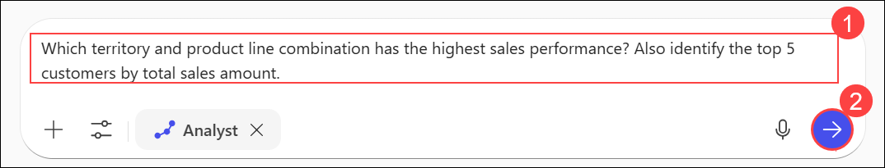
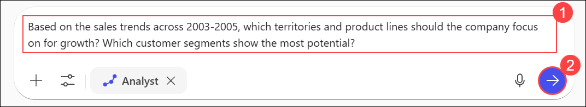
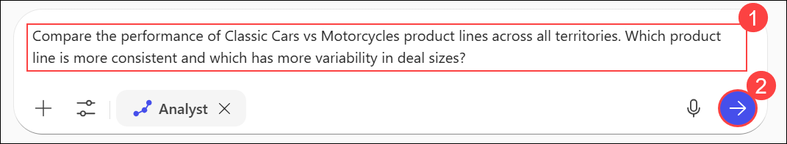
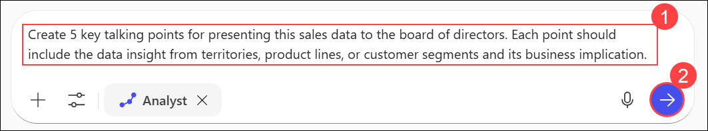
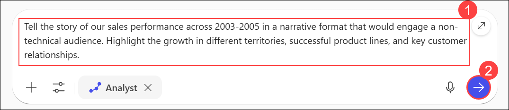

# Exercise 1: Enhance Data Storytelling Using Microsoft 365 Copilot Analyst Agent

## Estimated Duration: 45 Minutes

## Overview

In this exercise, you will explore the Analyst Agent in Microsoft 365 Copilot. The Analyst Agent is a pre-built agent designed to help users analyze data, generate insights, and create compelling data visualizations. It can work with Excel and CSV data, help identify trends, and produce professional-quality reports.

You will use the Analyst Agent to analyze a real sales dataset containing order information, product lines, customer data, and regional performance across 2003-2005. The dataset includes:

- **Territories:** NA (North America), EMEA (Europe, Middle East, Africa), APAC (Asia Pacific), Japan
- **Product Lines:** Classic Cars, Motorcycles, Trucks and Buses, and more
- **Deal Sizes:** Small, Medium, Large
- **Customer Information:** Company names, contacts, and locations
- **Order Details:** Order numbers, quantities, prices, sales amounts, and dates

## Exercise Objectives

In this exercise, you will complete the following tasks:

- Task 1: Access the Analyst Agent in Microsoft 365 Copilot
- Task 2: Upload and analyze sales data
- Task 3: Generate data insights and trends
- Task 4: Create data visualizations
- Task 5: Build a data-driven narrative

### Task 1: Access the Analyst Agent in Microsoft 365 Copilot

In this task, you will navigate to Microsoft 365 Copilot and access the Analyst Agent.

1. In the VM, open **Microsoft Edge**, and then open a **new tab**.

1. Navigate to the Microsoft 365 portal:

   ```
   https://www.microsoft365.com
   ```

1. Click **Sign in**, enter your lab credentials, and select **Yes** to stay signed in.

1. Sign in with your lab credentials:

   - Email/Username: <inject key="AzureAdUserEmail"></inject>

     

   - Password: <inject key="AzureAdUserPassword"></inject>

     

1. Click the **X (Close)** button at the top-right corner of the popup to cancel it.

   

1. On the Microsoft 365 home page, click on the **Copilot** icon from the left navigation panel.

   

1. In the agents panel, browse or search for the **Analyst** agent.

   

1. Click on the **Analyst** agent to view its details and capabilities:

   - Analyze data from Excel files
   - Generate insights and trends
   - Create charts and visualizations
   - Provide data-driven recommendations

      

### Task 2: Upload and Analyze Sales Data

In this task, you will download the required datasets and upload a sales data file to the Analyst Agent for analysis.

1. First, download the required datasets for this lab. Open a new browser tab and navigate to:

   ```
   https://github.com/Girish1704/github-copilot-for-managers/archive/refs/heads/Day1-datasets.zip
   ```

1. Once downloaded, extract the **Day1-datasets.zip** file to a location of your choice (e.g., Desktop or Downloads folder).

1. With the Analyst Agent active, click the **+ (Add) (1)** icon, then select **Upload images and files (2)** to upload your data.

   

1. Browse to the location where you extracted the datasets, select the **sales_data_sample.csv** file, then click **Open**.

   

1. Enter the analysis prompt in the **message box (1)**, then click the **Send (2)** button to submit it.

   ```
   Analyze this sales data and provide:
   1. Total sales by territory (NA, EMEA, APAC, Japan)
   2. Top performing product line
   3. Year-over-year sales trends
   4. Any notable patterns or anomalies in deal sizes
   ```

   

   **Expected Output:**

   The Analyst Agent will reason through the data and provide a comprehensive analysis including:

   - **Territory Sales Table:** EMEA leads with approximately $845K, followed by NA with ~$760K, while APAC and Japan contribute ~$120K each
   - **Top Product Line:** Classic Cars is the clear leader with over $1.16M in sales (more than 2x Motorcycles)
   - **Year-over-Year Trends:** Growth of +17% from 2003 to 2004, followed by a decline in 2005 (likely due to partial year data)
   - **Deal Size Patterns:** Medium deals dominate both volume (230 orders) and revenue, with Large deals showing higher average order values

      >**Note:** The Analyst Agent performs real-time data analysis and may display "Reasoning" or "Coding and executing" status while processing your request.

1. Enter the deeper insight question in the **message box (1)**, then click the **Send (2)** button to submit it.

   ```
   Which territory and product line combination has the highest sales performance? Also identify the top 5 customers by total sales amount.
   ```

   

   **Expected Output:**

   The Analyst Agent will identify:
   - **Highest Performing Combination:** EMEA x Classic Cars with approximately $588K (the strongest territory/product-line pair)
   - **Top 5 Customers by Total Sales:**
     1. Mini Gifts Distributors Ltd. - ~$116K
     2. Euro Shopping Channel - ~$93K
     3. Dragon Souveniers, Ltd. - ~$62K
     4. Corporate Gift Ideas Co. - ~$52K
     5. Land of Toys Inc. - ~$46K

### Task 3: Generate Data Insights and Trends

In this task, you will use the Analyst Agent to identify trends and generate actionable insights.

1. Enter the trend analysis prompt in the **message box (1)**, and then click the **Send (2)** button to submit it.

   ```
   Identify the top 3 trends in this sales data across the years 2003-2005 and explain what business factors might be driving these trends.
   ```

   

   **Expected Output:**

   The Analyst Agent will identify trends such as:

   - **Trend 1:** Significant growth from 2003 to 2004 (+17%), followed by a sharp decline in 2005 - possibly due to partial year data or market changes
   - **Trend 2:** Strong and consistent outperformance by Classic Cars across all years - driven by premium product positioning and distributor affinity
   - **Trend 3:** Territory imbalance with EMEA and NA dominating while APAC and Japan show "high-value but low-volume" profiles

1. Enter the predictive insights prompt in the **message box (1)**, and then click the **Send (2)** button to submit it.

   ```
   Based on the sales trends across 2003-2005, which territories and product lines should the company focus on for growth? Which customer segments show the most potential?
   ```

   

   **Expected Output:**

   The Analyst Agent will provide strategic recommendations including:

   - **Priority Territories:** EMEA (highest revenue, strong Classic Cars performance) and NA (solid customer base)
   - **Growth Opportunities:** Japan and APAC show highest average order values - potential for premium/collector offerings
   - **Product Focus:** Continue investing in Classic Cars while expanding Motorcycles as a secondary growth driver
   - **Customer Segments:** Major wholesalers (Mini Gifts, Euro Shopping Channel) and premium collectors in Japan/APAC

1. Enter the comparative analysis prompt in the **message box (1)**, and then click the **Send (2)** button to submit it.

   ```
   Compare the performance of Classic Cars vs Motorcycles product lines across all territories. Which product line is more consistent and which has more variability in deal sizes?
   ```

   

   **Expected Output:**

   The Analyst Agent will provide a detailed comparison:

   - **Classic Cars:** Higher total revenue (~$1.16M), heavier reliance on Large deals, slightly higher variability in per-order values
   - **Motorcycles:** More balanced across territories, concentrated in Medium deals, more predictable and consistent
   - **Verdict:** Motorcycles is more consistent (lower variability), while Classic Cars has more variability but higher revenue potential

### Task 4: Create Data Visualizations

In this task, you will ask the Analyst Agent to suggest and describe data format.

1. Enter the table formatting prompt in the **message box (1)**, and then click the **Send (2)** button to submit it.

   ```
   Format the territory sales summary as a table that I can copy into a PowerPoint presentation, with clear headers showing territory, total sales, number of orders, and average deal size.
   ```

   

   **Expected Output:**

   The Analyst Agent will generate a clean, copy-ready table:

   | Territory | Total Sales ($) | Number of Orders | Average Deal Size ($) |
   |-----------|-----------------|------------------|----------------------|
   | EMEA      | 845,849.18      | 176              | 4,805.96             |
   | NA        | 759,793.05      | 150              | 5,065.29             |
   | APAC      | 123,612.55      | 27               | 4,578.24             |
   | Japan     | 117,941.25      | 21               | 5,616.25             |

   >**Note:** Some records may have blank territory values. The Analyst can map these using country data if requested.

### Task 5: Build a Data-Driven Narrative

In this task, you will use the Analyst Agent to create a compelling narrative around the data.

1. Enter the executive summary prompt in the **message box (1)**, and then click the **Send (2)** button to submit it.

   ```
   Write an executive summary (3-4 paragraphs) of our sales performance based on this data from 2003-2005. Include key achievements across territories, top-performing product lines, and recommended actions for future growth.
   ```

   

   **Expected Output:**

   The Analyst Agent will generate a professional executive summary covering:

   - **Performance Overview:** Strong momentum from 2003-2004 with 17% growth, total sales exceeding $1.8M across the period
   - **Regional Achievements:** EMEA as the top-performing territory, NA providing steady volume, Japan/APAC showing premium potential
   - **Product Line Success:** Classic Cars as the flagship driver with $1.16M, Motorcycles as a stable secondary line
   - **Recommended Actions:** Focus on EMEA growth, deepen key account relationships, explore premium offerings in Japan/APAC, strengthen discount governance

1. Enter the presentation talking points prompt in the **message box (1)**, and then click the **Send (2)** button to submit it.

   ```
   Create 5 key talking points for presenting this sales data to the board of directors. Each point should include the data insight from territories, product lines, or customer segments and its business implication.
   ```

   

   **Expected Output:**

   The Analyst Agent will create 5 board-ready talking points such as:

   1. **EMEA Leadership:** Strongest territory with $845K - prioritize inventory and partnerships
   2. **Classic Cars Dominance:** Flagship product driving 2x revenue vs Motorcycles - continue investment
   3. **2005 Decline Investigation:** Sharp drop requires analysis - partial data or market change?
   4. **Customer Concentration Risk:** Top 5 customers drive significant share - diversify mid-tier accounts
   5. **Deal Size Variability:** Classic Cars has higher Large-deal dependence - adjust forecasting

1. Enter the data story prompt in the **message box (1)**, and then click the **Send (2)** button to submit it.

   ```
   Tell the story of our sales performance across 2003-2005 in a narrative format that would engage a non-technical audience. Highlight the growth in different territories, successful product lines, and key customer relationships.
   ```

   

   **Expected Output:**

   The Analyst Agent will craft an engaging narrative telling the story of:

   - The journey from 2003 foundation to 2004 growth peak
   - How EMEA became the powerhouse market
   - The Classic Cars success story and customer partnerships
   - Key relationships with Mini Gifts Distributors, Euro Shopping Channel, and other top accounts
   - Opportunities in premium markets like Japan and APAC

## Summary

In this exercise, you explored the Analyst Agent in Microsoft 365 Copilot. You learned how to:

- Access and activate the Analyst Agent
- Upload and analyze real sales data from a CSV file (376 orders across 2003-2005)
- Generate insights on territories (EMEA, NA, APAC, Japan), product lines (Classic Cars, Motorcycles), and customers
- Request data visualization recommendations for executive dashboards
- Build compelling data-driven narratives and board-ready talking points

The Analyst Agent is a powerful tool for transforming raw data into actionable insights and professional presentations, with real-time data analysis capabilities.

### You have successfully completed this exercise. Click on Next to proceed to the next exercise.
