# Exercise 13: Build Conversational Topics and Deploy Quiz Generator

## Estimated Duration: 45 Minutes

## Overview

In this exercise, you will build a conversational topic that integrates the prompt action created in the previous exercise. Users will be able to interactively generate quizzes through a guided conversation that collects their preferences and delivers customized quiz content. You will also test the complete solution and optionally deploy it to Microsoft Teams.

By the end of this exercise, you will have a fully functional Quiz Generator agent that users can interact with through natural conversation.

## Exercise Objectives

In this exercise, you will complete the following tasks:

- Task 1: Create the Generate Quiz Topic
- Task 2: Build the Conversation Flow
- Task 3: Connect the Prompt Action to the Topic
- Task 4: Test the Complete Quiz Generator
- Task 5: Publish and Deploy to Teams (Optional)

### Task 1: Create the Generate Quiz Topic

In this task, you will create a topic that triggers when users want to generate a quiz.

1. In Microsoft Copilot Studio, open your **Quiz Generator** agent created in the previous exercise.

   

1. Select **Topics (1)** in the top navigation, choose **+ Add a topic (2)**, and then select **From blank (3)** to create a new topic.

   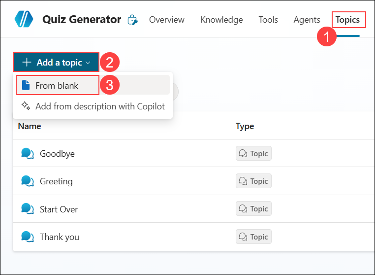

1. Configure the topic name:

   **Topic Name:**
   ```
   Generate Quiz
   ```

   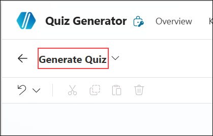

1. In the **Trigger** node, enter:

   ```
   This topic generates customized multiple-choice quiz questions on any topic. It helps users create quizzes by collecting the topic, number of questions, and difficulty level. Users can ask things like "Create a quiz", "Generate quiz questions", "Make a test", "Quiz me on", or "Help me make a quiz".
   ```

   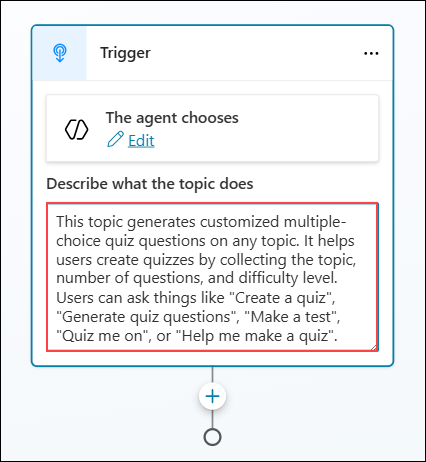

1. In the **Trigger** node, select **+** to add the next step to the topic flow.

   

1. From the add step menu, select **Send a message** to insert a message node into the topic flow.

   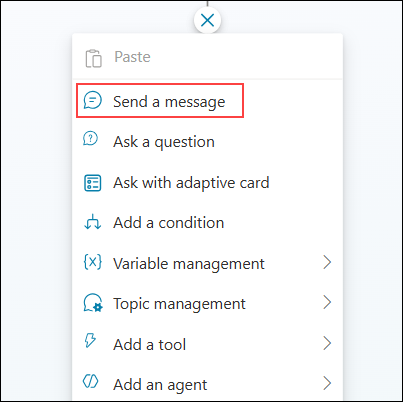

1. In the **Message** node, enter the welcome text to introduce the Quiz Generator to users.

   ```
   Welcome to the Quiz Generator!

   I can create customized multiple-choice quizzes on any topic you'd like.
   ```

   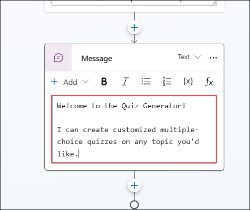

1. Select the **+** button below the message node to add the next step in the conversation flow.

   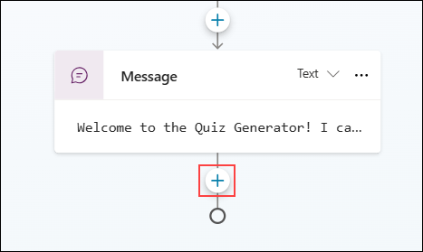

1. From the add step menu, select **Ask a question** to collect input from the user.

   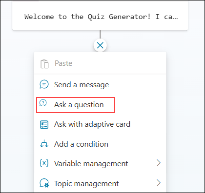

1. In the **Question** node, enter the prompt in the **Question text (1)** field, and set **Identify (2)** to **User’s entire response**.

   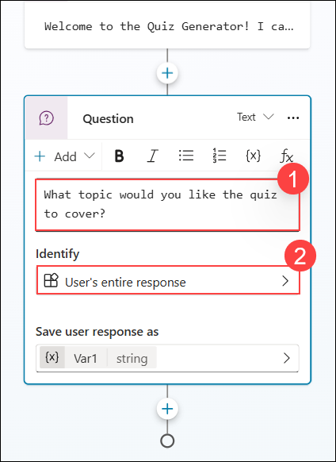

1. In the **Question** node, select the **Var1** variable under **Save user response as** to edit the variable name.

   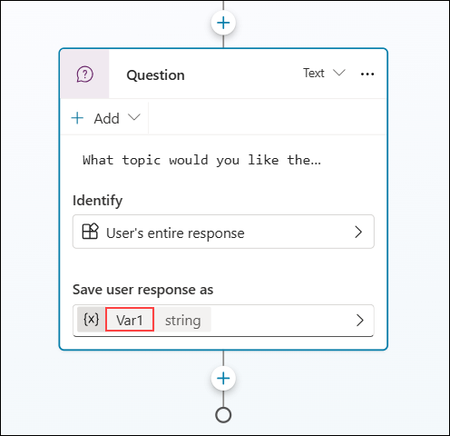

1. In the **Variable properties** pane, enter the new name in the **Variable name `QuizTopic` (1)** field, and then select **Close (2)** to save the changes.

   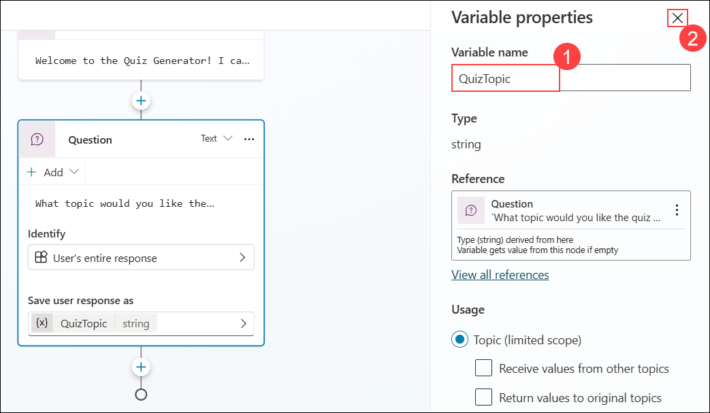

1. Select the **+ (1)** button below the node, and then choose **Ask a question (2)** to add the next input step.

   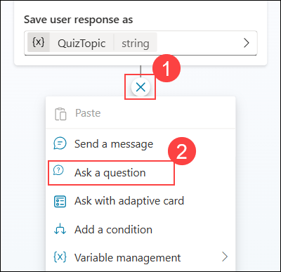

1. In the **Question** node, verify that the **Question text (1)**, **Identify (2)**, and **Save user response as (3)** fields are configured correctly for collecting the number of questions.

   | Field | Value |
   |-------|-------|
   | Question text | `How many questions would you like in your quiz?` |
   | Identify | User’s entire response |
   | Save response as | Create a new variable named `QuestionCount` |

   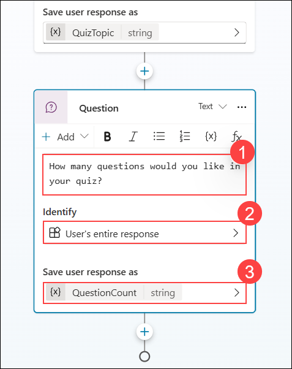

1. Select the **+ (1)** button below the node, and then choose **Ask a question (2)** to add the next question step.

   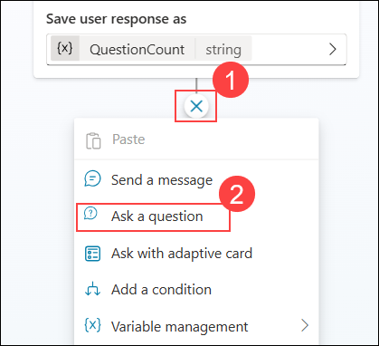

1. In the **Question** node, enter the prompt in the **Question text (1)** field, set **Identify (2)** to **Multiple choice options**, and select **New option (3)** to add answer choices.

   | Field | Value |
   |-------|-------|
   | Question text | `What difficulty level would you prefer?` |
   | Identify | Multiple choice options |

   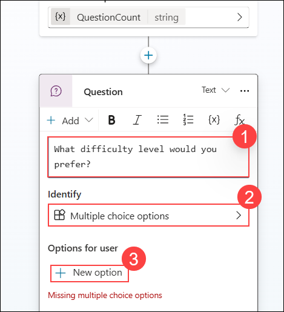

1. Under **Options for user (1)**, verify that all required choices are added, and confirm the response is saved as **QuizDifficulty (2)**.

   - `Beginner`
   - `Intermediate`
   - `Advanced`

   | Field | Value |
   |-------|-------|
   | Save response as | Create a new variable named `QuizDifficulty` |

   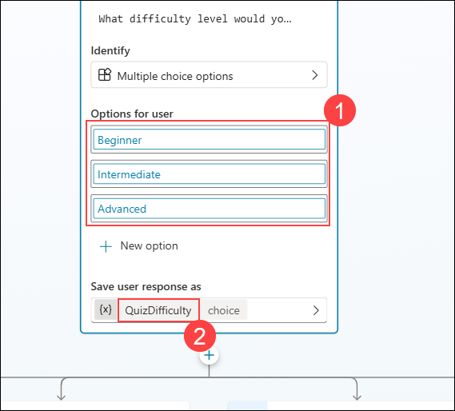

1. Select the **+ (1)** button below the node, and then choose **Variable management (2)** to manage topic variables.

   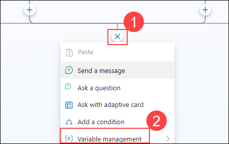

1. Under **All other conditions**, select the **+** button to add the next step for the default branch.

   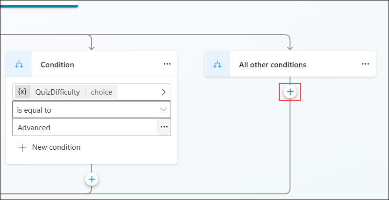

1. Under **All other conditions**, select the **+** button, and then choose **Send a message** to add a default response.

   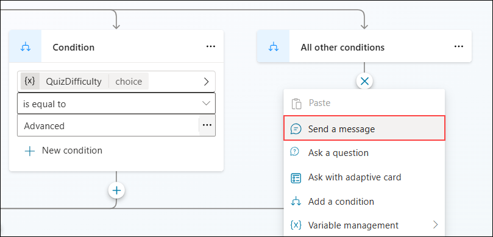

1. In the **Message** node, enter the default response in the text field **(1)**, and then select the **+ (2)** button to continue building the flow.

   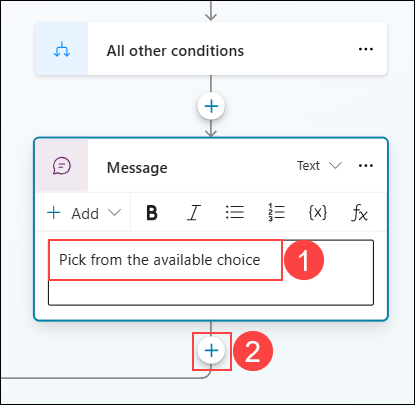

1. From the add step menu, select **Topic management (1)**, and then choose **Go to step (2)** to redirect the conversation flow.

   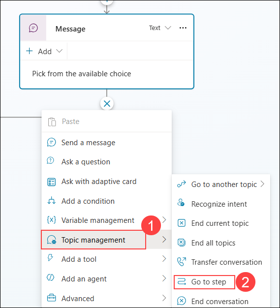

1. In the **Select destination step** panel, choose the **Question** node for difficulty selection to redirect the flow back to this step.

   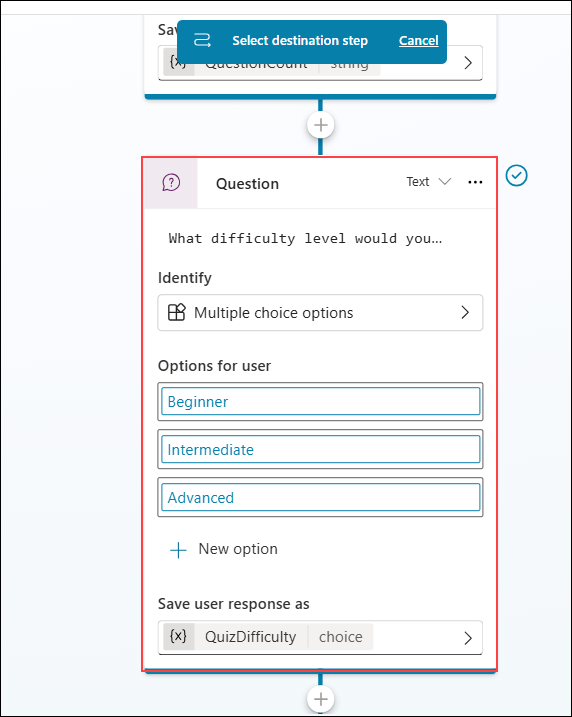

1. Verify that the flow redirects from the default message back to the difficulty **Question** node for retry.

   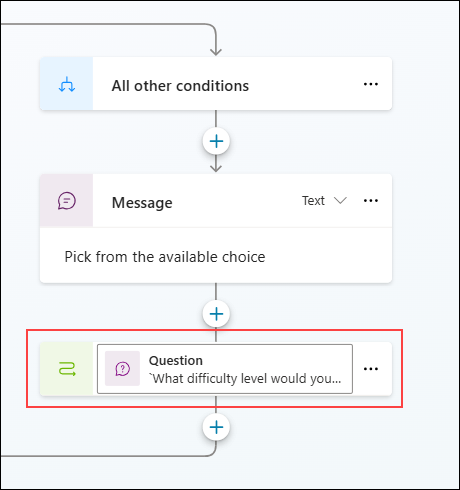

1. From the **Variable management** menu, select **Set a variable value** to configure a new variable.

   

1. In the **Set variable** field, select the picker **(1)**, and then choose **Create a new variable (2)** to define a new variable.

   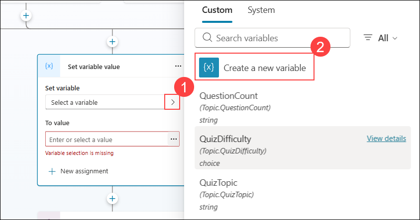

1. In the **Set variable value** node, select **DifficultyText (1)**, enter the name in the **Variable name (2)** field, and then select **Close (3)** to save the variable.

   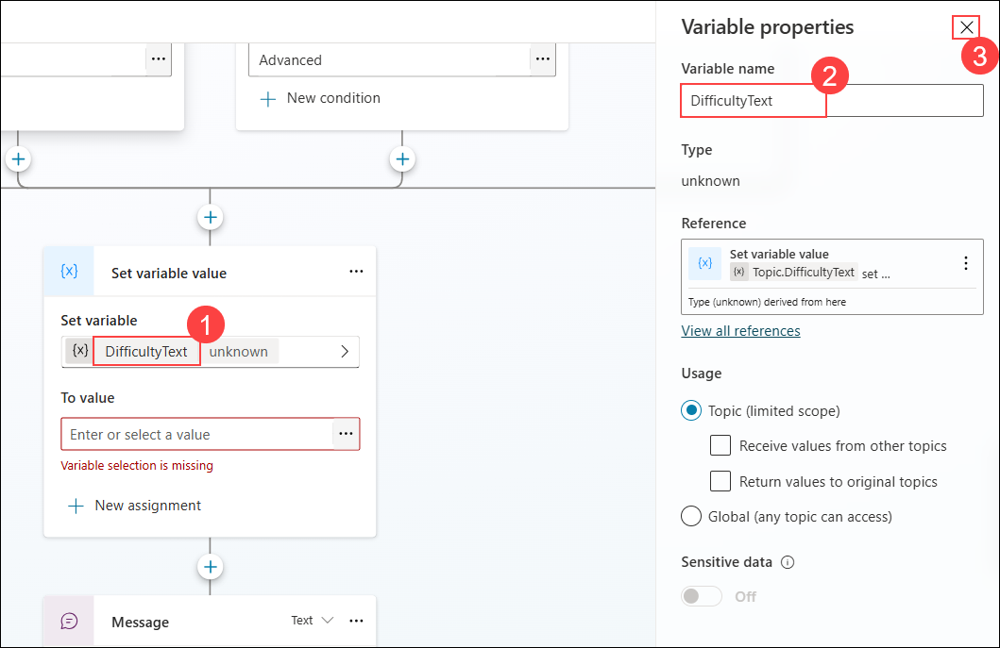

1. In the **To value** field, select the picker **(1)**, and then choose **QuizTopic (2)** to assign the source variable.

   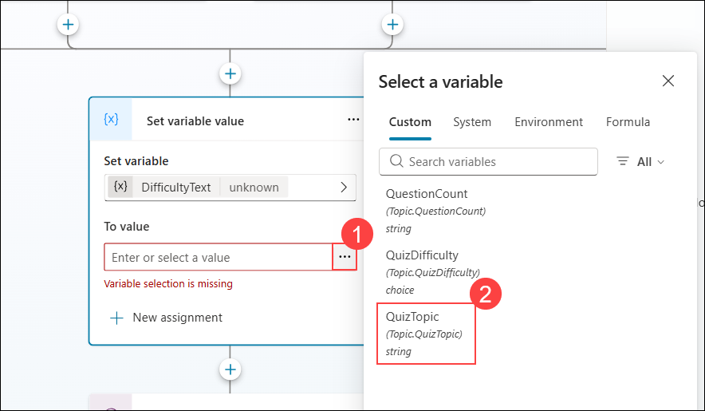

1. In the **Set variable value** node, verify that **DifficultyText** is set to type **string**, and confirm the value is assigned correctly.

   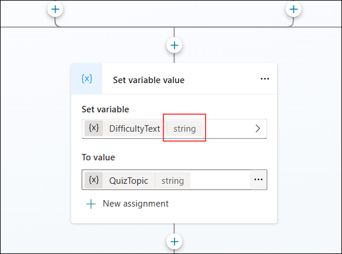

1. In the **To value** field, select the picker **(1)**, switch to **Formula (2)**, enter `Text(Topic.QuizDifficulty)` **(3)**, and then select **Insert (4)**.

   

1. Select the **+ (1)** button below the node, and then choose **Send a message (2)** to add a confirmation message.

   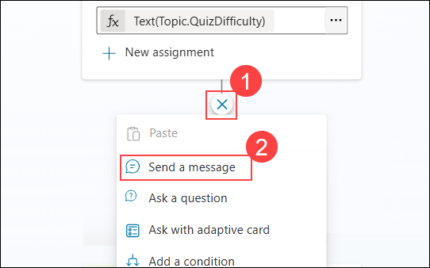

1. In the **Message** node, enter the confirmation text using the variables.

   ```
   Perfect! Here's what I'll create for you:

   Topic: {Topic.QuizTopic}
   Questions: {Topic.QuestionCountText}
   Difficulty: {Topic.DifficultyText}

   Generating your quiz now... Please wait a moment.
   ```

   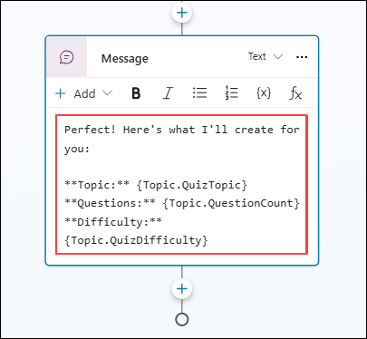

1. After inserting the variables in the **Message** node, click outside the variable fields to automatically apply and format them in the message.

   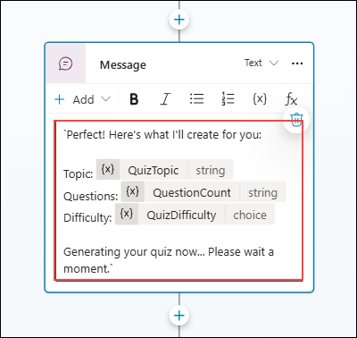

1. Select the **+** button below the confirmation message to add the next step in the topic flow.

1. Select **Add a tool (1)**, switch to the **Tool (2)** tab, and then choose **Generate QuizQuestions (3)** to add the prompt action.

   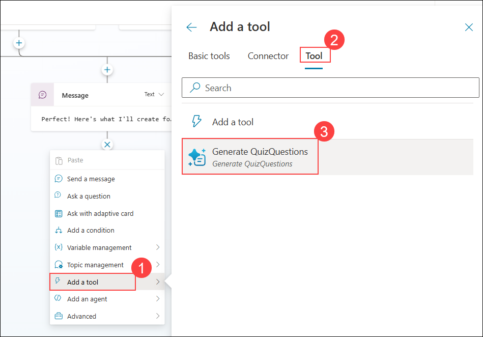

1. In the **Tool** node, select **+ Set value** to configure the input parameters for the action.

   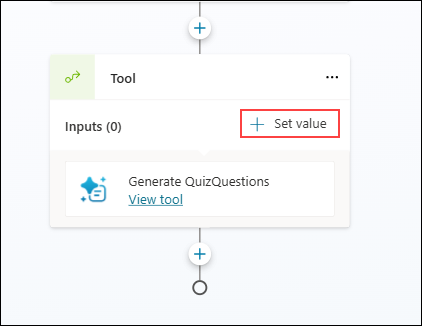

1. In the input mapping panel, select **Topic (1)**, **DifficultyLevel (2)**, and **NumberOfQuestions (3)** to map the corresponding topic variables.

   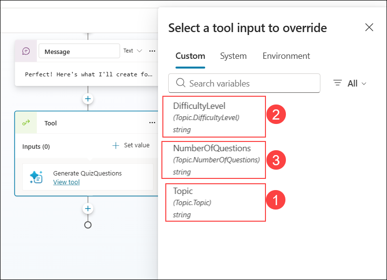

1. In the **Tool** node, verify that the input fields for are displayed so you can enter or select the required values.

   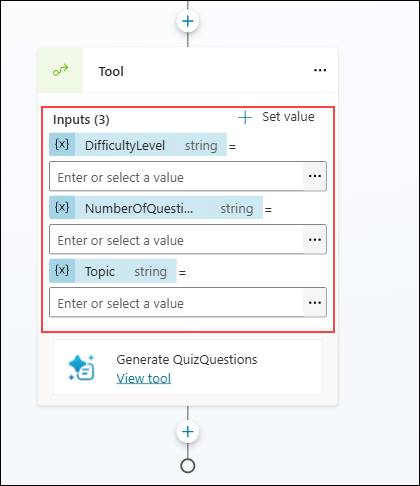

1. In the **DifficultyLevel** input, select the picker **(1)**, and then choose **QuizDifficulty (2)** to map the variable.

   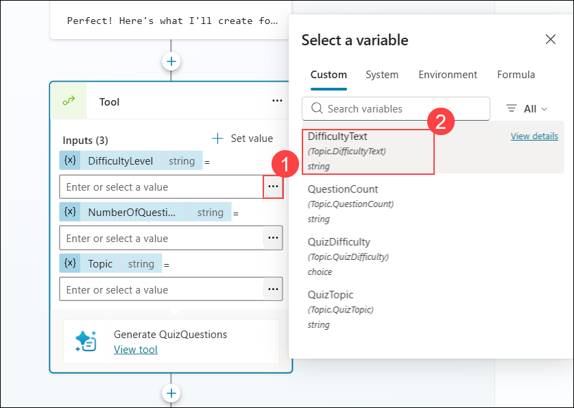

1. In the **NumberOfQuestions** input, select the picker **(1)**, and then choose **QuestionCount (2)** to map the variable.

   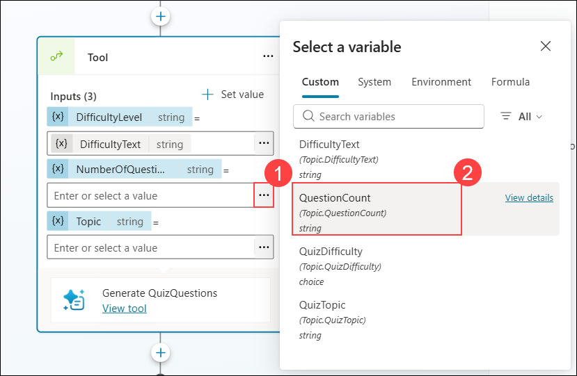

1. In the **Topic** input, select the picker **(1)**, confirm the **Custom (2)** tab is selected, and then choose **QuizTopic (3)** to map the variable.

   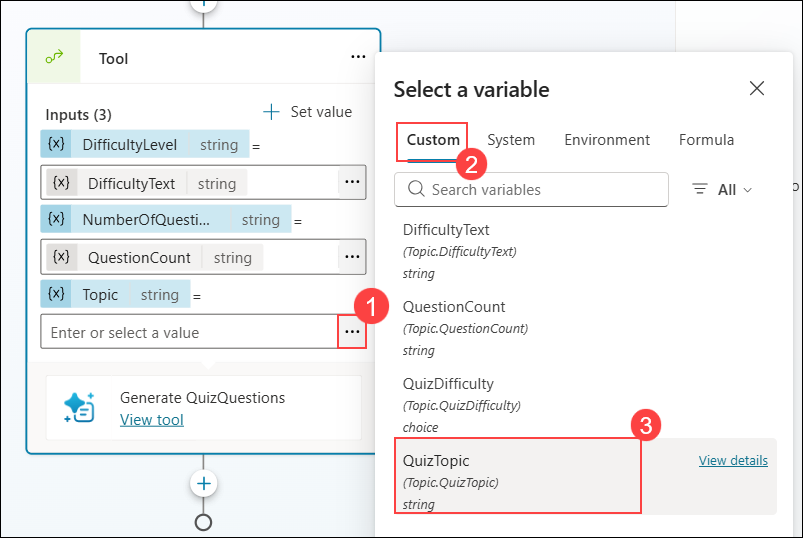

1. Select **Save** to store the latest changes to the topic.

   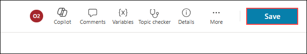

### Task : Test the Complete Quiz Generator

In this task, you will perform comprehensive testing of the quiz generator.

1. Select **Test** in the top menu to open the testing panel and validate the topic flow.

   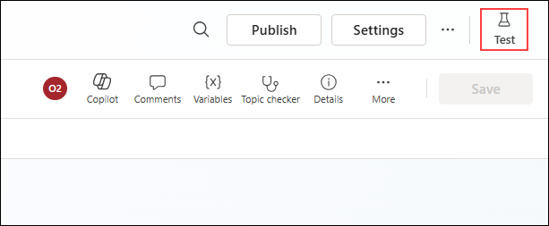

1. **Test 1 - Complete Flow:**

   ```
   Can you help me create a quiz?
   ```

   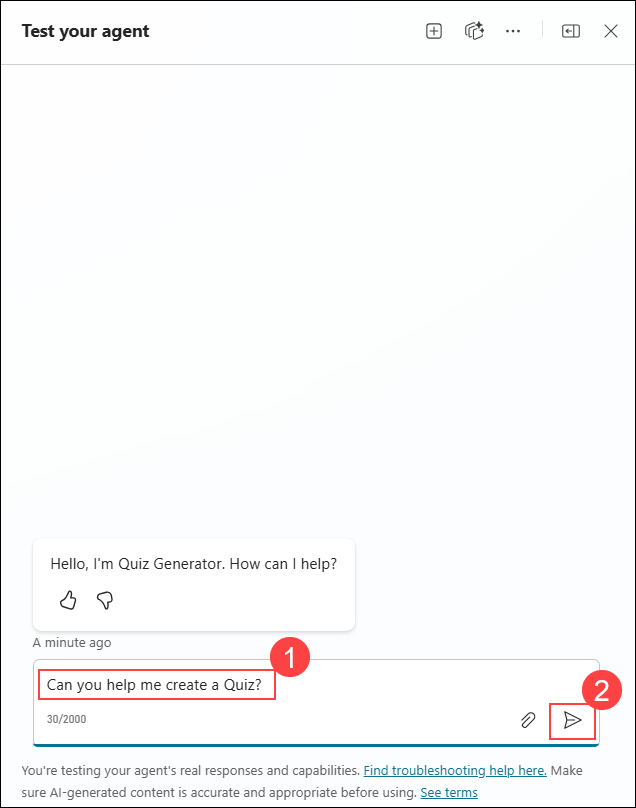

1. In the test chat panel, enter a topic in the message box **(1)**, and then select **Send (2)** to continue the conversation.

   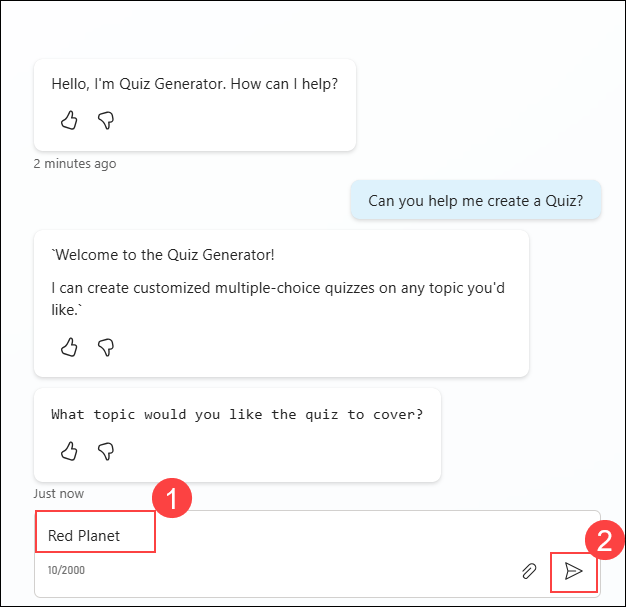

1. In the test chat panel, enter the number of questions in the input field **(1)**, and then select **Send (2)** to proceed.

   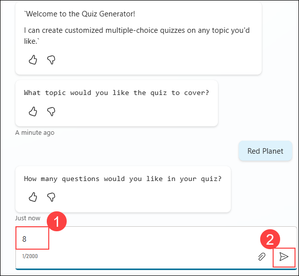

1. In the test chat panel, select a difficulty option, such as **Intermediate**, to continue the quiz setup.

   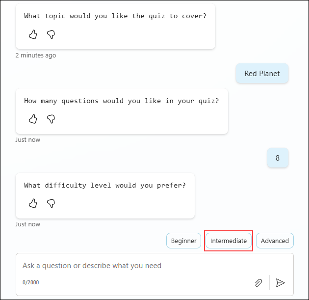

1. Wait for the confirmation message to display while the agent generates the quiz content.

   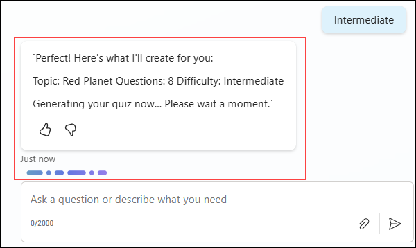

### Task 5: Publish and Deploy to Teams (Optional)

In this task, you will publish the Quiz Generator and optionally deploy it to Microsoft Teams.

1. Once testing is complete.

1. Select **Publish** in the top menu to make the updated topic available.

   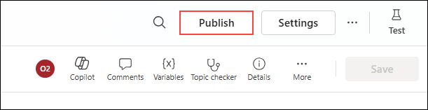

1. In the **Publish this agent** dialog, select **Publish** to confirm and deploy the latest changes.

   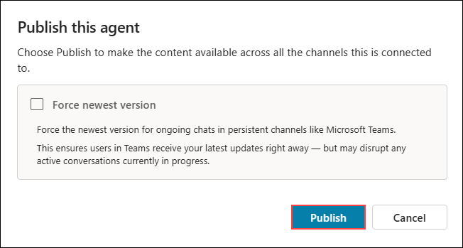

1. **(Optional) Deploy to Microsoft Teams:**

   - Click on **Channels** in the left navigation
   - Select **Microsoft Teams**

   

1. Click **Turn on Teams** to enable the Teams channel.

   

1. Configure Teams availability:

   - Select **Show to everyone in my org** or **Show to users or groups**
   - Click **Submit for admin approval** (or **Add to Teams** if you have permissions)

   

1. Click **Open the app in Teams** to test in Teams.

   

1. In Microsoft Teams, test the Quiz Generator:

   **Prompt:**
   ```
   Create a quiz about cloud computing
   ```

   

1. Verify the complete flow works correctly in Teams:

   - Welcome message displays
   - All questions are asked correctly
   - Quiz is generated and displayed
   - Follow-up options work

   

## Summary

In this exercise, you built a complete conversational topic that integrates the prompt action for quiz generation. You learned how to:

- Create topics with multiple trigger phrases for natural language activation
- Build multi-step conversation flows with questions and messages
- Use variables to collect and pass user inputs
- Connect prompt actions to topics with proper input mapping
- Handle follow-up actions with condition branches
- Test conversational flows comprehensively
- Publish and deploy agents to Microsoft Teams

Your Quiz Generator agent is now a complete solution that can:
- Generate quizzes on any topic
- Support multiple difficulty levels (Beginner, Intermediate, Advanced)
- Create 3, 5, 7, or 10 questions per quiz
- Provide answer keys with explanations
- Allow users to generate multiple quizzes in one session
- Be accessed through Teams (if deployed)

## Congratulations!

You have successfully completed all exercises in this lab! You've learned how to:

1. **Create Copilot Agents** with custom instructions and knowledge bases
2. **Integrate Freshdesk** for professional ticketing workflows
3. **Build AI-generated Topics** using natural language descriptions
4. **Create Power Automate Flows** for automation
5. **Deploy to Microsoft Teams** for organization-wide access
6. **Implement Prompt Actions** for custom AI content generation
7. **Build Conversational Topics** for interactive user experiences

These skills enable you to build powerful AI-powered solutions using Microsoft Copilot Studio that can transform how your organization handles support, education, and automation.

### You have successfully completed all exercises in this lab!
