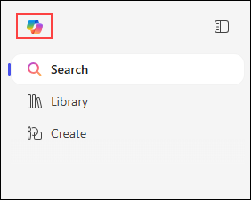

# Exercise 2: Use the Researcher Agent to Surface Insights and Produce Professional Outputs

## Estimated Duration: 45 Minutes

## Overview

In this exercise, you will explore the Researcher Agent in Microsoft 365 Copilot. The Researcher Agent is designed to help users gather information, organize content, and produce professional-quality outputs. It can research topics, synthesize information from multiple sources, and create structured documents.

You will use the Researcher Agent to research a business topic, organize findings, and produce a professional report.

## Exercise Objectives

In this exercise, you will complete the following tasks:

- Task 1: Access the Researcher Agent
- Task 2: Research a business topic
- Task 3: Organize and synthesize information
- Task 4: Create structured content
- Task 5: Produce a professional report

### Task 1: Access the Researcher Agent

In this task, you will navigate to Microsoft 365 Copilot and access the Researcher Agent.

1. On the Microsoft 365 home page, click on the **Copilot** icon from the left navigation panel.

   

1. In the Copilot interface, click on the **Agents** button on the right side panel.

   

1. In the agents panel, browse or search for the **Researcher** agent.

   

1. Click on the **Researcher** agent to open it. You will see the Researcher interface with a prompt box asking **"What do you want to research today?"**

   

1. Notice the quick action cards available on the Researcher home page:

   | Quick Action | Description |
   |--------------|-------------|
   | **Project update** | Executive status report on a project |
   | **Topic report** | Get updates on any topic |
   | **Customer brief** | Prepare for a meeting with a customer |
   | **Market analysis** | Analyze the market position of a company |
   | **Meeting prep** | Prepare for upcoming meetings |
   | **Daily briefing** | Show today's updates, tasks, and meetings |

   

1. Also notice the input options:
   - **+** button to add attachments
   - **Computer use** option for advanced scenarios
   - **Sources** to specify research sources
   - **Microphone** icon for voice input

   >**Note:** The Researcher agent can access web sources, your Microsoft 365 data (emails, files, calendar), and any sources you explicitly add.

### Task 2: Research a Business Topic

In this task, you will use the Researcher Agent to research a business topic.

1. You can either click on one of the quick action cards or type directly in the prompt box. Let's start with a custom research topic. In the **"What do you want to research today?"** box, type:

   **Prompt:**
   ```
   I need to research the topic of "AI adoption in enterprise organizations". Please provide:
   1. An overview of current AI adoption trends
   2. Key benefits organizations are seeing
   3. Common challenges and barriers
   4. Best practices for successful implementation
   ```

   

   >**Note:** The Researcher agent may ask clarifying questions before proceeding, such as:
   >- Are you looking for global trends or specific region/industry?
   >- Do you want recent data or broader historical perspective?
   >- Are you interested in real-world case studies?
   >
   >You can either answer these questions or simply respond with **"go ahead"** to let the Researcher use its best judgment.

   The Researcher will then ask you to choose a report length:
   
   - **Short** (1 to 5 pages)
   - **Long** (5+ pages)

   Select **Short** for a concise report.

   **Expected Output:**

   The Researcher Agent will display "Searching" or "Gathering information" status while compiling the research, then provide a comprehensive report including:

   - **Current Trends:** Growth statistics, adoption rates, and emerging patterns
   - **Key Benefits:** Productivity gains, cost savings, improved decision-making
   - **Challenges:** Data quality, talent gaps, change management, ethical concerns
   - **Best Practices:** Start small, focus on data quality, build cross-functional teams

   

   >**Note:** The actual content and depth may vary based on the Researcher's sources and the report length you selected.

1. Dig deeper into specific areas:

   **Prompt:**
   ```
   Expand on the implementation challenges. What are the top 5 reasons AI projects fail in enterprises, and what can organizations do to avoid these pitfalls?
   ```

   

   The Researcher may again ask for report length preference. Select your preferred option.

   **Expected Output:**

   The Researcher will provide detailed analysis of common failure points such as:

   - **Unclear business objectives** - Starting with technology instead of business problems
   - **Poor data quality** - Insufficient or unreliable data for training models
   - **Lack of executive sponsorship** - Missing leadership commitment and resources
   - **Talent gaps** - Shortage of skilled AI/ML professionals
   - **Change resistance** - Organizational culture not ready for AI-driven processes

   

   >**Tip:** If the response doesn't include specific details you need, you can ask follow-up questions like "Can you provide specific examples?" or "What are the top 3 mitigation strategies?"

1. Now try using one of the quick action cards. Click on **Market analysis** and enter a company name like **Microsoft** to see how the Researcher analyzes market positioning.

   

   **Expected Output:**

   The Researcher will provide market analysis covering competitive landscape, market share, strategic positioning, and recent developments.

   

1. Request industry-specific insights:

   **Prompt:**
   ```
   How does AI adoption differ across industries? Compare AI adoption patterns in financial services, healthcare, and manufacturing sectors.
   ```

   

   **Expected Output:**

   The Researcher will provide a comparative analysis across the three sectors, highlighting differences in adoption rates, use cases, and challenges.

   

   >**Note:** If you need more detail on a specific industry, ask a follow-up question like "Can you expand on healthcare AI adoption challenges?"

### Task 3: Organize and Synthesize Information

In this task, you will have the Researcher Agent organize and synthesize the gathered information.

1. Request a structured outline:

   **Prompt:**
   ```
   Based on the research we have gathered, create a detailed outline for a whitepaper titled "Enterprise AI Adoption: A Strategic Guide for Business Leaders". Include main sections and subsections.
   ```

   

   **Expected Output:**

   The Researcher Agent creates a comprehensive outline with main sections and subsections for the whitepaper, such as:

   - Executive Summary
   - Introduction
   - The State of Enterprise AI Adoption
   - Strategic Drivers of AI Adoption
   - Core Use Cases by Industry
   - Barriers to AI Adoption
   - Cross-Industry Lessons and Best Practices
   - Recommendations for Business Leaders
   - Conclusion

   

   >**Note:** The outline structure may vary. If you need more detail in specific sections, you can ask "Can you expand section 3 with more subsections?"

1. Ask for key takeaways:

   **Prompt:**
   ```
   Synthesize all the information we have discussed into 10 key takeaways that a C-level executive should know about AI adoption.
   ```

   

   **Expected Output:**

   

1. Request a comparison framework:

   **Prompt:**
   ```
   Create a comparison table that organizations can use to evaluate their AI readiness. Include categories like data infrastructure, talent, culture, and governance, with maturity levels from beginner to advanced.
   ```

   

   **Expected Output:**

   The Researcher will provide a maturity assessment table with categories and levels. If the initial response doesn't include a visual table, you can ask: **"Can you format this as a table?"** or **"Can you turn this into a presentation slide?"**

   

   >**Important:** The Researcher may ask if you want this formatted as a presentation or printable assessment tool. Choose the format that best suits your needs.

### Task 4: Create Structured Content

In this task, you will use the Researcher Agent to create different types of structured content.

1. Create an infographic description:

   **Prompt:**
   ```
   Describe an infographic that visualizes the AI adoption journey for enterprises. Include 5-6 stages with key activities and milestones for each stage.
   ```

   

   **Expected Output:**

   The Researcher will describe an infographic concept with stages such as:

   - **Stage 1: Awareness & Exploration** - Executive briefings, vendor demos, identifying problems
   - **Stage 2: Strategy & Planning** - Define vision, identify use cases, assess readiness
   - **Stage 3: Pilot & Experimentation** - Develop POCs, measure outcomes
   - **Stage 4: Operationalization** - Build MLOps, integrate into workflows
   - **Stage 5: Scaling & Integration** - Expand across business units
   - **Stage 6: Optimization & Innovation** - AI drives strategic decision-making

   

   >**Note:** The Researcher describes the infographic concept but doesn't create actual visuals. If you need the visual created, you would need to use design tools or ask: "Can you turn this into a visual presentation format?"

1. Create a checklist:

   **Prompt:**
   ```
   Create a comprehensive AI readiness checklist that organizations can use before starting their AI journey. Organize it by category with specific actionable items.
   ```

   

   **Expected Output:**

   

1. Create FAQ content:

   **Prompt:**
   ```
   Generate a FAQ section with 8-10 common questions that business leaders ask about AI adoption, along with clear and concise answers.
   ```

   

   **Expected Output:**

   

### Task 5: Produce a Professional Report

In this task, you will have the Researcher Agent produce a professional report.

>**Important Note:** The Researcher agent works best through iteration. Don't expect perfect output on the first try. You may need to:
>- Request clarifications or expansions
>- Ask for specific formatting (tables, lists, sections)
>- Refine the tone or length
>- Request visual formats when needed
>
>This back-and-forth is normal and helps produce better results.

1. Request an executive summary:

   **Prompt:**
   ```
   Write a professional executive summary (400-500 words) for the AI adoption whitepaper. It should capture the key findings, recommendations, and call to action for business leaders.
   ```

   

   **Expected Output:**

   The Researcher Agent creates a polished executive summary covering:
   - Overview of AI's transformative potential
   - Key findings on adoption trends
   - Strategic imperatives for business leaders
   - Clear call to action

   

   >**Tip:** If the summary is too long or too short, you can say "Make this more concise" or "Expand on the recommendations section."

1. Create an introduction section:

   **Prompt:**
   ```
   Write the introduction section for the whitepaper. Set the context for why AI adoption is critical now, the opportunity it presents, and what readers will learn from this document.
   ```

   

   **Expected Output:**

   

1. Create a conclusion with recommendations:

   **Prompt:**
   ```
   Write the conclusion section with 5 specific recommendations for organizations looking to accelerate their AI adoption. Each recommendation should be actionable and prioritized.
   ```

   

   **Expected Output:**

   

1. Request the complete document structure:

   **Prompt:**
   ```
   Compile all the sections we have created into a complete document outline with the executive summary, introduction, main content sections, and conclusion. Show how they flow together.
   ```

   

   **Expected Output:**

   The Researcher will provide a complete document structure showing how all sections flow together, from executive summary through to conclusion.

   

   >**Pro Tip:** At this point, you could ask the Researcher:
   >- "Can you export this as a Word document?" (Note: You may need to copy/paste the content)
   >- "Can you create a PowerPoint presentation version?"
   >- "Can you add visual elements or charts?"
   >
   >The Researcher will guide you on available options for output formats.

## Summary

In this exercise, you explored the Researcher Agent in Microsoft 365 Copilot. You learned how to:

- Access and activate the Researcher Agent
- Research business topics comprehensively
- Organize and synthesize information effectively
- Create various types of structured content
- Produce professional reports and documents
- Work iteratively with the Researcher to refine outputs

The Researcher Agent is valuable for creating well-researched, professional-quality content quickly and efficiently.

## Key Takeaways

- **The Researcher asks clarifying questions** - Be prepared to specify report length, focus areas, or provide additional context
- **Iteration is normal** - Don't expect perfect results on the first prompt; refine through follow-up questions
- **Request specific formats** - If you need tables, lists, or presentations, explicitly ask for them
- **AI-generated content varies** - Responses will differ based on sources, context, and how you frame questions
- **Back-and-forth is valuable** - The best results come from an interactive conversation, not single prompts

### You have successfully completed this exercise. Click on Next to proceed to the next exercise.
