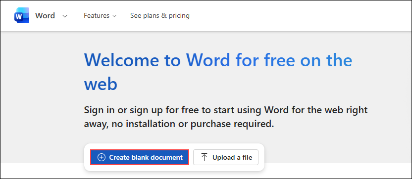
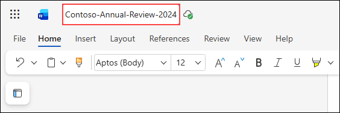
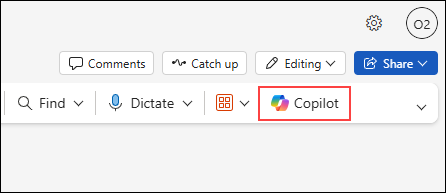
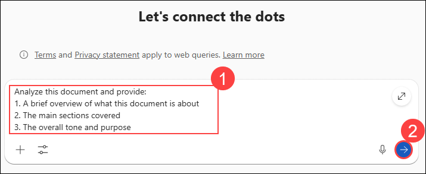

# Exercise 3: Explore Document Analyzer Agent to Ask Questions, Analyze Content, and Transform Documents in Word

## Estimated Duration: 45 Minutes

## Overview

In this exercise, you will explore the Document Analyzer Agent in Microsoft 365 Copilot. The Document Analyzer Agent is designed to help users understand, analyze, and transform documents. It can answer questions about document content, extract key information, summarize lengthy documents, and help transform content into different formats.

You will use the Document Analyzer Agent to analyze a business document, extract insights, and transform the content for different purposes.

## Exercise Objectives

In this exercise, you will complete the following tasks:

- Task 1: Access the Document Analyzer Agent
- Task 2: Analyze document content
- Task 3: Extract key information
- Task 4: Transform document content

### Task 1: Access the Document Analyzer Agent

In this task, you will navigate to Microsoft 365 and access the Document Analyzer Agent in Word.

1. On the Microsoft 365 home page, click on **Apps (1)** in the left navigation pane, then select **Word (2)** to open Word Online.

   

1. Click **New blank document** to create a new document.

   

1. First, let us create a sample business document to analyze. Copy and paste the following content into the document:

   ```
   ANNUAL BUSINESS REVIEW 2024
   Contoso Corporation

   EXECUTIVE SUMMARY

   Contoso Corporation achieved significant milestones in fiscal year 2024, with total revenue reaching $4.2 billion, representing a 15% year-over-year increase. This growth was driven primarily by our cloud services division, which saw a 28% increase in subscription revenue.

   KEY FINANCIAL HIGHLIGHTS

   - Total Revenue: $4.2 billion (up 15% YoY)
   - Cloud Services Revenue: $1.8 billion (up 28% YoY)
   - Enterprise Solutions Revenue: $1.5 billion (up 8% YoY)
   - Consumer Products Revenue: $0.9 billion (up 5% YoY)
   - Operating Margin: 22% (up from 19% in 2023)
   - Net Income: $756 million (up 24% YoY)
   - Employee Count: 12,500 (up from 10,800)

   STRATEGIC INITIATIVES

   1. Cloud Transformation
   We successfully migrated 85% of enterprise customers to our cloud platform, exceeding our target of 75%. Customer satisfaction scores for cloud services improved to 4.6 out of 5.

   2. AI Integration
   Launched AI-powered features across all product lines. Early adoption rates exceeded expectations with 40% of customers actively using AI features within the first quarter of launch.

   3. Market Expansion
   Entered three new international markets: Japan, Brazil, and Germany. These markets contributed $180 million in revenue, with Japan being the strongest performer at $95 million.

   4. Sustainability Goals
   Achieved carbon neutrality in our data center operations. Reduced overall carbon footprint by 35% compared to 2022 baseline.

   CHALLENGES AND RISKS

   - Increased competition in the cloud services market from established players
   - Talent acquisition remains challenging in AI and machine learning roles
   - Supply chain constraints affected hardware product deliveries in Q2
   - Currency fluctuations impacted international revenue by approximately 3%

   OUTLOOK FOR 2025

   We project continued growth with revenue expected to reach $4.8-5.0 billion. Key focus areas include:
   - Expanding AI capabilities across all products
   - Achieving 95% cloud migration for enterprise customers
   - Launching in five additional international markets
   - Investing $500 million in R&D for next-generation technologies

   The board recommends a 10% increase in dividend payments to shareholders, reflecting our strong financial position and confidence in future growth.
   ```

1. Save the document and name it:

   ```
   Contoso-Annual-Review-2024
   ```

   

1. With the document open, click on the **Copilot** icon in the toolbar to access Copilot in Word.

   

### Task 2: Analyze Document Content

In this task, you will use Copilot to analyze the document content.

>**Note:** Copilot in Word analyzes the document you have open. Make sure the Contoso-Annual-Review-2024 document is the active document before proceeding.

1. In the **Copilot** pane, enter the analysis prompt in the **message box (1)**, and then select **Send (2)**.

   ```
   Analyze this document and provide:
   1. A brief overview of what this document is about
   2. The main sections covered
   3. The overall tone and purpose
   ```

   

   **Expected Output:**

   

   Copilot will analyze the document and provide:
   - **Brief Overview:** Identifies this as a corporate annual business review covering fiscal year 2024 performance
   - **Main Sections:** Executive Summary, Key Financial Highlights, Strategic Initiatives, Challenges and Risks, Outlook for 2025
   - **Tone and Purpose:** Professional, optimistic yet balanced; designed for stakeholder communication

   >**Troubleshooting:** If Copilot responds that it cannot find content or the document appears empty:
   >- Check that you're in the correct document (Contoso-Annual-Review-2024)
   >- Scroll through the document to ensure all content is visible
   >- Try asking a more specific question like "What is the total revenue mentioned?"
   >- Save the document and refresh if needed

1. Request a deeper analysis:

   **Prompt:**
   ```
   What are the key performance indicators (KPIs) mentioned in this document? List them with their values and year-over-year changes.
   ```

   

   **Expected Output:**

   Copilot will extract and list KPIs such as:
   - Total Revenue: $4.2B (↑15% YoY)
   - Cloud Services Revenue: $1.8B (↑28% YoY)
   - Operating Margin: 22% (↑3 percentage points from 19%)
   - Net Income: $756M (↑24% YoY)
   - Employee Count: 12,500 (↑15.7% from 10,800)

      

   >**Note:** If you want the data in a specific format, you can ask: "Can you format this as a table?" or "Can you show this as a comparison chart?"

1. In the **Copilot** pane, enter the sentiment analysis prompt, and then submit it.

   ```
   What is the overall sentiment of this report? Is it optimistic, cautious, or neutral? Provide evidence from the text to support your assessment.
   ```

   

   **Expected Output:**

   Copilot will assess the overall sentiment as **Optimistic** with supporting evidence:
   - Positive language: "significant milestones," "exceeded our target," "exceeded expectations"
   - Strong financial performance: 15% revenue growth, 24% net income increase
   - Successful strategic initiatives: 85% cloud migration vs 75% target
   - Forward-looking confidence: Board recommending 10% dividend increase
   
   However, it will note balanced reporting with acknowledgment of challenges (competition, talent acquisition, supply chain).

   >**Note:** If Copilot cannot assess sentiment, it means it couldn't access the document text. Verify the document is open and has content.

### Task 3: Extract Key Information

In this task, you will extract specific information from the document.

1. In the **Copilot** pane, enter the financial data extraction prompt in the **message box (1)**, and then select **Send (2)**.

   ```
   Create a table summarizing all financial figures mentioned in this document, including revenue, margins, and growth percentages.
   ```

   

   **Expected Output:**

   Copilot will create a comprehensive financial table:

   | **Metric** | **2024 Value** | **2023 Value** | **YoY Change** |
   |------------|----------------|----------------|----------------|
   | Total Revenue | $4.2B | $3.65B | +15% |
   | Cloud Services | $1.8B | $1.41B | +28% |
   | Enterprise Solutions | $1.5B | $1.39B | +8% |
   | Consumer Products | $0.9B | $0.86B | +5% |
   | Operating Margin | 22% | 19% | +3 pp |
   | Net Income | $756M | $610M | +24% |
   | Employees | 12,500 | 10,800 | +15.7% |

   

   >**Note:** If the table isn't formatted exactly as you need, you can refine with:
   >- "Can you add a column for dollar change (not just percentage)?"
   >- "Can you highlight which metrics exceeded 20% growth?"
   >- "Can you format this for Excel import?"

1. In the **Copilot** pane, enter the future plans and commitments prompt in the **message box (1)**, and then select **Send (2)**.

   ```
   What are all the future plans and commitments mentioned in this document? List them as action items with specific targets.
   ```

   

   **Expected Output:**

   Copilot will extract future commitments as actionable items:

   **2025 Action Items:**
   1. ☐ Achieve revenue of $4.8-5.0B (16-19% growth target)
   2. ☐ Reach 95% cloud migration for enterprise customers (up from 85%)
   3. ☐ Launch in 5 additional international markets
   4. ☐ Invest $500M in R&D for next-generation technologies
   5. ☐ Expand AI capabilities across all products
   6. ☐ Implement 10% dividend increase to shareholders

   >**Note:** You can ask Copilot to: "Organize these by priority" or "Add responsible parties and deadlines based on industry best practices"

1. In the **Copilot** pane, enter the key dates and timelines prompt in the **message box (1)**, and then select **Send (2)**.```

   ```
   List all time-related references in this document, including years, quarters, and future projections.
   ```

   

### Task 4: Transform Document Content

In this task, you will transform the document content into different formats.

1. Review the existing **Key Financial Highlights** section in the document to understand the current formatting and structure used for financial information.

   

1. In the **Copilot** pane, select **Options (1)**, and then choose **Agent mode (2)** to allow direct edits to the document.```

   

1. In the **Copilot** pane, enter the formatting update prompt in the **message box (1)**, and then select **Send (2)**.

   ```
   Update the formatting of the Key Financial Highlights section in the Word document to use clear sub-numbering instead of bullet points, with consistent spacing and emphasis for key metrics.
   ```

   

   **Expected Output:**

   Copilot automatically updates the **Key Financial Highlights** section in the document

   

1. Review the document and continue interacting with **Copilot** to update, refine, or transform any section of the Word file as needed using prompts and direct edits.

1. In the **Copilot** pane, enter the risk perspective rewrite prompt in the **message box (1)**, and then select **Send (2)**.

   ```
   Rewrite the challenges section from a risk management perspective, categorizing each challenge by risk level (high, medium, low) and suggesting mitigation strategies.
   ```

   

   **Expected Output:**

   Copilot will reframe challenges as risks with mitigation strategies:

   **HIGH RISK:**
   - **Increased Cloud Competition**
     - *Impact:* Revenue growth and margin pressure
     - *Mitigation:* Accelerate AI differentiation, strengthen customer success programs, competitive pricing strategy

   **MEDIUM RISK:**
   - **AI/ML Talent Shortage**
     - *Impact:* Delayed product innovation
     - *Mitigation:* Strategic partnerships, acquisition targets, enhanced employee development programs
   
   - **Currency Fluctuations (3% impact)**
     - *Impact:* International revenue volatility
     - *Mitigation:* Currency hedging strategies, localized pricing models

   **LOW RISK:**
   - **Supply Chain Constraints (Q2 only)**
     - *Impact:* Limited hardware delivery delays
     - *Mitigation:* Diversify supplier base, increase inventory buffers

   >**Note:** Risk categorization may vary based on Copilot's interpretation. You can refine by asking: "Can you justify why each risk is rated at that level?"

1. In the **Copilot** pane, enter the email drafting prompt in the **message box (1)**, and then select **Send (2)**.

   ```
   Draft a brief email to the board of directors highlighting the top 3 achievements and top 3 focus areas for 2025 based on this report.
   ```

   

   **Expected Output:**

   Copilot will draft a concise board email:

   ```
   Subject: FY2024 Results Summary and 2025 Strategic Focus

   Dear Board Members,

   I'm pleased to share Contoso's strong FY2024 performance:

   Top 3 Achievements:
   1. Revenue Growth: Achieved $4.2B (↑15% YoY) with exceptional cloud performance (↑28%)
   2. Strategic Execution: Exceeded cloud migration target (85% vs 75% goal) with 4.6/5 satisfaction
   3. Market Expansion: Successfully entered Japan, Brazil, and Germany, contributing $180M

   Top 3 Focus Areas for 2025:
   1. Revenue Target: $4.8-5.0B through AI expansion and cloud acceleration to 95% migration
   2. Innovation Investment: $500M R&D commitment for next-generation technologies
   3. Global Growth: Launch in 5 additional international markets

   Full annual review attached. We recommend a 10% dividend increase reflecting our strong position.

   Best regards,
   [Name]
   ```

   >**Customization Options:** You can refine the email by asking:
   >- "Make this more formal/casual"
   >- "Add a section about challenges"
   >- "Make it shorter (3 bullets each instead of full paragraphs)"
   >- "Change the tone to be more cautious about 2025 targets"

## Summary

In this exercise, you explored the Document Analyzer capabilities in Microsoft 365 Copilot for Word. You learned how to:

- Access Copilot in Word for document analysis
- Analyze document content and structure
- Ask specific questions about document content
- Extract key information into structured formats
- Transform document content for different purposes
- Iterate and refine outputs to get exactly what you need

The Document Analyzer capabilities help you quickly understand, analyze, and repurpose document content for various business needs.

## Key Takeaways

**Document Requirements:**
- Copilot needs readable text content in the active document to perform analysis
- If you get "no content found" errors, verify the document is open and contains text
- Save your document before running complex analysis to avoid losing work

**Question Quality Matters:**
- More specific questions yield better, more focused answers
- Breaking complex questions into smaller parts often produces better results
- You can build on previous answers with follow-up questions

**Iterative Refinement:**
- First responses may not be exactly what you need - that's normal
- Use follow-up prompts to refine format, tone, length, or focus
- Asking "Can you format this as a table/list/email?" often improves usability

**Copilot's Capabilities:**
- Can perform calculations and comparisons based on document data
- Can make logical inferences connecting different parts of the document
- Can transform content into multiple formats (summaries, tables, emails, bullet points)
- Works best with explicitly stated information; struggles with implicit or missing data

**Common Follow-Up Prompts:**
- "Can you make this more concise?"
- "Can you format this as a table?"
- "Can you provide more specific evidence?"
- "Can you show your calculations?"
- "Can you adjust the tone to be more [formal/casual/optimistic/cautious]?"

### You have successfully completed this exercise. Click on Next to proceed to the next exercise.
