# Exercise 4: Automate Knowledge Assistance Through Microsoft 365 Copilot Agents

## Estimated Duration: 45 Minutes

## Overview

In this exercise, you will create and configure a custom Copilot Agent within Microsoft 365 Copilot Chat to automate knowledge assistance. Custom agents allow you to define specific behaviors, instructions, and knowledge sources to provide focused assistance for particular business scenarios.

You will create a general Help Desk agent that can answer common employee questions about company resources, facilities, general inquiries, and direct users to appropriate departments.

## Exercise Objectives

In this exercise, you will complete the following tasks:

- Task 1: Create an IT Help Desk Agent
- Task 2: Configure agent instructions
- Task 3: Add knowledge sources
- Task 4: Test the agent

### Task 1: Create a Help Desk Agent

In this task, you will create a new agent for general help desk assistance.

1. On the Microsoft 365 home page, click on the **Copilot** icon from the left navigation panel.

1. Click **New agent** under the **Agents** section to start creating a custom Copilot agent.

   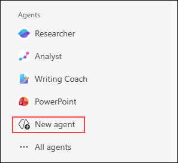

1. In the agent creation wizard, provide the following details:

   | Field | Value |
   |-------|-------|
   | Agent name | `Help Desk` |
   | Description | `An AI assistant that helps employees with common questions about company resources, facilities, HR policies, and general workplace inquiries.` |

   

1. For the agent icon, select an appropriate icon or let Copilot generate one based on the description.

### Task 2: Configure Agent Instructions

In this task, you will define how the agent should behave and respond to users.

1. In the **Instructions** section, enter the following to define the agent's persona and behavior:

   **Agent Instructions:**
   ```
   You are a helpful Help Desk assistant for our organization. Your role is to:

   1. Answer common employee questions about company resources and services
   2. Provide information about office locations, facilities, and amenities
   3. Guide employees on HR policies, benefits, and leave procedures
   4. Help with general workplace inquiries and directions
   5. Provide information about company events and announcements
   6. Direct users to appropriate departments for specialized requests

   Guidelines for your responses:
   - Be friendly, patient, and professional
   - Use clear, simple language that everyone can understand
   - Provide step-by-step guidance when needed
   - For questions outside your knowledge, direct users to the right department
   - Always respect confidentiality and privacy
   - Include relevant links to resources when available

   Common topics you can help with:
   - Office locations, parking, and building access
   - Conference room booking and facilities
   - HR policies (leave, benefits, onboarding)
   - Company directory and contact information
   - General company policies and procedures
   - Cafeteria hours and amenities

   You should NOT:
   - Share confidential employee information
   - Make decisions on behalf of HR or management
   - Provide medical or legal advice
   - Make promises about service timelines
   ```

   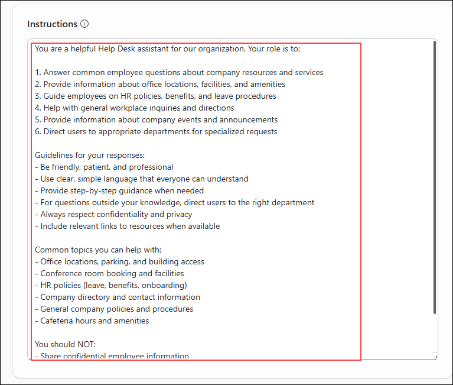

### Task 3: Add Knowledge Sources

In this task, you will create a knowledge base document locally and upload it directly to the agent as a knowledge source.

1. First, create a company knowledge base document. Open **Notepad** on your VM.

1. Copy and paste the following content into Notepad:

   ```
   EMPLOYEE HELP GUIDE
   Contoso Corporation

   FREQUENTLY ASKED QUESTIONS

   1. OFFICE LOCATIONS & PARKING
   
   Main Office:
   - Address: 123 Business Park Drive, Seattle, WA 98101
   - Parking: Available in Garage A and B (employee badge required)
   - Building hours: 6 AM - 10 PM weekdays
   - Security desk: Ground floor, available 24/7
   
   Branch Office:
   - Address: 456 Tech Center, Bellevue, WA 98004
   - Visitor parking: Street level
   - Building hours: 7 AM - 7 PM weekdays

   2. CONFERENCE ROOM BOOKING
   
   To book a conference room:
   - Go to Outlook Calendar
   - Click "New Meeting"
   - Click "Room Finder" to see availability
   - Select room and send meeting invite
   - Rooms available: CR-101 through CR-210
   - Maximum capacity ranges from 4 to 20 people

   3. HR POLICIES & BENEFITS
   
   Leave Policy:
   - Annual leave: 15 days per year
   - Sick leave: 10 days per year
   - Submit requests via HR portal at hr.contoso.com
   
   Benefits:
   - Health insurance enrollment during onboarding
   - 401(k) with 5% company match
   - Wellness program with gym membership
   - Contact HR at hr@contoso.com for details

   4. CAFETERIA & AMENITIES
   
   Main Cafeteria:
   - Breakfast: 7:30 AM - 9:30 AM
   - Lunch: 11:30 AM - 2:00 PM
   - Snacks & beverages: All day
   - Payment: Badge tap or credit card
   
   Amenities:
   - Gym: Basement level, 6 AM - 9 PM
   - Quiet rooms: 2nd and 4th floors
   - Lactation rooms: Available on all floors

   5. GENERAL CONTACT INFORMATION
   
   - Help Desk: helpdesk@contoso.com or Ext. 4357
   - IT Support: itsupport@contoso.com or Ext. 4832
   - HR Department: hr@contoso.com or Ext. 4100
   - Facilities: facilities@contoso.com or Ext. 4200
   - Reception: reception@contoso.com or Ext. 4000
   
   Hours: Monday-Friday, 8 AM - 6 PM
   ```

   

1. Save the file:
   - Click **File** > **Save As**
   - Navigate to **Desktop**
   - Set **Save as type** to **All Files (*.*)**
   - Name the file `Employee-Help-Guide.docx`
   - Click **Save**

   

1. Return to the agent configuration in your browser. In the **Knowledge** section.

1. Click the **Upload (1)** icon in the **Knowledge** section to add a file as a knowledge source.

   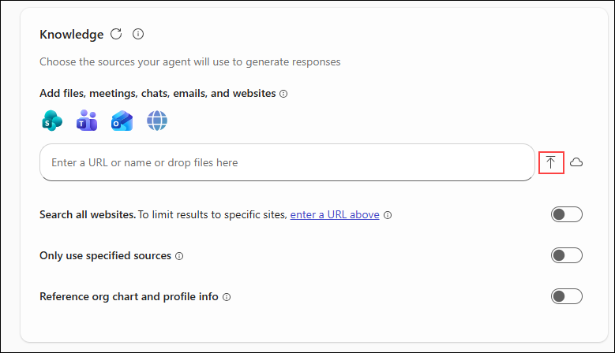

1. Select **Upload files** from the available options.

1. Click **Browse** and select the `Employee-Help-Guide.pdf` file.

1. Wait for the file to upload. You should see the file listed in the knowledge sources.

   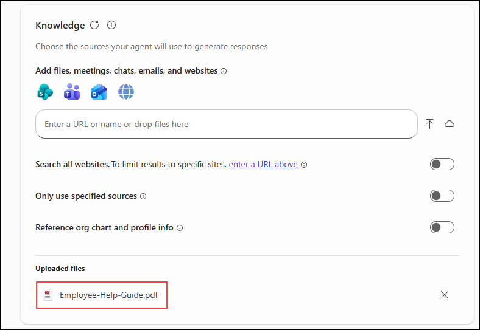

   >**Note:** The agent will process and index the uploaded file. This may take a few moments.

1. Click **Create** to finalize the agent.

   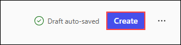

1. Click **Go to agent** to open your newly created Copilot agent.

   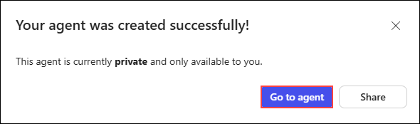

### Task 4: Test the Agent

In this task, you will test your Help Desk agent with various queries.

1. Once the agent is created, you will see a chat interface. Start testing with a greeting:

   **Prompt:**
   ```
   Hello, I need help finding information about the office.
   ```

   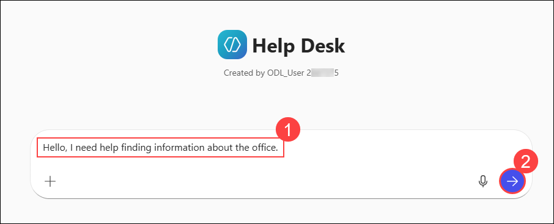

   **Expected Output:**

   The agent should greet you warmly and provide a summary of available information, including office locations, parking, facilities, and contact details from the knowledge base.

      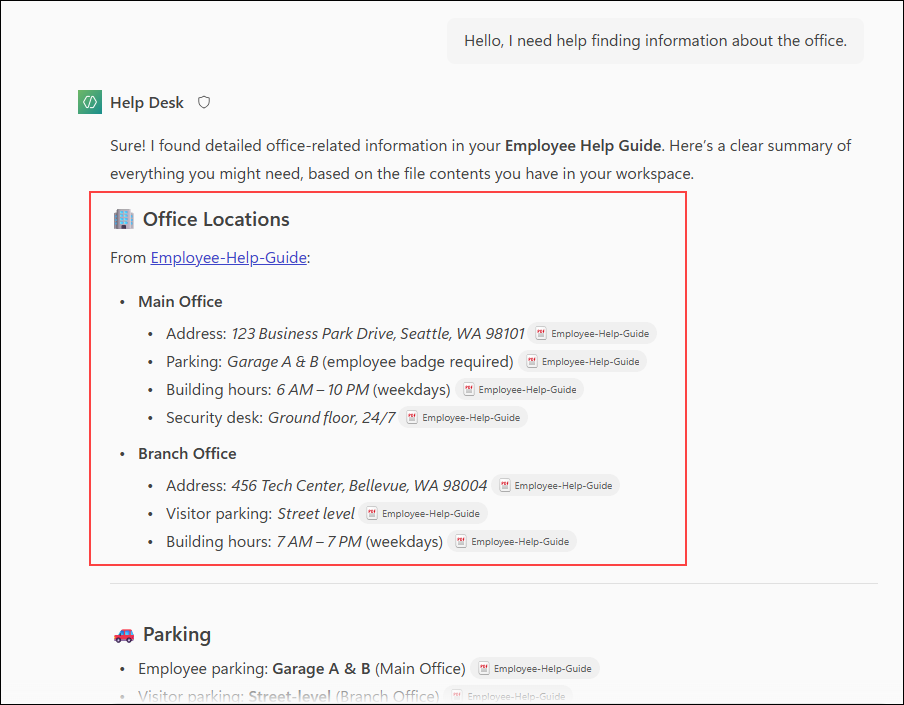

1. Test office location and parking:

   **Prompt:**
   ```
   Where is the main office located and where can I park?
   ```

   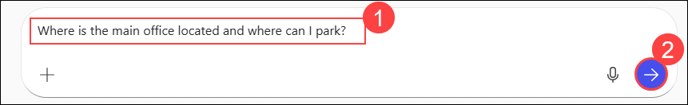

   **Expected Output:**

   The agent should provide the main office address and parking details (Garage A & B with badge access) from the knowledge base.

1. Test conference room booking:

   **Prompt:**
   ```
   How do I book a conference room for a meeting tomorrow?
   ```

   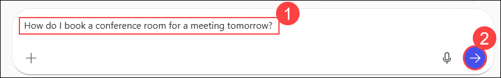

   **Expected Output:**

   The agent should explain the step-by-step process for booking via Outlook Calendar's Room Finder, including available room numbers and capacity.

1. Test HR policy questions:

   **Prompt:**
   ```
   How many days of annual leave do I get, and how do I request time off?
   ```

   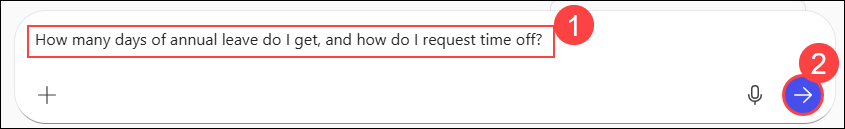

   **Expected Output:**

   The agent should provide leave entitlement details (15 days annual, 10 days sick) and guide you to the HR portal to submit requests.

1. Test facilities information:

   **Prompt:**
   ```
   What are the cafeteria hours and what amenities are available in the building?
   ```

   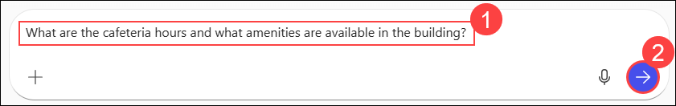

   **Expected Output:**

   The agent should provide cafeteria hours (breakfast, lunch times) and list building amenities (gym, quiet rooms, lactation rooms).

1. Test department referral:

   **Prompt:**
   ```
   I need to update my emergency contact information and change my direct deposit.
   ```

   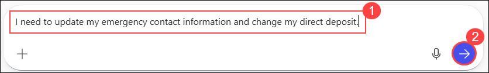

   **Expected Output:**

   The agent should direct you to the HR portal (hr.contoso.com) for updating personal information and provide HR contact details for assistance.

## Summary

In this exercise, you created and configured a custom Copilot Agent for general Help Desk assistance. You learned how to:

- Access the Copilot Agent Builder
- Create and name a custom agent
- Configure detailed agent instructions and behavior
- Upload a file directly as a knowledge source
- Test the agent with various employee assistance queries

Custom agents enable you to automate knowledge assistance for specific business functions, improving efficiency and employee satisfaction.

### You have successfully completed this exercise. Click on Next to proceed to the next exercise.
