# Exercise 5: Create and Configure a Copilot Agent in SharePoint to Deliver Contextual Answers

## Estimated Duration: 45 Minutes

## Overview

In this exercise, you will create a **SharePoint Agent** - an AI-powered assistant that is embedded directly within a SharePoint site. Unlike the M365 Copilot agent you created in Exercise 4, SharePoint Agents are designed to help users discover documents, extract insights, and find specific information within site content.

You will set up a SharePoint site for a law firm (Morrison & Associates) and upload various document types including Word documents and CSV files. The agent will help legal staff:
- Find specific case documents and client information
- Get insights from billing and case tracking data
- Navigate the document library and locate files efficiently

**Key Difference from Exercise 4:**

| Exercise 4 | Exercise 5 |
|------------|------------|
| M365 Copilot Agent | SharePoint Agent |
| Single file upload | Multiple file types (Word + CSV) |
| General assistance focus | Document discovery & data insights |
| Accessed via Copilot Chat | Embedded in SharePoint site |

## Exercise Objectives

In this exercise, you will complete the following tasks:

- Task 1: Create a Law Firm SharePoint site
- Task 2: Upload law firm documents to the site
- Task 3: Create a SharePoint Agent from the site
- Task 4: Configure the agent for document discovery and insights
- Task 5: Test the agent for document search and data analysis

>**Important:** This exercise requires the datasets that were downloaded in Exercise 1. If you haven't completed Exercise 1, please download and extract the datasets from: `https://github.com/Girish1704/github-copilot-for-managers/archive/refs/heads/Day1-datasets.zip`

### Task 1: Create a Law Firm SharePoint Site

In this task, you will create a SharePoint site to store law firm documents including case files, client information, and billing data.

1. On the Microsoft 365 home page, click on the **Copilot** icon from the left navigation panel.

   

1. In the left navigation pane, select **Apps (1)**, and then choose **SharePoint (2)** to open SharePoint.```

   

1. In SharePoint, select **Create (1)**, and then choose **Site (2)** to start creating a new site.

   

1. On the **Create a site** page, select **Team site** to create a collaborative workspace for your team.

   

1. On the **Select a template** page, choose the **Standard team** template to continue creating the team site.

   

1. On the **Preview and use 'Standard team' template** page, review the site details, and then select **Use template** to continue.

   

1. Select **Team site** and configure:

   | Field | Value |
   |-------|-------|
   | Site name | `Morrison Law Firm` |
   | Site description | `Document repository for Morrison & Associates Law Firm - case files, client data, and billing information` |
   | Privacy settings | Private |

   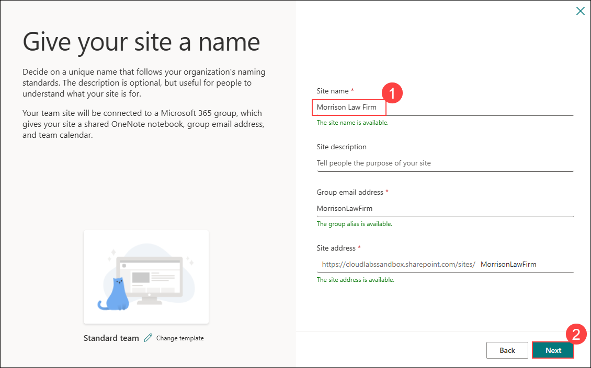

1. On the **Set language and other options** page, confirm **Private – only members can access this site (1)** under Privacy settings, and then select **Create site (2)**.

   

1. On the **Add site owners and members** page, select **Finish** to complete the site creation.

   

### Task 2: Upload Law Firm Documents to the Site

In this task, you will locate the law firm documents from the datasets you downloaded earlier and upload them to your SharePoint site. These documents include Word documents (contracts, case summaries, policies) and CSV files (client roster, case tracking, billing data).

1. In your SharePoint site, click **Documents (1)** in the left navigation, then click **Upload (2)** and select **Folder (3)** to create a new folder.

   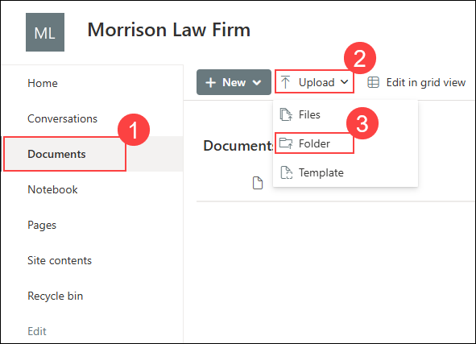

1. Navigate to the location where you extracted the datasets in Exercise 1, select the **law-data** folder, and upload it to the SharePoint **Documents** library.

   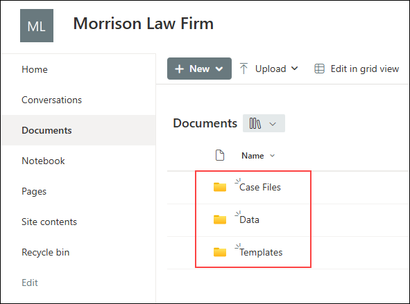

### Task 3: Create a SharePoint Agent from the Site

In this task, you will create a SharePoint Agent directly from within the SharePoint site. This agent will help legal staff discover documents and extract insights from both Word documents and CSV data.

1. In your SharePoint site, ensure you are on the **Documents** page or the site home page.

1. In the SharePoint **Documents** library, select **New (1)**, and then choose **Create an agent (2)** to start creating a new Copilot agent.

   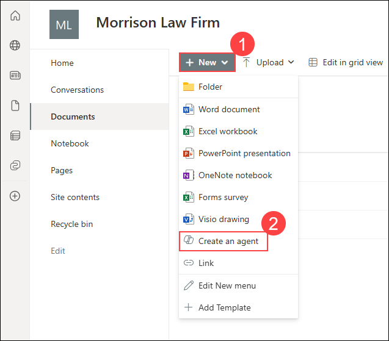

   >**Note:** The "Create an agent" option allows you to create an AI assistant that is scoped to the current SharePoint site's content.

1. Select **Overview (1)**, enter the agent name in the **Name (2)** field, then enter the purpose in the **Purpose (3)** box.

   | Field | Value |
   |-------|-------|
   | Name | `Legal Document Assistant` |
   | Purpose | `Helps legal staff find case documents, client information, billing data, and provides insights from firm records stored in this SharePoint site.` |

   

   >**Note:** A description in the Purpose field is required before you can create the agent.

1. (Optional) To change the agent icon, click **Change** below the icon and select a legal or document-related icon.

1. On the **Create your new agent** page, select **Sources (1)**, and then enable **Prioritize the knowledge sources you added (2)**.

   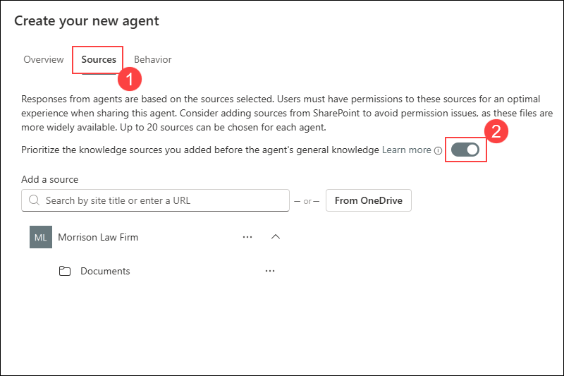

1. Verify that the **Morrison Law Firm** site is listed with the **Documents** folder expanded. This means the agent will have access to all documents in your site.

   >**Note:** Up to 20 sources can be chosen for each agent. You can add additional SharePoint sites or OneDrive files if needed.

1. Click on the **Behavior** tab to configure how the agent responds.

### Task 4: Configure the Agent for Document Discovery and Insights

In this task, you will configure the agent's behavior including welcome messaging, starter prompts, and custom instructions.

1. Select **Behavior (1)**, enter a welcome message in the **Welcome messaging (2)** box, enter the agent instructions in the **Agent instructions (3)** field, then click **Create (4)** to finish.

   ```
   Welcome to the Legal Document Assistant! How can I help you?
   ```

   In the **Agent instructions** field, replace the default text with the following:

   ```
   You are a Legal Document Assistant for Morrison & Associates Law Firm. Your role is to help legal staff find documents, extract information, and provide insights from firm records.

   DOCUMENT DISCOVERY:
   - Help users locate specific documents (contracts, case files, policies)
   - Identify which folder contains the requested document
   - Provide document names and their locations

   CASE INFORMATION:
   - Provide details about active cases from case summaries
   - Look up case status, deadlines, and assigned attorneys
   - Extract key dates and milestones from case documents

   CLIENT DATA:
   - Find client contact information from the client roster
   - Look up client engagement dates and assigned attorneys
   - Provide billing status and outstanding balances

   BILLING & FINANCIAL INSIGHTS:
   - Analyze billing data by attorney or time period
   - Calculate totals and identify trends
   - Provide fee schedule information for different services

   RESPONSE GUIDELINES:
   - Always cite the document and folder where information was found
   - For CSV data, provide specific values and calculations when asked
   - Reply in a professional, formal tone
   - For confidential matters, remind users about attorney-client privilege
   ```

   Click **Create** at the bottom of the dialog to create the SharePoint Agent.

   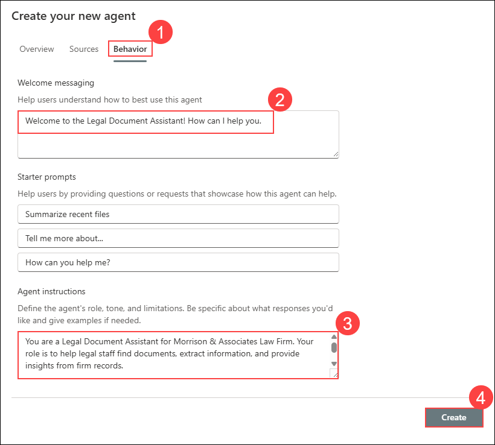

1. Click **Chat with agent** to start interacting with your newly created agent.

   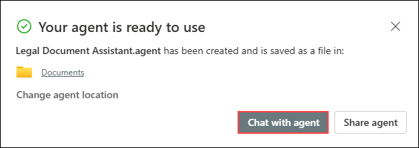

1. Use the **Message Copilot** box to enter your prompt and start interacting with the agent in Microsoft 365.

   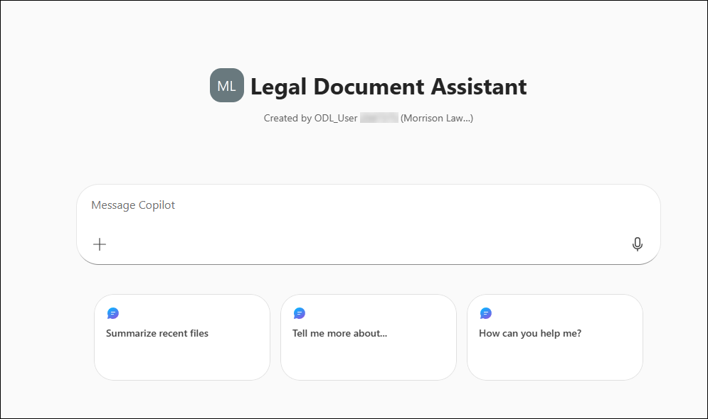

### Task 5: Test the Agent for Document Search and Data Analysis

In this task, you will test the SharePoint Agent's ability to find documents, locate specific information, and provide insights from the law firm data.

1. Once the agent is created, you will see the chat interface within SharePoint. Start with a document location question:

   **Prompt:**
   ```
   Where can I find the client contract template?
   ```

   

   **Expected Output:**

   The agent should identify that the **Client Contract Template** is located in the **Templates** folder and provide a brief description of its contents.

   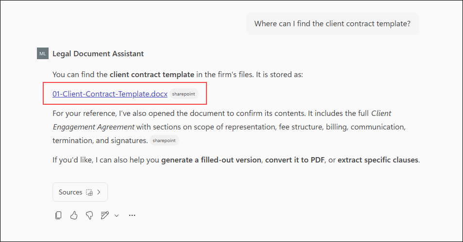

1. Test case information lookup:

   **Prompt:**
   ```
   What is the status of the Johnson v. Apex case? Who is the lead attorney and what are the next steps?
   ```

   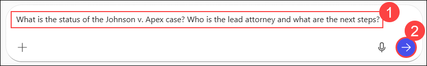

   **Expected Output:**

   The agent should provide details from the case summary including:
   - Case status: Discovery Phase
   - Lead Attorney: Sarah Morrison
   - Next deadline: Deposition scheduled
   - Estimated damages: $1,180,000+

1. Test client data lookup:

   **Prompt:**
   ```
   Look up the client TechStart Solutions. Who is their attorney and what is their outstanding balance?
   ```

   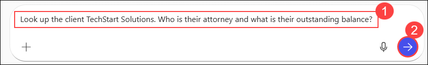

   **Expected Output:**

   The agent should find information from the **client-roster.csv**:
   - Client: TechStart Solutions LLC
   - Lead Attorney: David Chen
   - Total Billed: $67,200
   - Outstanding Balance: $12,000

1. Test billing data analysis:

   **Prompt:**
   ```
   How many billable hours did Sarah Morrison have in March 2024? What was her total billed amount?
   ```

   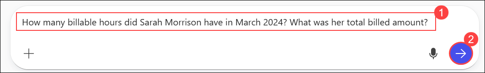

   **Expected Output:**

   The agent should extract from **billing-summary-2024.csv**:
   - Billable Hours: 182
   - Billed Amount: $81,900
   - Collections: $73,700

1. Test fee schedule lookup:

   **Prompt:**
   ```
   What is the hourly rate for a Senior Associate? What about flat fees for an LLC formation?
   ```

   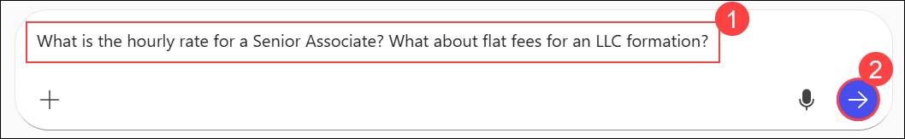

   **Expected Output:**

   The agent should provide from the **Fee Schedule**:
   - Senior Associate hourly rate: $375
   - LLC Formation flat fee: $800

## Summary

In this exercise, you created a **SharePoint Agent** for a law firm that helps legal staff discover documents and extract insights from various file types including Word documents and CSV data files. You learned how to:

- Create a SharePoint site with an organized folder structure
- Upload multiple document types (Word and CSV) to serve as the knowledge base
- Create a SharePoint Agent from within the SharePoint site interface
- Configure agent instructions for document discovery and data analysis
- Test the agent with document location, case lookup, client data, and billing queries

**Key Takeaways:**

| Feature | SharePoint Agent |
|---------|------------------|
| **Access Point** | Embedded in SharePoint site |
| **File Types Supported** | Word documents, CSV files, and more |
| **Primary Use Case** | Document discovery & data insights |
| **Knowledge Scope** | Site-specific content with folder organization |
| **Best For** | Finding documents, analyzing data, extracting specific information |

SharePoint Agents enhance productivity by providing intelligent document and data assistance directly within the context where files are stored, enabling users to quickly find information across multiple document types and data sources.

### You have successfully completed this exercise. Click on Next to proceed to the Day 2 Overview.

SharePoint Agents enhance the user experience by providing intelligent document assistance directly within the context where documents are stored, reducing search time and improving information discovery.

### You have successfully completed this exercise. Click on Next to proceed to the Day 2 Overview.
