# Exercise 6: Extend Microsoft 365 Copilot Chat with an HR Agent Built Using Microsoft Copilot Studio

## Estimated Duration: 90 Minutes

## Overview

In this exercise, you will build a comprehensive HR Agent using Microsoft Copilot Studio that extends Microsoft 365 Copilot Chat capabilities. Microsoft Copilot Studio provides a powerful low-code platform for creating intelligent agents that can handle complex conversations, connect to enterprise data sources, and integrate with Microsoft 365 Copilot.

You will create an HR agent that can answer employee questions about policies, benefits, leave management, and direct complex queries to appropriate HR personnel.

## Exercise Objectives

In this exercise, you will complete the following tasks:

- Task 1: Upload HR policy documents to SharePoint
- Task 2: Access Microsoft Copilot Studio and create an HR Agent
- Task 3: Add knowledge sources to the agent
- Task 4: Configure agent topics and conversations
- Task 5: Configure agent actions and integrations
- Task 6: Test and publish the agent to Microsoft 365 Copilot

### Task 1: Upload HR Policy Documents to SharePoint

In this task, you will upload HR policy documents to SharePoint that will later be used as knowledge sources for the agent to provide grounded responses.

#### Step 1: Locate and Review Policy Documents

1. First, open **File Explorer** on your lab VM.

1. Navigate to the HR policy documents folder:

   ```
   C:\datasets\policies
   ```

   

1. You will find the following HR policy documents:

   | Document | Description |
   |----------|-------------|
   | 01-Leave-Policy.md | Annual, sick, personal, parental leave entitlements |
   | 02-Holiday-Calendar-2025.md | Official holidays and floating holidays |
   | 03-Employee-Benefits-Guide.md | Medical, dental, 401k, wellness programs |
   | 04-Code-of-Conduct.md | Ethics, values, conflicts of interest |
   | 05-Performance-Review-Policy.md | Ratings, goals, merit increases |
   | 06-Onboarding-Guide.md | First day through 90-day milestones |
   | 07-Remote-Work-Policy.md | Hybrid/remote work guidelines |
   | 08-Health-and-Safety-Policy.md | Emergency procedures, hazard reporting |
   | 09-Travel-and-Expense-Policy.md | Booking, per diem, reimbursement |
   | 10-Anti-Harassment-Policy.md | Discrimination prevention, reporting |
   | 11-IT-Security-Policy.md | Passwords, devices, data handling |
   | 12-Training-and-Development-Policy.md | Tuition, certifications, mentoring |

1. Select all the policy files (Ctrl+A) and copy them (Ctrl+C).

1. Open a new browser tab and navigate to your SharePoint site:

   ```
   https://<inject key="TenantName" enableCopy="false"/>.sharepoint.com/sites/HRPoliciesHub-<inject key="DeploymentID" enableCopy="false"/>
   ```

1. Click on **Documents** in the left navigation.

   

1. Click **+ New** > **Folder** to create a new folder.

1. Name the folder `HR Policies` and click **Create**.

   

1. Open the **HR Policies** folder and click **Upload** > **Files**.

   

1. Navigate to `C:\datasets\policies`, select all the policy documents, and click **Open**.

   

1. Wait for all files to upload successfully. You should see all 12 policy documents in the folder.

   

   >**Note:** These policy documents contain comprehensive Contoso HR information that the agent will use to answer employee questions accurately.

### Task 2: Access Microsoft Copilot Studio and Create an HR Agent

In this task, you will navigate to Microsoft Copilot Studio, create a new HR Agent, and configure its basic settings.

1. On the Copilot Studio home page, click **+ Create** from the left navigation.

   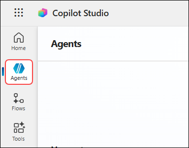

1. Click **+ Create blank agent** to start creating a new agent.

   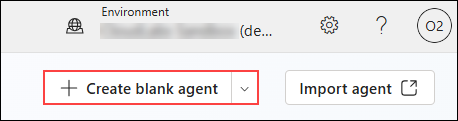

1. Click **Edit** to update the agent details.

   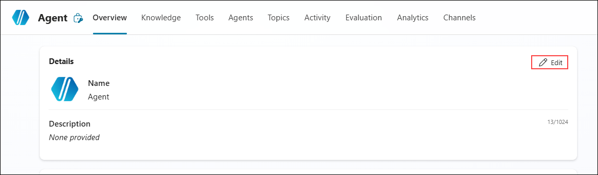

1. Enter the agent name in the **Name (1)** field, add the description in the **Description (2)** box, then click **Save (3)** to apply the changes.

   | Field | Value |
   |-------|-------|
   | Name | `HR Assistant-<inject key="DeploymentID" enableCopy="false"/>` |
   | Description | `An intelligent HR assistant that helps employees with policies, benefits, and HR-related questions.` |

   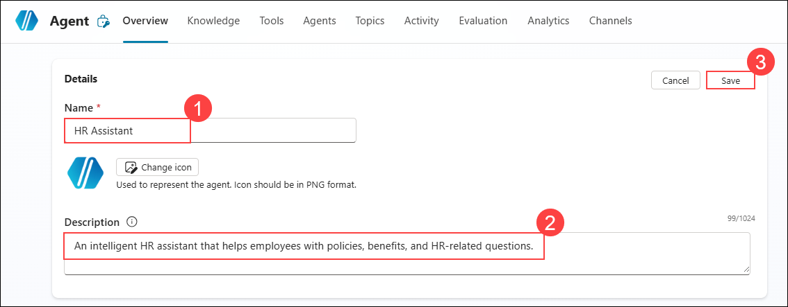

1. Click **Edit** to update the agent instructions.

   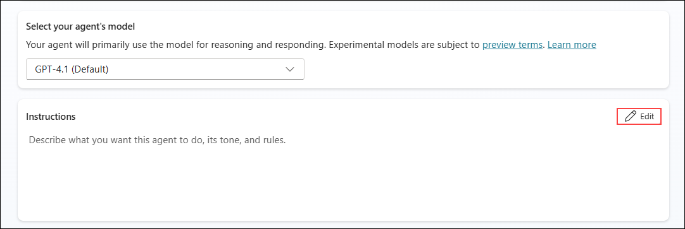

1. Enter the agent instructions in the **Instructions (1)** box, then click **Save (2)** to apply the changes.

   ```
   HR assistant that helps employees with:
   - Company policies and procedures
   - Leave management (vacation, sick leave, parental leave)
   - Benefits information (health insurance, retirement, wellness)
   - Onboarding information for new employees
   - Performance review processes
   - General HR FAQs
   
   The agent should be professional, empathetic, and helpful. It should escalate complex issues to human HR representatives.
   ```

   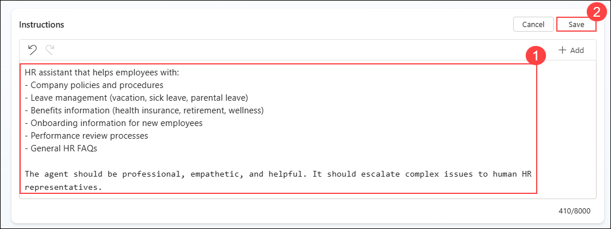

1. Click **+ Add knowledge** to add data and resources to the agent.

   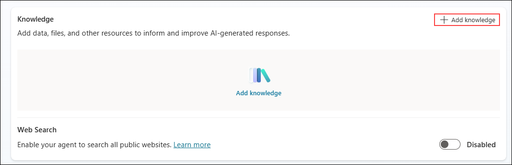

1. Click **SharePoint** to add knowledge from SharePoint sources.

   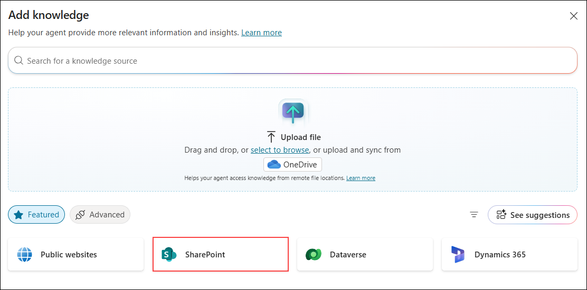

1. Enter the SharePoint site URL in the **URL field (1)**, then click **Add (2)** to connect the source.

   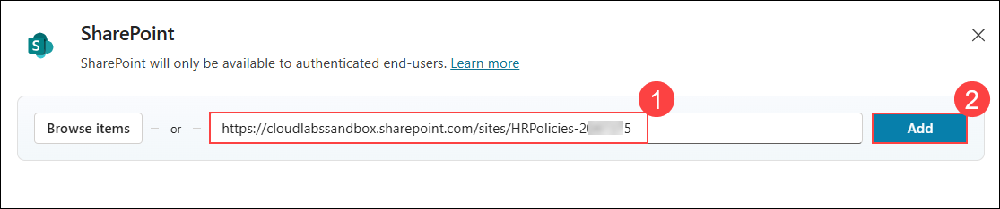

1. Click **Add to agent** to attach the SharePoint knowledge source.

   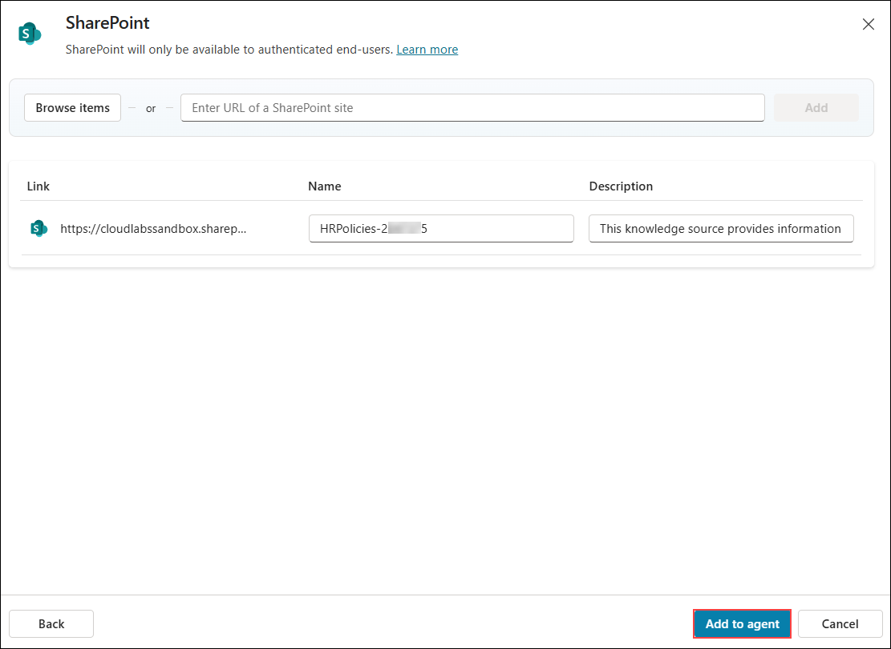

1. Verify that the knowledge source shows **Ready** to confirm it is successfully added.

   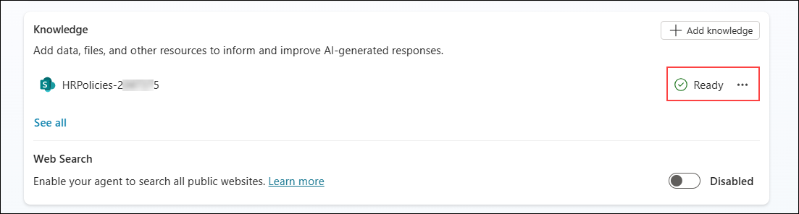

   >**Note:** The SharePoint knowledge source is now connected and will be used by the agent to answer questions based on the HR policy documents.

### Task 3: Configure Agent Topics and Conversations

In this task, you will configure topics that define how the agent handles different types of conversations. You will create an escalation topic and use the **Add from description with Copilot** feature to quickly generate topic flows.

#### Topic 1: Escalation to HR

1. Click **Topics (1)**, then select **+ Add a topic (2)** and choose **From blank (3)** to create a new topic.

   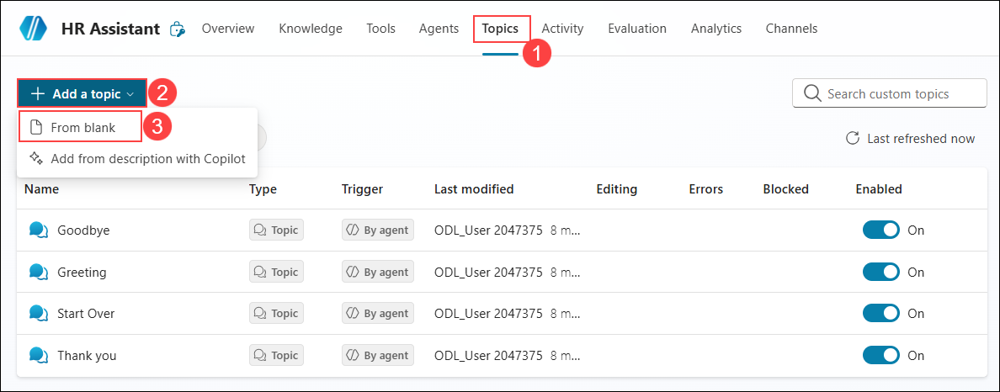

1. Enter the topic description in the **Describe what the topic does** box.

   ```
   This tool can handle queries like these:
   contact HR, escalate to HR, report issue to HR, I need help from HR, talk to human resources
   ```

   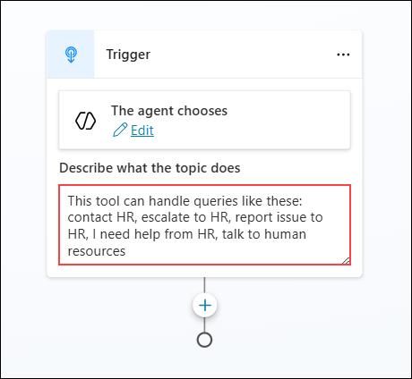

1. Click the **+ (Add) (1)** icon to add the next node to the topic flow.

   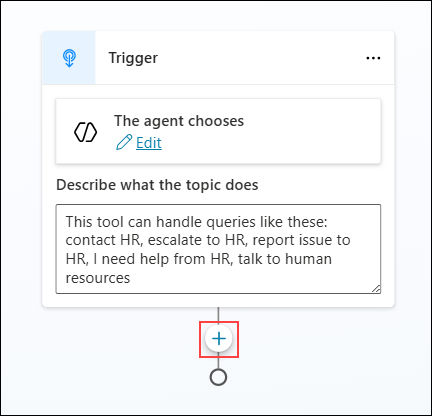

1. Select **Send a message** to add a message node to the topic flow.

   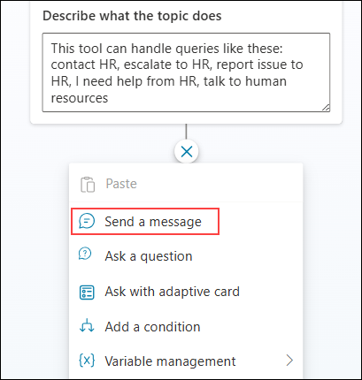

1. Enter the response text in the **Message** box to define the agent’s reply.

   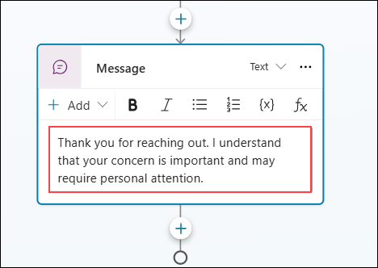

1. Click the **+ (Add) (1)** icon, then select **Send a message (2)** to add another message node.

   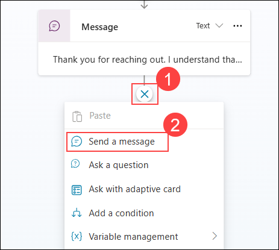

1. Enter the response text in the **Message** box to define the next agent reply.

   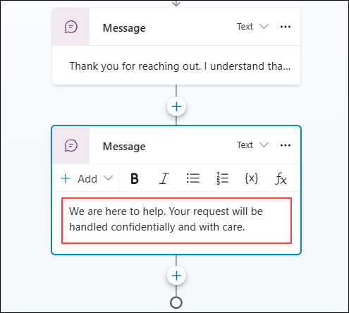

1. Select **Add from description with Copilot** option.

   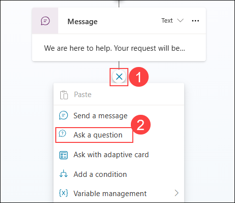

1. Enter the question in the **Question text (1)** field, then select **User’s entire response (2)** under Identify.

   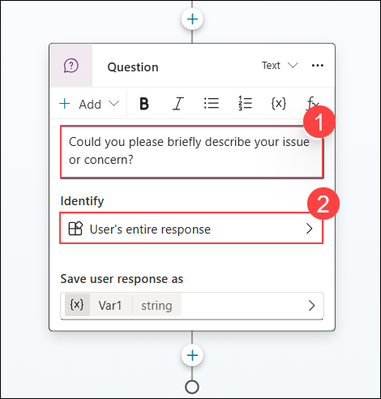

1. Click the **Var1** variable under **Save user response as** to edit the response storage.

   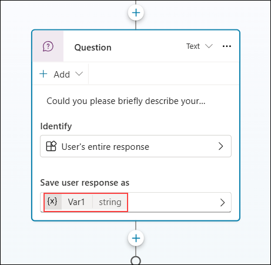

1. Enter the variable name in the **Variable name (1)** field, then click the **Close (X) (2)** button to save the changes.

   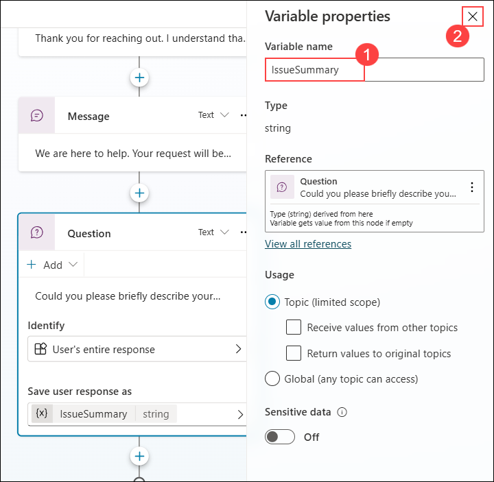

1. Click the **+ (Add) (1)** icon, then select **Ask a question (2)** to add another question node.

   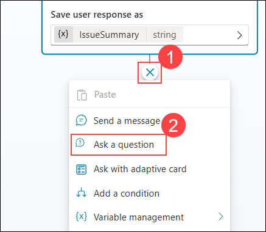

1. Enter the name prompt in the **Question text (1)** field, then select **Person name (2)** under Identify.

   

1. Click the **Var1** variable under **Save user response as** to rename and configure the name field.

   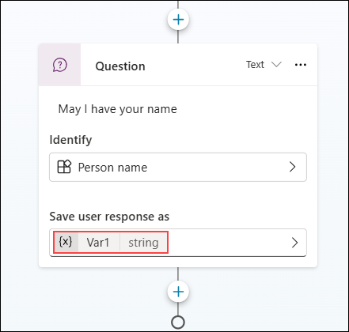

1. Enter the variable name in the **Variable name (1)** field, then click the **Close (X) (2)** button to save the changes.

   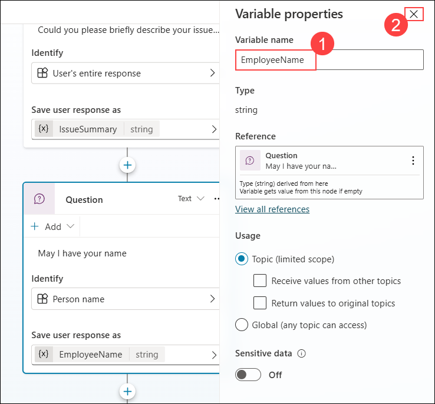

1. Click the **+ (Add) (1)** icon, then select **Ask a question (2)** to add another question node.

   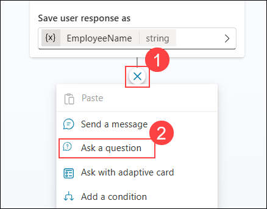

1. Enter the email prompt in the **Question text (1)** field, select **Email (2)** under Identify, then save the response in **ContactEmail (3)**.

   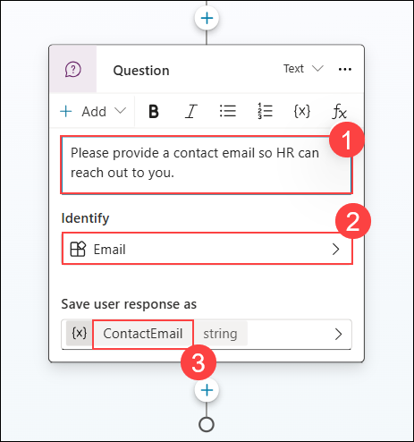

1. Click the **+ (Add) (1)** icon, then select **Send a message (2)** to add a confirmation message.

   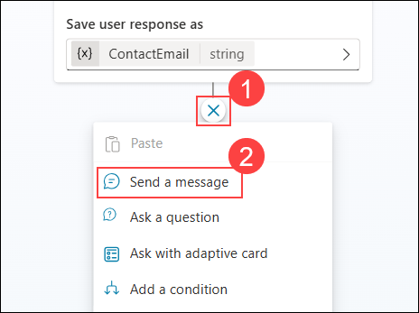

1. Enter the confirmation message in the **Message text (1)** box to inform the user.

   

1. Click **Untitled** to rename the topic.

   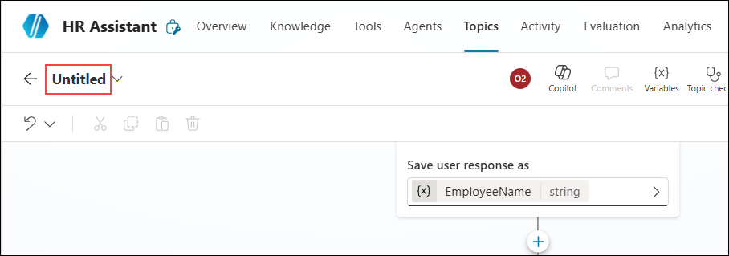

1. Enter **Escalation to HR** as the topic name to save and identify the flow.

   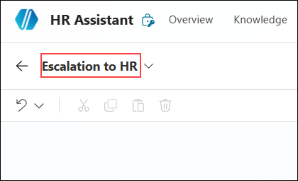

1. Click **Save** to store your changes.

   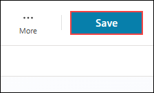

#### Topic 2: General HR Help

1. Click **Topics** to return to the topics list after saving the topic.

   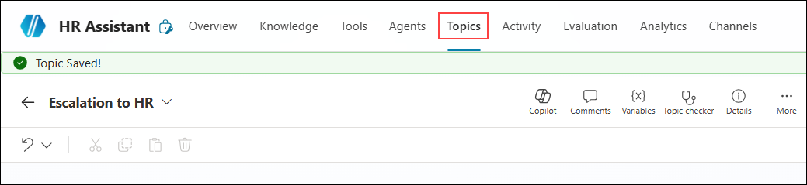

1. Click **+ Add a topic (1)**, then select **Add from description with Copilot (2)** to create a new topic automatically.

   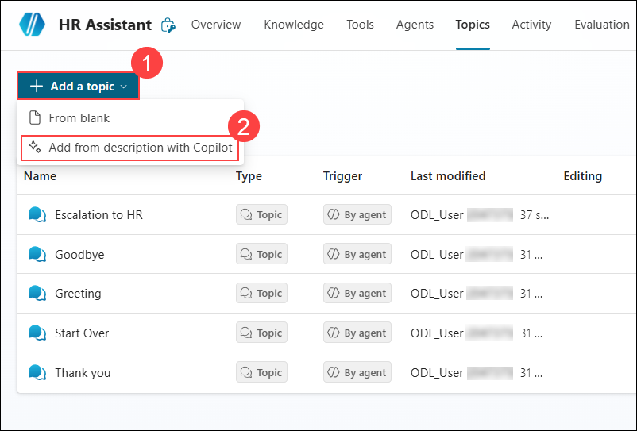

1. In the **Add from description with Copilot** dialog, enter the following:

   | Field | Value |
   |-------|-------|
   | **Name your topic** | `General HR Help` |
   | **Create a topic to...** | See description below |

   **Topic Description:**
   ```
   Create a topic that helps users with general HR questions.
   Start by greeting the user and asking what HR topic they need help with.
   Let the user explain their question in their own words.
   Identify whether the question is related to:
   - Benefits
   - Company policies or rules
   - Onboarding or new hire process
   - Performance reviews or appraisals
   If the question is about benefits, provide basic information and guide the user to the HR portal.
   If the question is about company policies, explain where official documents can be found.
   If the question is about onboarding, guide new employees through the process.
   If the question is about performance reviews, explain timelines and procedures.
   If the question is unclear, ask the user to clarify.
   If the assistant cannot answer, offer to escalate to HR.
   If the user agrees, confirm that the request will be sent.
   End by asking if the user needs any more help.
   ```

   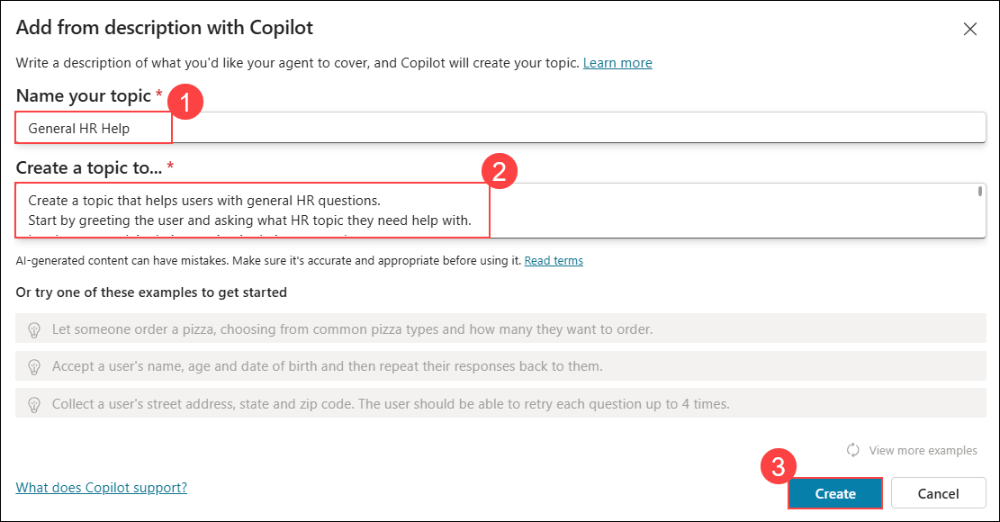

1. Copilot Studio will automatically generate the conversation flow with:
   - Welcome message
   - Question node to collect the HR query
   - Condition branches for benefits, policies, onboarding, and performance reviews
   - Clarification flow for unrecognized queries
   - Escalation option
   - Closing message

1. Review the generated flow.

1. Click **Topic checker (1)** to verify **Errors (0) (2)**, then click **Save (3)** to store the changes.

   

#### Topic 3: Leave and Time Off

1. Click **Topics** to return to the topics list after saving the topic.

   

1. Click **+ Add a topic (1)**, then select **Add from description with Copilot (2)** to create a new topic automatically.

   

1. Enter the following details:

   | Field | Value |
   |-------|-------|
   | **Name your topic** | `Leave and Time Off` |
   | **Create a topic to...** | See description below |

   **Topic Description:**
   ```
   Create a topic that helps users with leave and time off questions.
   Start by greeting the user and asking what kind of leave they need help with.
   Let the user choose or explain their leave type.
   Support questions related to:
   - Annual or vacation leave
   - Sick leave
   - Personal leave
   - General leave information
   Provide clear information based on the selected leave type.
   Explain how leave is earned, used, and managed.
   Guide users to the HR portal to check their leave balance.
   Ask if the user has questions about special leave cases such as:
   - Medical leave
   - Parental leave
   - Emergency leave
   If needed, recommend contacting HR for special cases.
   End by asking if the user needs further assistance.
   ```

   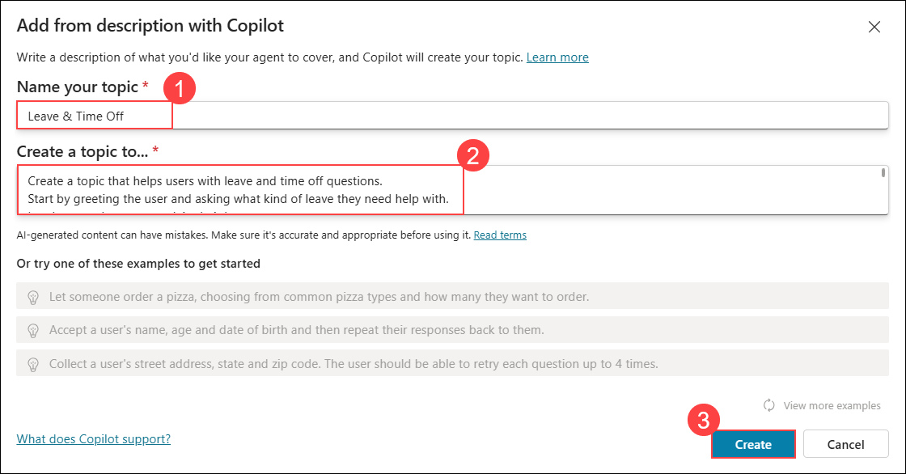

1. Click **Create** to generate the topic.

1. Review the generated flow which should include:
   - Welcome message for leave inquiries
   - Multiple choice question for leave type selection
   - Conditional responses for each leave type
   - Information about leave accrual and HR portal
   - Special cases handling
   - Closing message

      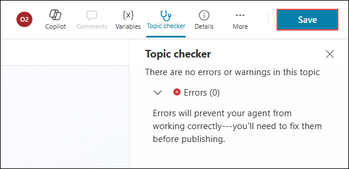

1. Click **Save** to save the topic.

### Task 4: Enhance Agent Instructions with Policy References

In this task, you will update the agent instructions to ensure it properly references the HR policy documents from the knowledge base.

1. Click on **Overview** in the left navigation to return to the agent overview.

1. Locate the **Instructions** section and click **Edit**.

   

1. Update the agent instructions to reference the policy documents:

   ```
   You are an HR Assistant for Contoso Corporation. Your role is to help employees with HR-related questions.

   When answering questions:
   - Always refer to the official HR policy documents in the knowledge base
   - For leave questions, reference the Leave Policy and Holiday Calendar
   - For benefits questions, reference the Employee Benefits Guide
   - For conduct or ethics questions, reference the Code of Conduct
   - For performance questions, reference the Performance Review Policy
   - For new employee questions, reference the Onboarding Guide
   - For remote work questions, reference the Remote Work Policy
   - For safety concerns, reference the Health and Safety Policy
   - For travel questions, reference the Travel and Expense Policy
   - For harassment or discrimination concerns, reference the Anti-Harassment Policy
   - For IT or security questions, reference the IT Security Policy
   - For training questions, reference the Training and Development Policy

   Be professional, empathetic, and helpful. Provide accurate information from the policy documents.
   If you cannot find the answer in the policies, offer to escalate to the HR team.
   Always maintain confidentiality and privacy.
   ```

   

1. Click **Save** to save the updated instructions.

### Task 5: Configure Agent Actions and Integrations

In this task, you will configure actions that the agent can perform.

1. In the agent editor, click on **Actions** in the left navigation.

   

1. Click **+ Add an action**.

   

1. Browse the available action types:

   - **Prebuilt connectors** - Connect to external services
   - **Power Automate flows** - Trigger automated workflows
   - **Custom connectors** - Connect to custom APIs

   

1. For this exercise, we will create a simple escalation flow. Select **Power Automate** > **Create a new flow**.

   

1. If Power Automate opens, create a simple flow:

   - Trigger: When called from Copilot Studio
   - Action: Send an email to HR

   >**Note:** For this lab, you can skip creating the actual flow. The important concept is understanding how actions extend agent capabilities.

1. Return to Copilot Studio and configure the greeting message:

   - Click on **Topics** > **System** > **Greeting**
   - Customize the greeting:

   ```
   Welcome to the HR Assistant! I can help you with:

   - Leave policies and requests
   - Benefits information
   - Onboarding procedures
   - HR policies and guidelines
   - General HR questions

   How can I assist you today?
   ```

   

1. Click **Save**.

### Task 6: Test and Publish the Agent to Microsoft 365 Copilot

In this task, you will test the agent and prepare it for publishing.

1. Click the **Test** button in the bottom left corner to open the test panel.

   

1. Test the agent with various queries:

   **Test 1 - Greeting:**
   ```
   Hello
   ```

   

   **Expected Output:**

   

1. **Test 2 - Leave Request:**

   **Prompt:**
   ```
   How do I request vacation time?
   ```

   

   **Expected Output:**

   

1. **Test 3 - Benefits:**

   **Prompt:**
   ```
   What health insurance options are available?
   ```

   

   **Expected Output:**

   

1. **Test 4 - Knowledge-based question:**

   **Prompt:**
   ```
   How many sick days can I take without a medical certificate?
   ```

   

   **Expected Output:**

   

1. Once testing is complete, click **Publish** in the top right corner.

   

1. In the publish dialog, select **Microsoft 365 Copilot** as the channel.

   

1. Review the publishing settings and click **Publish**.

   

1. Wait for the publishing process to complete.

   

   >**Note:** The agent may take a few minutes to appear in Microsoft 365 Copilot after publishing.

1. Once published, you can access the agent from Microsoft 365 Copilot Chat:

   - Go to `https://www.microsoft365.com`
   - Click on **Copilot**
   - Look for your HR Assistant agent in the agents panel

   

## Summary

In this exercise, you built an HR Agent using Microsoft Copilot Studio. You learned how to:

- Access and navigate Microsoft Copilot Studio
- Create a new agent with AI-assisted setup
- Configure topics and conversation flows
- Add SharePoint as a knowledge source
- Configure actions and integrations
- Test and publish the agent to Microsoft 365 Copilot

Microsoft Copilot Studio provides a powerful platform for creating sophisticated agents that can handle complex business scenarios.

### You have successfully completed this exercise. Click on Next to proceed to the next exercise.
