# Exercise 6: Build an HR Agent with Microsoft Copilot Studio - Part 1

## Estimated Duration: 90 Minutes

## Overview

In this exercise, you will begin building a comprehensive HR Agent using Microsoft Copilot Studio that extends Microsoft 365 Copilot Chat capabilities. Microsoft Copilot Studio provides a powerful low-code platform for creating intelligent agents that can handle complex conversations, connect to enterprise data sources, and integrate with Microsoft 365 Copilot.

In Part 1, you will create the foundational HR agent, connect it to SharePoint knowledge sources, configure conversation topics, and build an automated leave application workflow with smart approval logic.

## Exercise Objectives

In this exercise, you will complete the following tasks:

- Task 1: Upload HR policy documents to SharePoint
- Task 2: Access Microsoft Copilot Studio and create an HR Agent
- Task 3: Configure agent topics and conversations
- Task 4: Build leave application flow with auto-approval and Teams integration

### Task 1: Create a SharePoint Site

In this task, you will create a SharePoint site to store law firm documents including case files, client information, and billing data.

1. On the Microsoft 365 home page, click on the **Copilot** icon from the left navigation panel.

   

1. In the left navigation pane, select **Apps (1)**, and then choose **SharePoint (2)** to open SharePoint.```

   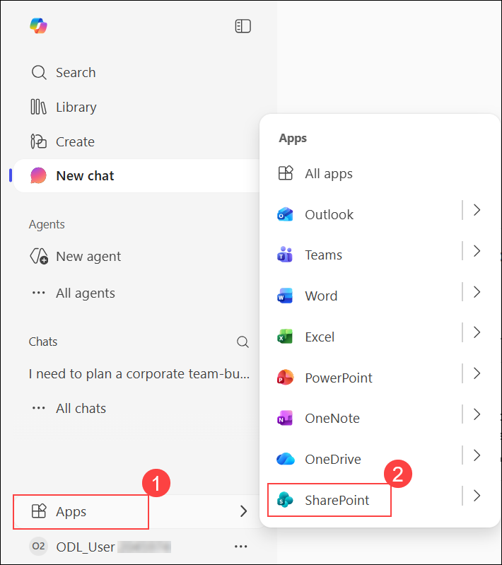

1. In SharePoint, select **Create (1)**, and then choose **Site (2)** to start creating a new site.

   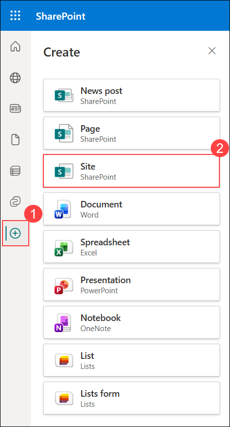

1. On the **Create a site** page, select **Team site** to create a collaborative workspace for your team.

   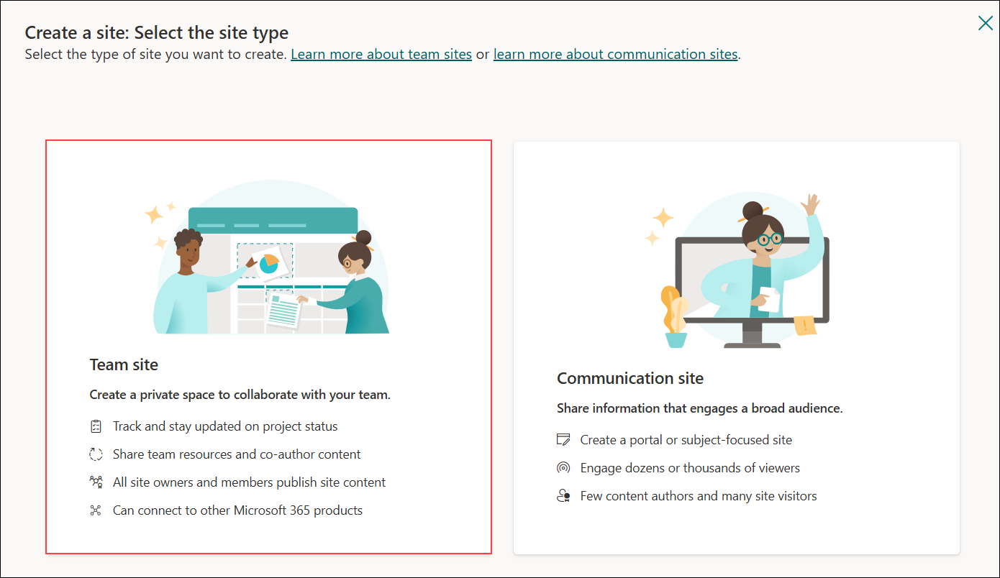

1. On the **Select a template** page, choose the **Standard team** template to continue creating the team site.

   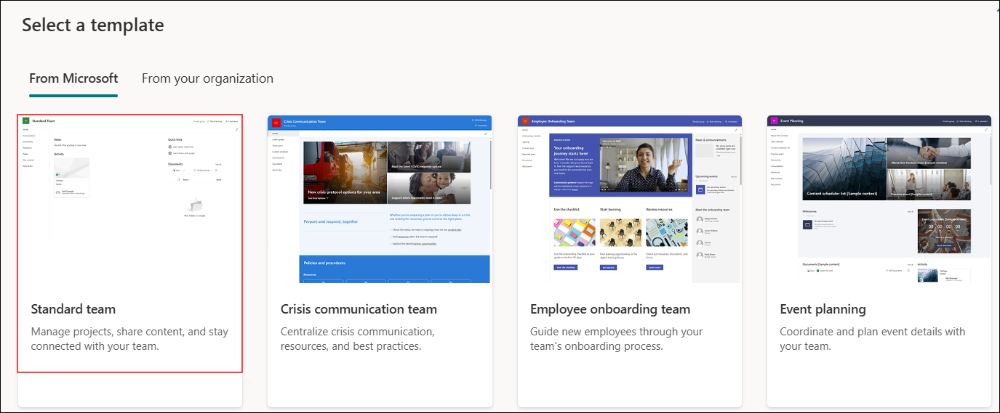

1. On the **Preview and use 'Standard team' template** page, review the site details, and then select **Use template** to continue.

   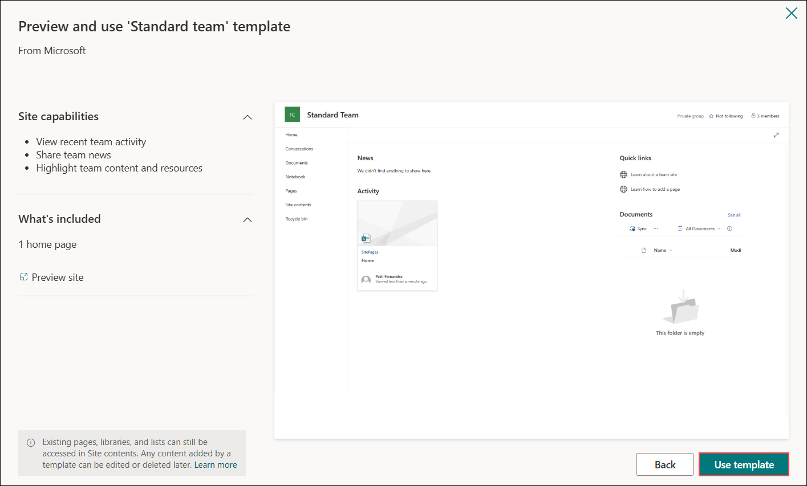

1. Select **Team site** and configure:

   | Field | Value |
   |-------|-------|
   | Site name | **HRPolicies-<inject key="DeploymentID" enableCopy="false"/>** |

   

1. On the **Set language and other options** page, confirm **Private – only members can access this site (1)** under Privacy settings, and then select **Create site (2)**.

   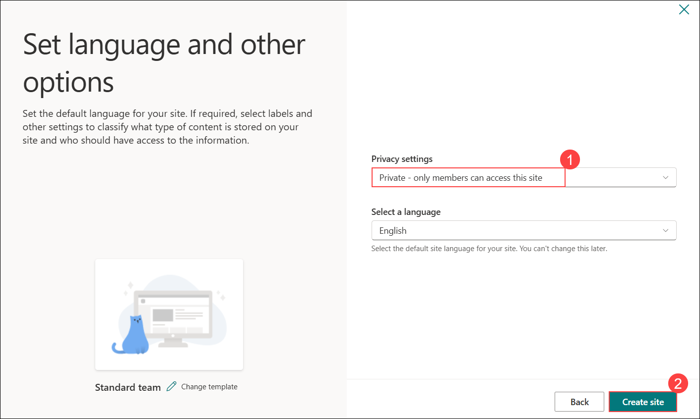

1. On the **Add site owners and members** page, select **Finish** to complete the site creation.

   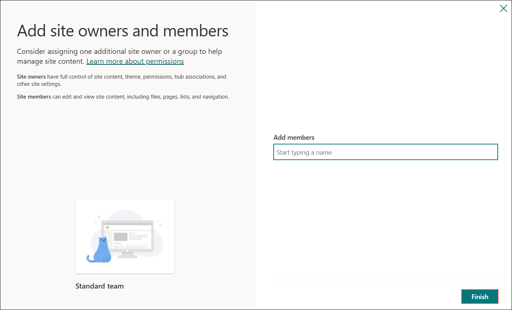

### Task 2: Upload HR Policy Documents to SharePoint

In this task, you will download the HR policy documents and upload them to SharePoint. These documents will later be used as knowledge sources for the agent to provide grounded responses.

#### Step 1: Download and Review Policy Documents

1. First, download the HR policy documents. Open a new browser tab and navigate to:

   ```
   https://github.com/CloudLabsAI-Azure/unlock-ai-powered-future-work-with-microsoft-365/archive/refs/heads/Day2-datasets.zip
   ```

1. Once downloaded, extract the **Day2-datasets.zip** file to a location of your choice (e.g., Desktop or Downloads folder).

1. Open **File Explorer** and navigate to the extracted folder. Inside the **policy** folder, you will find the following HR policy documents:

   | Document | Description |
   |----------|-------------|
   | Anti-Harassment-Policy.pdf | Discrimination prevention, reporting |
   | Code-of-Conduct.pdf | Ethics, values, conflicts of interest |
   | Employee-Benefits-Guide.pdf | Medical, dental, 401k, wellness programs |
   | Health-and-Safety-Policy.pdf | Emergency procedures, hazard reporting |
   | Holiday-Calendar-2025.pdf | Official holidays and floating holidays |
   | IT-Security-Policy.pdf | Passwords, devices, data handling |
   | Leave-Policy.pdf | Annual, sick, personal, parental leave entitlements |
   | Onboarding-Guide.pdf | First day through 90-day milestones |
   | Performance-Review-Policy.pdf | Ratings, goals, merit increases |
   | Remote-Work-Policy.pdf | Hybrid/remote work guidelines |
   | Training-and-Development-Policy.pdf | Tuition, certifications, mentoring |
   | Travel-and-Expense-Policy.pdf | Booking, per diem, reimbursement |

   >**Note:** These 12 PDF files contain comprehensive Contoso HR policy information.

1. Open a new browser tab and navigate to your SharePoint site:

1. In the SharePoint site, select **Documents (1)**, click **Upload (2)**, and then choose **Folder (3)** to create a new folder.``

   

1. Browse to the location where you extracted the Day2-datasets, navigate to the **policy** folder, select all the policy PDF documents, and click **Open**.

   

1. Wait for all files to upload successfully. You should see all 12 policy documents in the folder.

   

   >**Note:** These policy documents contain comprehensive Contoso HR information that the agent will use to answer employee questions accurately.

### Task 2: Access Microsoft Copilot Studio and Create an HR Agent

In this task, you will navigate to Microsoft Copilot Studio, create a new HR Agent, and configure its basic settings.

1. On the Copilot Studio home page, click **+ Create** from the left navigation.

   

1. Click **+ Create blank agent** to start creating a new agent.

   

1. Click **Edit** to update the agent details.

   

1. Enter the agent name in the **Name (1)** field, add the description in the **Description (2)** box, then click **Save (3)** to apply the changes.

   | Field | Value |
   |-------|-------|
   | Name | `HR Assistant` |
   | Description | `An intelligent HR assistant that helps employees with policies, benefits, and HR-related questions.` |

   

1. Click **Edit** to update the agent instructions.

   

1. Enter the agent instructions in the **Instructions (1)** box, then click **Save (2)** to apply the changes.

   ```
   You are an HR Assistant for Contoso Corporation. Help employees with:
   - Company policies and procedures
   - Leave management and applications (collect Employee ID, Name, Days, Reason)
   - Benefits information (health insurance, retirement, wellness)
   - Onboarding information for new employees
   - Performance review processes
   - General HR FAQs
   
   For leave requests, always collect: Employee ID, Employee Name, Number of Days, and Reason.
   Leave requests of 2 days or less are auto-approved; longer requests require manager approval.
   Be professional, empathetic, and helpful. Escalate complex issues to human HR representatives.
   ```

   

1. Click **+ Add knowledge** to add data and resources to the agent.

   

1. Click **SharePoint** to add knowledge from SharePoint sources.

   

1. Enter the SharePoint site URL in the **URL field (1)**, then click **Add (2)** to connect the source.

   

1. Click **Add to agent** to attach the SharePoint knowledge source.

   

1. Verify that the knowledge source shows **Ready** to confirm it is successfully added.

   

   >**Note:** The SharePoint knowledge source is now connected and will be used by the agent to answer questions based on the HR policy documents.

### Task 3: Configure Agent Topics and Conversations

In this task, you will configure topics that define how the agent handles different types of conversations. You will create an escalation topic and use the **Add from description with Copilot** feature to quickly generate topic flows.

#### Topic 1: Escalation to HR

1. Click **Topics (1)**, then select **+ Add a topic (2)** and choose **From blank (3)** to create a new topic.

   

1. Enter the topic description in the **Describe what the topic does** box.

   ```
   This tool can handle queries like these:
   contact HR, escalate to HR, report issue to HR, I need help from HR, talk to human resources
   ```

   

1. Click the **+ (Add) (1)** icon to add the next node to the topic flow.

   

1. Select **Send a message** to add a message node to the topic flow.

   

1. Enter the response text in the **Message** box to define the agent’s reply.

   

1. Click the **+ (Add) (1)** icon, then select **Send a message (2)** to add another message node.

   

1. Enter the response text in the **Message** box to define the next agent reply.

   

1. Select **Add from description with Copilot** option.

   

1. Enter the question in the **Question text (1)** field, then select **User’s entire response (2)** under Identify.

   

1. Click the **Var1** variable under **Save user response as** to edit the response storage.

   

1. Enter the variable name in the **Variable name (1)** field, then click the **Close (X) (2)** button to save the changes.

   

1. Click the **+ (Add) (1)** icon, then select **Ask a question (2)** to add another question node.

   

1. Enter the name prompt in the **Question text (1)** field, then select **Person name (2)** under Identify.

   

1. Click the **Var1** variable under **Save user response as** to rename and configure the name field.

   

1. Enter the variable name in the **Variable name (1)** field, then click the **Close (X) (2)** button to save the changes.

   

1. Click the **+ (Add) (1)** icon, then select **Ask a question (2)** to add another question node.

   

1. Enter the email prompt in the **Question text (1)** field, select **Email (2)** under Identify, then save the response in **ContactEmail (3)**.

   

1. Click the **+ (Add) (1)** icon, then select **Send a message (2)** to add a confirmation message.

   

1. Enter the confirmation message in the **Message text (1)** box to inform the user.

   

1. Click **Untitled** to rename the topic.

   

1. Enter **Escalation to HR** as the topic name to save and identify the flow.

   

1. Click **Save** to store your changes.

   

#### Topic 2: General HR Help

1. Click **Topics** to return to the topics list after saving the topic.

   

1. Click **+ Add a topic (1)**, then select **Add from description with Copilot (2)** to create a new topic automatically.

   

1. In the **Add from description with Copilot** dialog, enter the following:

   | Field | Value |
   |-------|-------|
   | **Name your topic** | `General HR Help` |
   | **Create a topic to...** | See description below |

   **Topic Description:**
   ```
   Create a topic that helps users with general HR questions.
   Start by greeting the user and asking what HR topic they need help with.
   Let the user explain their question in their own words.
   Identify whether the question is related to:
   - Benefits
   - Company policies or rules
   - Onboarding or new hire process
   - Performance reviews or appraisals
   If the question is about benefits, provide basic information and guide the user to the HR portal.
   If the question is about company policies, explain where official documents can be found.
   If the question is about onboarding, guide new employees through the process.
   If the question is about performance reviews, explain timelines and procedures.
   If the question is unclear, ask the user to clarify.
   If the assistant cannot answer, offer to escalate to HR.
   If the user agrees, confirm that the request will be sent.
   End by asking if the user needs any more help.
   ```

   

1. Copilot Studio will automatically generate the conversation flow with:
   - Welcome message
   - Question node to collect the HR query
   - Condition branches for benefits, policies, onboarding, and performance reviews
   - Clarification flow for unrecognized queries
   - Escalation option
   - Closing message

1. Review the generated flow.

1. Click **Topic checker (1)** to verify **Errors (0) (2)**, then click **Save (3)** to store the changes.

   

#### Topic 3: Leave and Time Off

1. Click **Topics** to return to the topics list after saving the topic.

   

1. Click **+ Add a topic (1)**, then select **Add from description with Copilot (2)** to create a new topic automatically.

   

1. Enter the following details:

   | Field | Value |
   |-------|-------|
   | **Name your topic** | `Leave and Time Off` |
   | **Create a topic to...** | See description below |

   **Topic Description:**
   ```
   Create a topic that helps users apply for leave and handles leave requests.
   Start by greeting the user and saying you can help them apply for leave.
   Collect the following information from the user:
   1. Ask for their Employee ID (number)
   2. Ask for their full name
   3. Ask how many days of leave they need (number)
   4. Ask for the reason for their leave request
   After collecting all information, display a summary showing:
   - Employee ID
   - Employee Name
   - Number of days
   - Reason
   Then call the Leave-Flow action with the collected information.
   Display the approval status returned from the flow.
   End by asking if the user needs any further assistance.
   ```

   

1. Click **Create** to generate the topic.

1. Review the generated flow which should include:
   - Welcome message for leave applications
   - Question nodes to collect Employee ID, Name, Days, and Reason
   - Leave summary message with collected information
   - Action node calling the Leave-Flow
   - Approval status message
   - Closing message

      

1. Click **Save** to save the topic.

#### Task 4: Build Leave Application Flow with Smart Approval

In this topic, you will create an automated leave application flow that automatically approves requests for 2 days or less, and routes longer requests to a manager via email for approval.

1. Navigate to **Microsoft Teams** and go to the **Chat (1)** section, click the **New (2)** dropdown, and select **New team (3)** to create a dedicated workspace for leave notifications.

   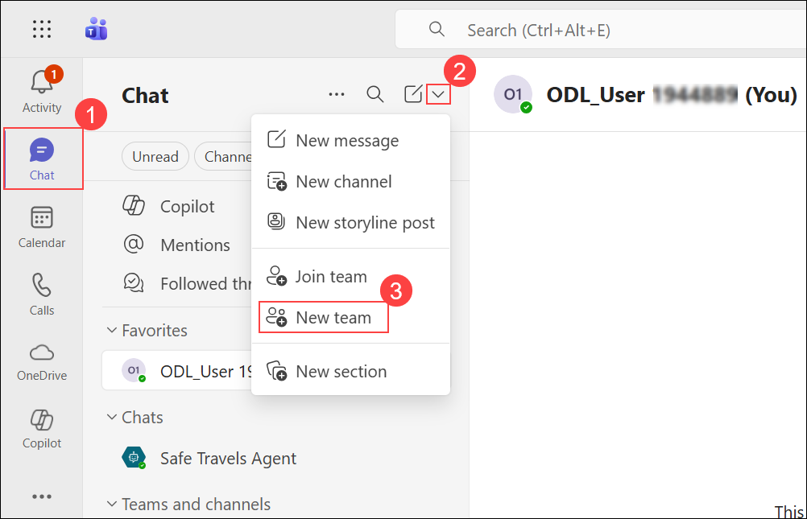

1. Configure your new team with the following details:
   - **Team name:** Enter **HR Approvals Team-<inject key="DeploymentID" enableCopy="false"/>**
   - **First channel:** Type **Leave Approvals-<inject key="DeploymentID" enableCopy="false"/>**
   - Click **Create** to establish the team structure.

   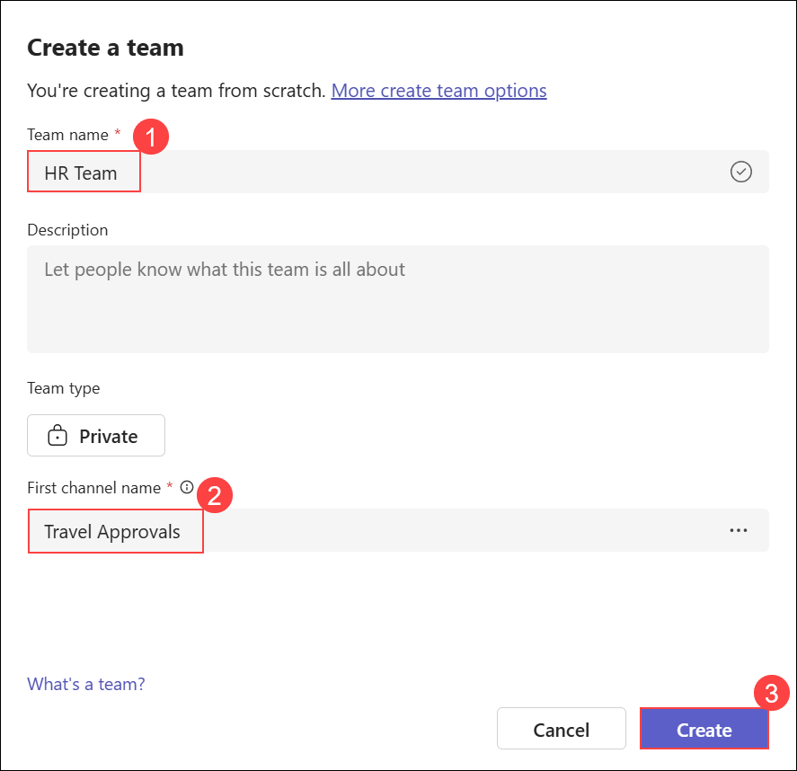

1. In the **Add members to HR Approvals Team** window, select **Skip** to continue without adding members for this demonstration.

   


1. In Copilot Studio, go to the **Flows (1)** section and click **New agent flow (2)** to create a new automated workflow.

   

1. Under **AI capabilities**, select **When an agent calls the flow** as the trigger mechanism to enable agent-initiated workflows.

   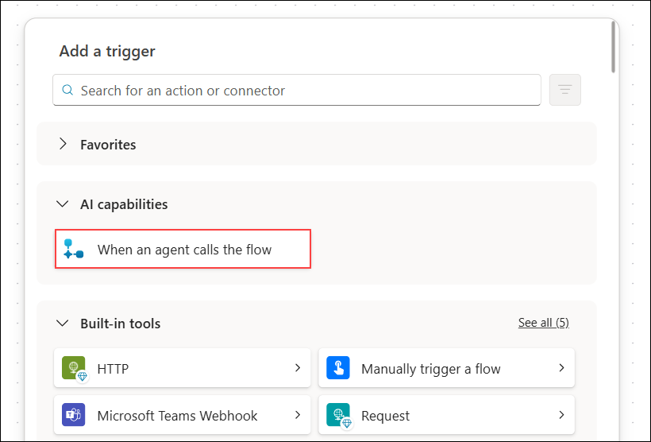

1. Click **Add an input** under the trigger node to define the data parameters that your agent will pass to the workflow.

   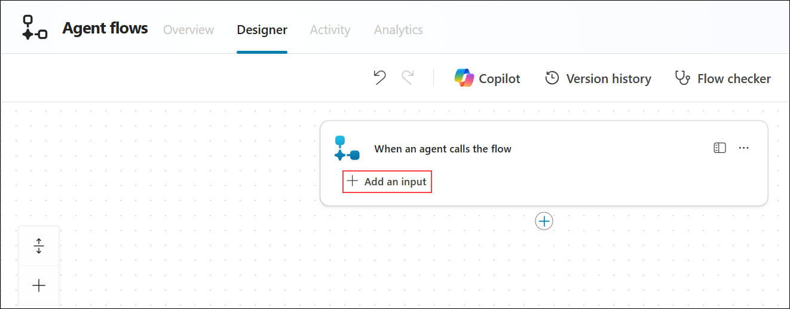

1. Choose **Number** as the data type for the first input parameter.

   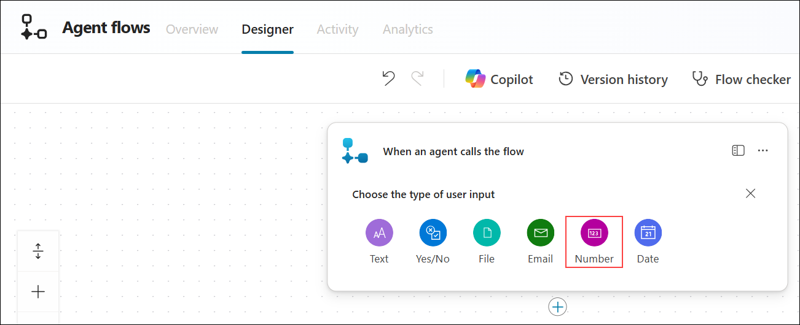

1. Add the following input parameters:

   | Input Type | Name |
   |------------|------|
   | Number | `EmployeeID` |
   | Text | `EmployeeName` |
   | Number | `LeaveDays` |
   | Text | `LeaveReason` |

   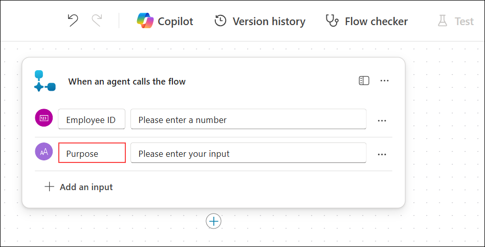

1. Click the **+ (Add)** icon below the trigger to add a new action.

   

1. Search for **Condition** and select **Condition** from the Control actions.

1. Configure the condition to check if leave days is less than or equal to 2:
   - **Choose a value:** Select **LeaveDays** from Dynamic content
   - **Operator:** Select **is less than or equal to**
   - **Value:** Enter `2`

   

   >**Smart Approval Logic:** This condition enables automatic approval for short leave requests (2 days or less), reducing administrative overhead while ensuring longer requests receive proper manager review.

##### Step 3: Configure the Auto-Approval Branch (If Yes - 2 Days or Less)

1. In the **If yes** branch, click **Add an action**.

1. Search for **Post message in a chat or channel (1)** and **select (2)** it from the available Microsoft Teams actions.

   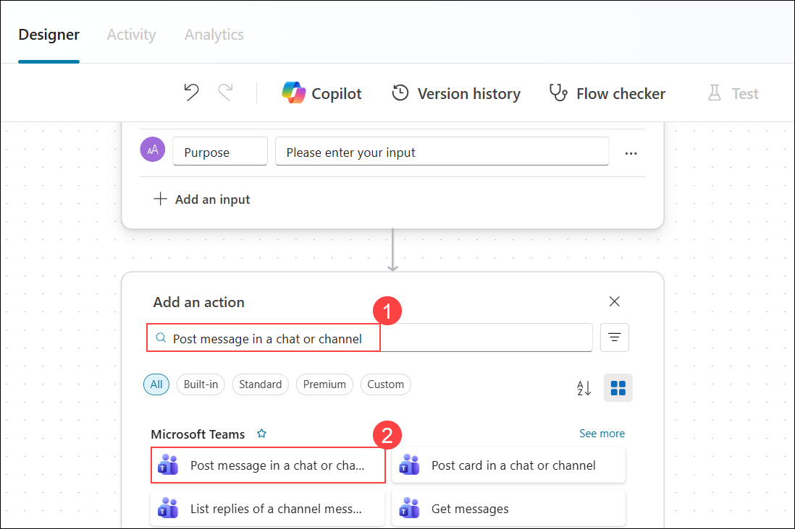

1. Establish the Microsoft Teams connection by selecting **Sign in** to authenticate and authorize the workflow integration.

   

1. Choose your **ODL_User (1)** account credentials to authenticate and establish the Microsoft Teams connection.

   

1. Configure the Teams message for auto-approved requests:
   - **Post as (1):** Flow bot
   - **Post in (2):** Channel
   - **Team (3):** HR Approvals Team
   - **Channel (4):** Leave Approvals  
   - **Message (5):** 
     ```
     ✅ **LEAVE AUTO-APPROVED**
     
     **Employee ID:** [EmployeeID]
     **Employee:** [EmployeeName]
     **Duration:** [LeaveDays] day(s)
     **Reason:** [LeaveReason]
     
     _This request was automatically approved as it is for 2 days or less._
     ```

   

1. Highlight **[EmployeeName] (1)** in the message box and click the **Dynamic content (2)** icon to insert the variable.

   

1. From the **Dynamic content** panel, select the appropriate variable under the "When an agent calls the flow" section.

   

   >**Note:** Replace all bracketed values [EmployeeName], [LeaveDays], etc. with Dynamic content from the trigger.

1. Click **Add an action** in the **If yes** branch and search for **Respond to agent (1)** and select **Respond to the agent (2)** under the Skills section.

   

1. Click **Add an output (1)** under the **Respond to the agent** action to define the return message.

   

1. Select **Text (1)** as the type of output for the agent response.

   

1. Add the output:
   - **Name (1):** `ApprovalStatus`
   - **Value (2):** `Your leave request for [LeaveDays] day(s) has been automatically approved! You will receive a confirmation email shortly.`
   - **Description (3):** `Confirmation message for auto-approved leave request`

   

##### Step 4: Configure the Email Notification Branch (If No - More Than 2 Days)

1. In the **If no** branch, click **Add an action**.

1. Search for **Send an email (V2)** and select the Office 365 Outlook action.

   

1. Establish the Office 365 Outlook connection by selecting **Sign in** to authenticate.

1. Configure the email for manager approval requests:
   - **To:** Enter your email address (e.g., `odl_user_XXXXXX@cloudlabssandbox.onmicrosoft.com`)
   - **Subject:** `Leave Approval`
   - **Body:** Enter the following:

   ```
   Leave Approval Request

   Employee ID: [EmployeeID]
   Employee Name: [EmployeeName]
   Duration: [LeaveDays] day(s)
   Reason: [LeaveReason]

   This request requires manager approval as it exceeds 2 days.
   Please review and respond to the employee accordingly.
   ```

   

   >**Note:** Replace all bracketed values [EmployeeID], [EmployeeName], [LeaveDays], and [LeaveReason] with Dynamic content from the trigger.

1. Click **Add an action** after the email action and search for **Respond to agent (1)** and select **Respond to the agent (2)** under the Skills section.

1. Add the output:
   - **Type:** Text
   - **Name:** `ApprovalStatus`
   - **Value:** `Your leave request for [LeaveDays] day(s) has been submitted for manager approval. You will receive a response via email shortly.`

1. Click **Save draft (1)** to save the current flow configuration before publishing.

   

1. Verify the confirmation message **"We saved your draft flow. You can test and run it after you publish."** appears at the top of the page.

   

1. Click **Publish** to make the agent flow available for use.

   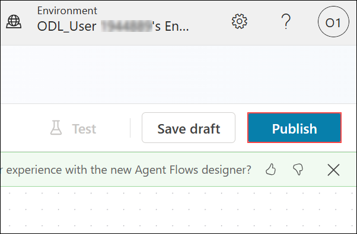

##### Step 5: Connect the Flow to Leave and Time Off Topic

1. Return to **Copilot Studio** and navigate to your **HR Assistant** agent.

1. From the **menu**, select **Topics** to access the topics list.

   

1. Click on the **Leave and Time Off** topic you created earlier to edit it.

1. Review the generated topic and locate the action node. If not already present, click **+ (Add)** and select **Add a tool** to connect the agent flow.

1. Add the Leave-Flow tool as follows:
   - **Add a tool (1):** From the options menu, select **Add a tool**.
   - **Leave-Flow (2):** In the list of tools, choose **Leave-Flow** to link it with the topic.

   

1. Map the flow inputs to the topic variables. In the **Flow inputs (2)** section, click the variable picker **(1)** and select the appropriate variable for each field:
   - **EmployeeID:** Select `EmployeeID`
   - **EmployeeName:** Select `EmployeeName`
   - **LeaveDays:** Select `LeaveDays`
   - **LeaveReason:** Select `LeaveReason`

   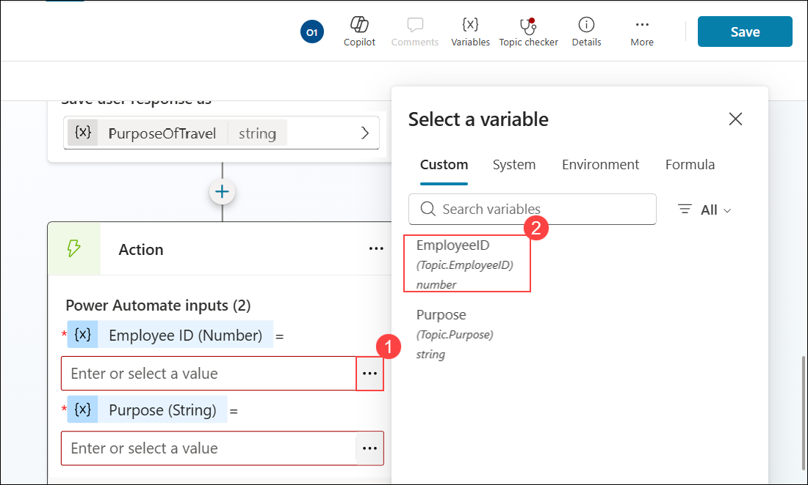

1. Once all variables are mapped correctly, verify the configuration.

   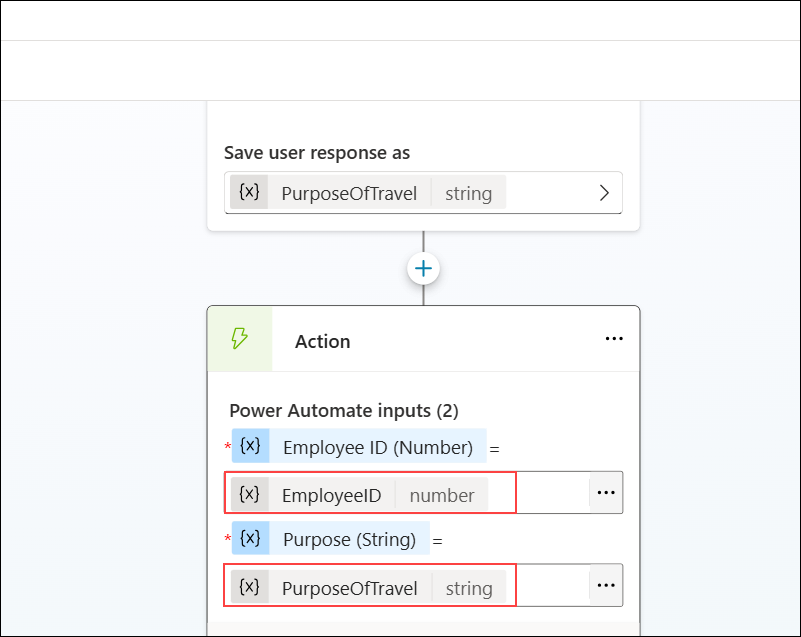

1. After the action node, ensure there is a **Send a message** node that displays the **ApprovalStatus** variable returned from the flow.

   

1. Click on the **Save** button to save the topic configuration.

   

##### Step 6: Test the Leave Application Flow

1. Navigate to the **Overview (1)** tab and click **Publish (2)** to make the agent updates live.

   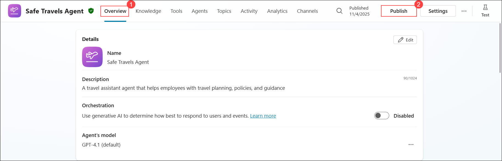

1. In the **Publish this agent** dialog box, click **Publish** to confirm and deploy the agent.

   

1. Once the agent is successfully published, click **Test** to verify and interact with your HR Agent.

   

1. **Test 1 - Short Leave (Auto-Approval):**

   In the **Test your agent** panel, type **I want to apply for leave (1)** and click the **Send (2)** icon to initiate the leave application flow.

   

   When prompted, provide:
   - **Employee ID:** 1001
   - **Name:** John Smith
   - **Days:** 2
   - **Reason:** Personal appointment

   

   **Expected Result:** The leave should be automatically approved since it's 2 days or less.

   

1. **Test 2 - Long Leave (Manager Approval Required):**

   Type: `I need to request time off`

   When prompted, provide:
   - **Employee ID:** 1002
   - **Name:** Jane Doe
   - **Days:** 5
   - **Reason:** Family vacation

1. When prompted for Office 365 Outlook connection access, click **Allow** to authorize the integration and enable the flow to send approval emails.

   

   **Expected Result:** An email notification should be sent to the manager for approval.

1. Navigate to **Outlook** to verify the leave approval email was received.

   Verify the email contains:
   - Employee ID and name
   - Leave duration (5 days)
   - Reason for leave
   - Request for manager review

   

   >**Smart Workflow Benefits:** This automated approval system reduces HR workload by auto-approving routine short leave requests while ensuring proper oversight for extended absences through email notifications to managers.

## Summary

In this exercise, you created the foundation of an HR Agent using Microsoft Copilot Studio. You learned how to:

- Upload HR policy documents to SharePoint as a knowledge base
- Access and navigate Microsoft Copilot Studio
- Create a new agent and configure its basic settings
- Add SharePoint as a knowledge source for grounded responses
- Configure four types of conversation topics:
  - Manual topic creation with conversation flow (Escalation to HR)
  - AI-generated topics using Copilot (General HR Help and Leave and Time Off)
- Build agent flows with conditional logic for smart approvals
- Integrate email notifications for manager approval workflows
- Implement auto-approval rules for requests of 2 days or less

In the next exercise, you will enhance the agent's instructions, configure actions, test its capabilities, and publish it to Microsoft 365 Copilot.

### You have successfully completed this exercise. Click on Next to proceed to the next exercise.
