# Exercise 11: Create a Quiz Generator Agent with Prompt Actions

## Estimated Duration: 45 Minutes

## Overview

In this exercise, you will create a Quiz Generator agent in Microsoft Copilot Studio and implement a prompt action that generates educational quiz questions. Prompt actions are a powerful feature that allows you to define custom AI instructions with specific parameters, enabling highly tailored content generation.

By the end of this exercise, you will have a working prompt action that can generate multiple-choice quiz questions on any topic, with configurable difficulty levels and question counts.

## Exercise Objectives

In this exercise, you will complete the following tasks:

- Task 1: Create a Quiz Generator Agent
- Task 2: Create a Prompt Action for Quiz Generation
- Task 3: Configure Prompt Inputs and Parameters
- Task 4: Write the Prompt Instructions
- Task 5: Test the Prompt Action Directly

### Task 1: Create a Quiz Generator Agent

In this task, you will create a new agent specifically designed for generating educational quizzes.

1. On the Copilot Studio home page, click **+ Create** from the left navigation.

   

1. Click **+ Create blank agent** to start creating a new agent.

   

1. On the agent **Overview** page, verify that the agent has been successfully provisioned, and then select **Edit**.

   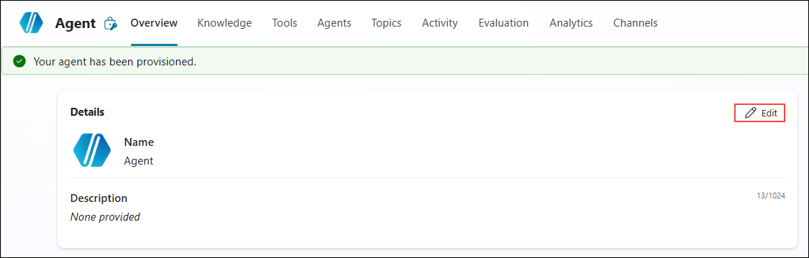

1. In the **Details** pane, enter the required information in the **Name (1)** and **Description (2)** fields, and then select **Save (3)**.

   | Field | Value |
   |-------|-------|
   | Name | `Quiz Generator` |
   | Description | `An intelligent agent that generates educational quiz questions on any topic with customizable difficulty levels` |
   | Instructions | (See below) |

   

1. In the **Instructions** section, select **Edit**.

   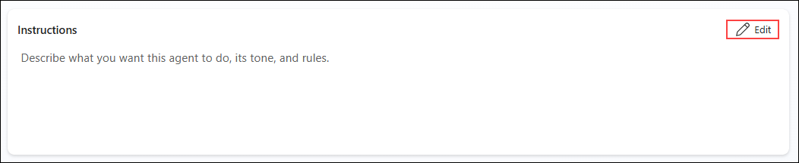

1. In the **Instructions** editor, enter the required content in the text area **(1)**, and then select **Save (2)**.

   ```
   You are a Quiz Generator assistant that helps educators, trainers, and learners create educational assessments.

   Your capabilities include:
   - Generating multiple-choice quiz questions on any topic
   - Supporting different difficulty levels (Beginner, Intermediate, Advanced)
   - Creating answer keys with explanations
   - Producing quizzes of varying lengths (1-10 questions)

   When interacting with users:
   - Be helpful and encouraging
   - Ask clarifying questions if the topic is too broad
   - Suggest related topics if appropriate
   - Ensure all generated content is accurate and educational
   ```

   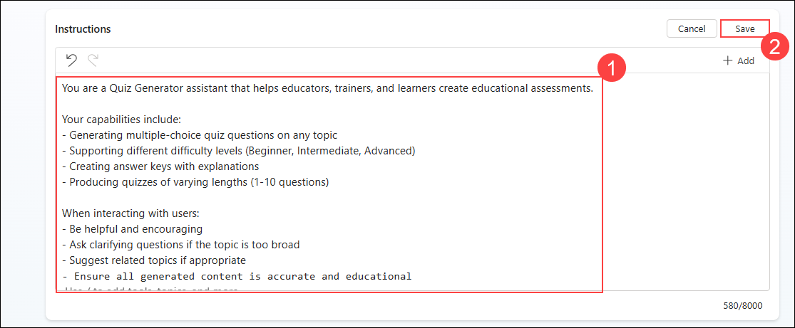

### Task 2: Create a Prompt Action for Quiz Generation

In this task, you will create a prompt action that defines how quiz questions are generated using AI.

1. In the agent editor, select **Tools (1)** from the left navigation pane, and then choose **+ New tool (2)**.

   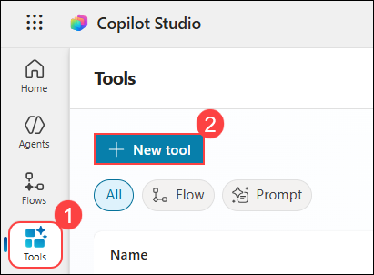

1. In the **New tool** dialog, select **Prompt**.

   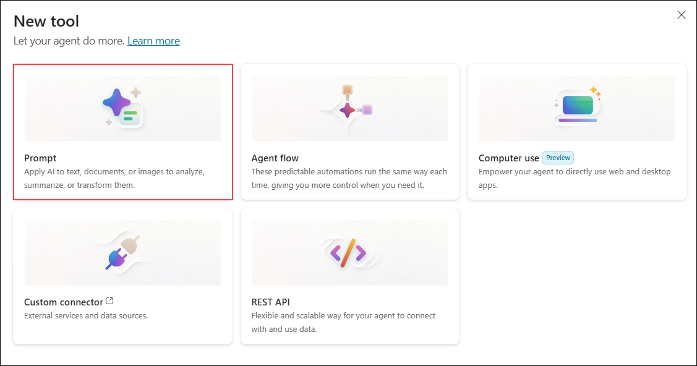

   >**What is a Prompt?**
   >
   >Prompts apply AI to text, documents, or images to analyze, summarize, or transform them. You can create reusable, parameterized AI generation logic.

1. The **Custom prompt** editor will open. You'll see:

   - **Instructions** panel (left) - where you write your prompt
   - **Model** selector - defaults to GPT-4.1 mini
   - **Model response** panel (right) - shows test results
   - **+ Add content** button - to add inputs and knowledge
   - **Get started with Copilot** section - AI helper to create prompts

   

1. First, let's rename the prompt. Click on the title **"Custom prompt [date/time]"** at the top and rename it to:

   ```
   Generate Quiz Questions
   ```

   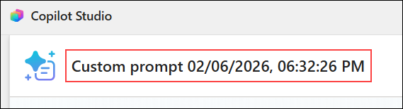

   

### Task 3: Write the Prompt Instructions

In this task, you will write detailed instructions that guide the AI in generating high-quality quiz questions.

1. Enter the following complete prompt (you can copy-paste this):

   ```
   You are an expert educational content creator specializing in creating quiz questions for learning and assessment purposes.

   Generate exactly {NumberOfQuestions} multiple choice quiz questions about the topic: {Topic}

   Difficulty Level: {DifficultyLevel}

   ## Difficulty Guidelines:

   **Beginner:**
   - Basic concepts and definitions
   - Straightforward, commonly known facts
   - Clear correct answer with obviously incorrect distractors

   **Intermediate:**
   - Requires understanding and application of concepts
   - May involve comparing or contrasting ideas
   - Distractors are plausible but distinguishable

   **Advanced:**
   - Complex scenarios requiring deep understanding
   - May involve analysis, synthesis, or evaluation
   - Distractors are very plausible, requiring careful thought

   ## Question Format Requirements:

   For each question, you MUST provide:
   1. Question number and clear question text
   2. Exactly four answer options labeled A, B, C, and D
   3. The correct answer letter
   4. A brief educational explanation (2-3 sentences)

   ## Quality Standards:

   - Questions must be clear, unambiguous, and grammatically correct
   - All four options must be plausible (no joke answers)
   - Each question should test a different aspect of the topic
   - Explanations should reinforce learning, not just state the answer
   - Avoid "All of the above" or "None of the above" options
   - Ensure factual accuracy

   ## Output Format:

   📝 **Quiz: {Topic}**
   📊 **Difficulty: {DifficultyLevel}**
   📋 **Questions: {NumberOfQuestions}**

   ---

   **Question 1:** [Question text here]

   A) [Option A]
   B) [Option B]
   C) [Option C]
   D) [Option D]

   ✅ **Correct Answer:** [Letter]
   💡 **Explanation:** [Educational explanation here]

   ---

   [Continue for all questions...]

   ---

   ## 📋 Answer Key Summary

   | Q# | Answer | Topic |
   |----|--------|-------|
   | 1 | [Letter] | [Brief topic] |
   | 2 | [Letter] | [Brief topic] |
   [Continue for all questions...]

   Now generate the quiz based on the provided parameters.
   ```

### Task 4: Configure Prompt Inputs and Parameters

In this task, you will add input parameters that control quiz generation.

1. In the **Instructions** text area, you'll see the placeholder text:
   
1. In the **Instructions** editor, select the `{NumberOfQuestions}` input variable **(1)**, and then choose **+ Add content (2)**.

   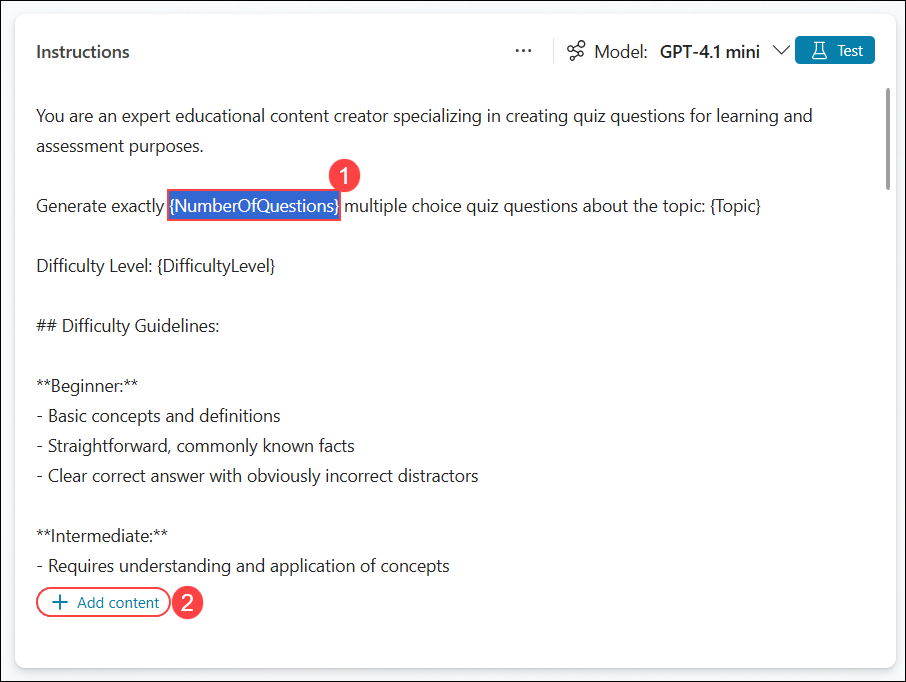

1. From the input menu, select **Text**.

   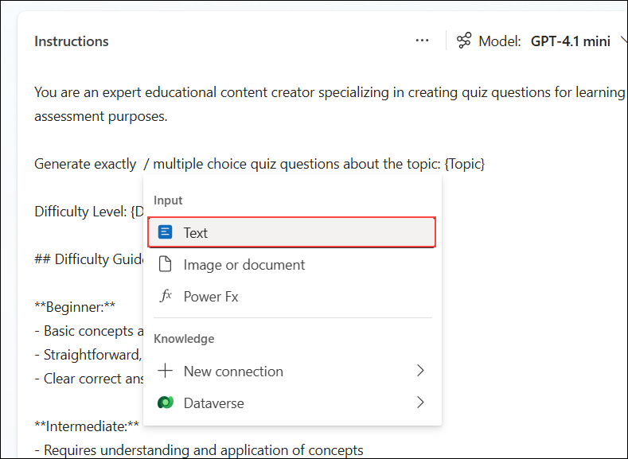

1. In the input configuration pane, enter the required information in the **Name (1)** and **Sample data (2)** fields, and then select **Close (3)**.

   | Field | Value |
   |-------|-------|
   | Name | `NumberOfQuestions` |
   | Description | `How many questions to generate (1-10)` |

   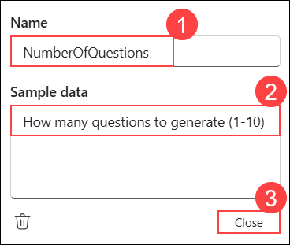

1. In the **Instructions** editor, select the `{Topic}` input variable **(1)**, and then choose **+ Add content (2)**.

   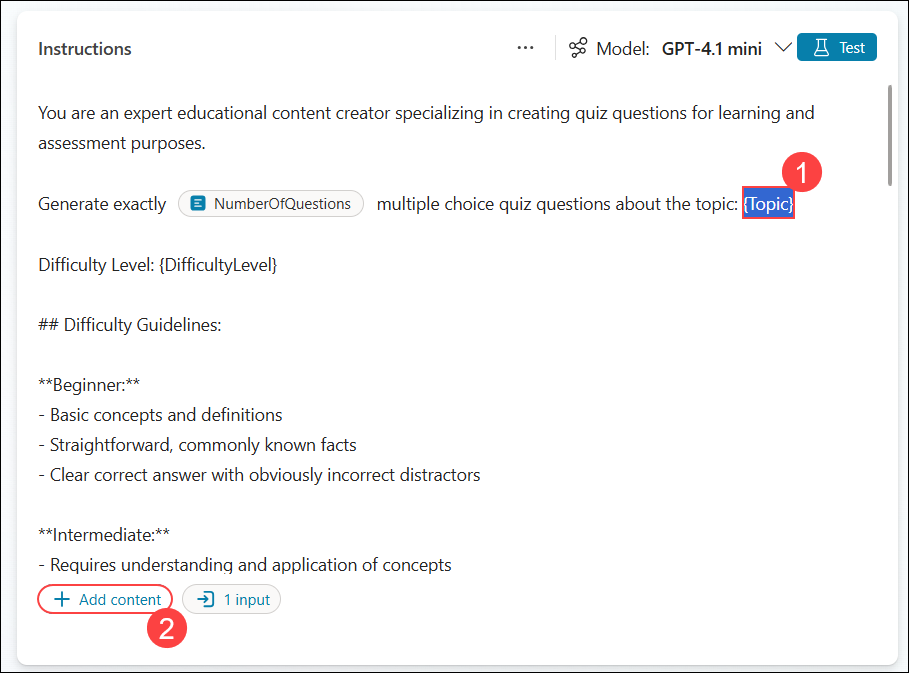

1. From the **In your prompt** menu, select **Text**.

   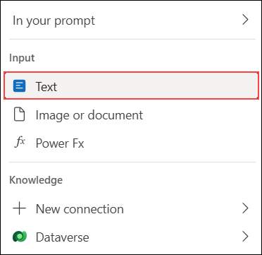

1. In the input configuration pane, enter the required information in the **Name (1)** and **Sample data (2)** fields, and then select **Close (3)**.

   | Field | Value |
   |-------|-------|
   | Name | `Topic` |
   | Description | `The subject or topic for quiz questions (e.g., Solar System, Python Programming)` |

   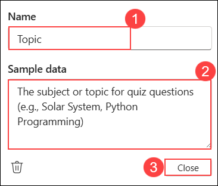

1. In the **Instructions** editor, select the `{DifficultyLevel}` input variable **(1)**, and then choose **+ Add content (2)**.

   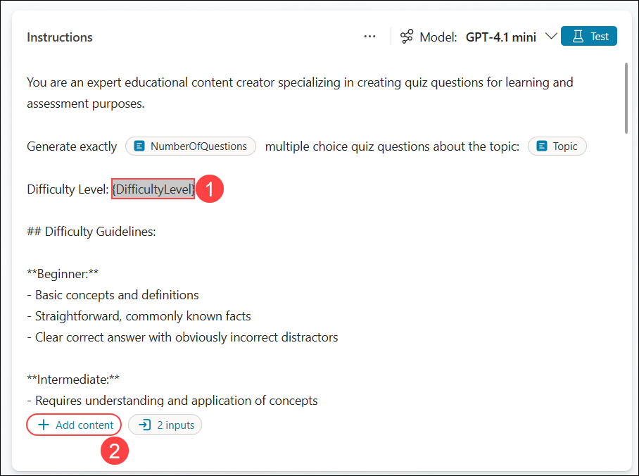

1. From the **In your prompt** menu, select **Text**.

   

1. In the input configuration pane, enter the required information in the **Name (1)** and **Sample data (2)** fields, and then select **Close (3)**.

   | Field | Value |
   |-------|-------|
   | Name | `DifficultyLevel` |
   | Description | `The difficulty level - Beginner, Intermediate, or Advanced` |

   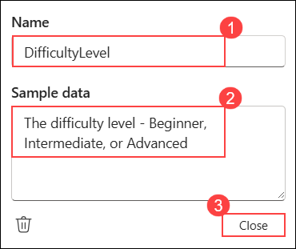

1. In the **Output Format** section, select the `{Topic}` input variable **(1)**, and then choose **+ Add content (2)** to add additional inputs.

   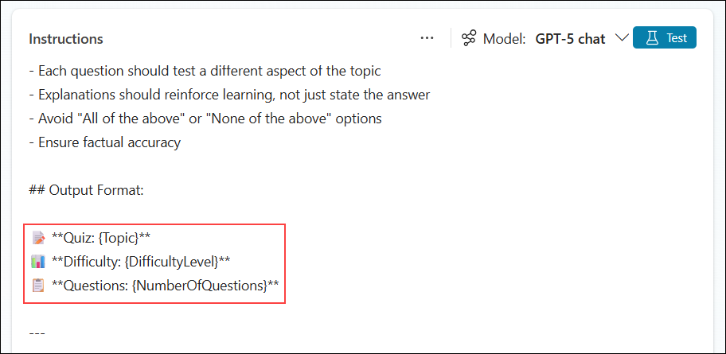

   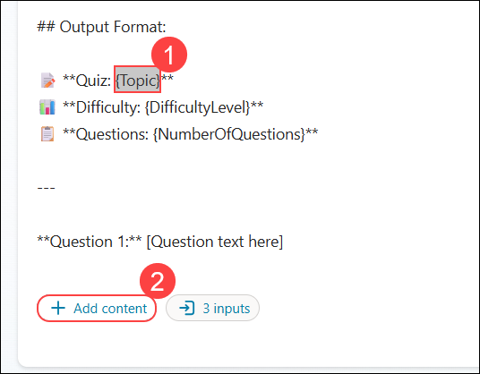

1. From the input menu, select **In your prompt**.

   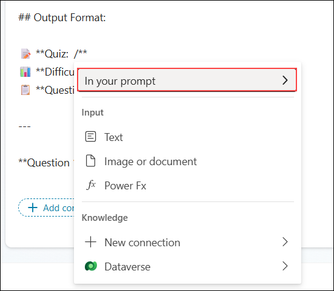

1. From the **In your prompt** list, select **Topic**.

   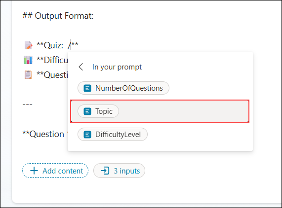

1. Repeat the same steps to add the `{DifficultyLevel}` and `{NumberOfQuestions}` input variables to the **Output Format** section.

   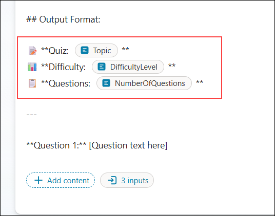

1. Select **Test** to validate the prompt using the configured input variables.

   

1. Verify that the generated quiz is displayed in the **Model response (1)** panel without any errors, and then select **Save (2)**.

   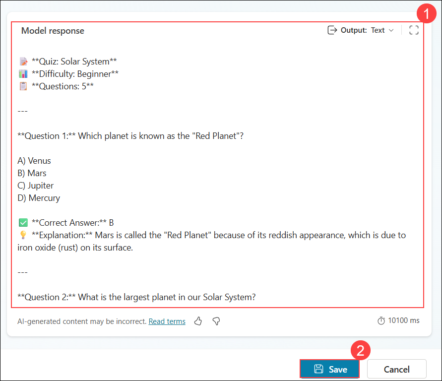

1. If a confirmation dialog appears to add the prompt to the agent, select **Yes**.

1. In the **Add to an Agent** dialog, select the **Quiz Generator** agent, and then choose **Add**.

   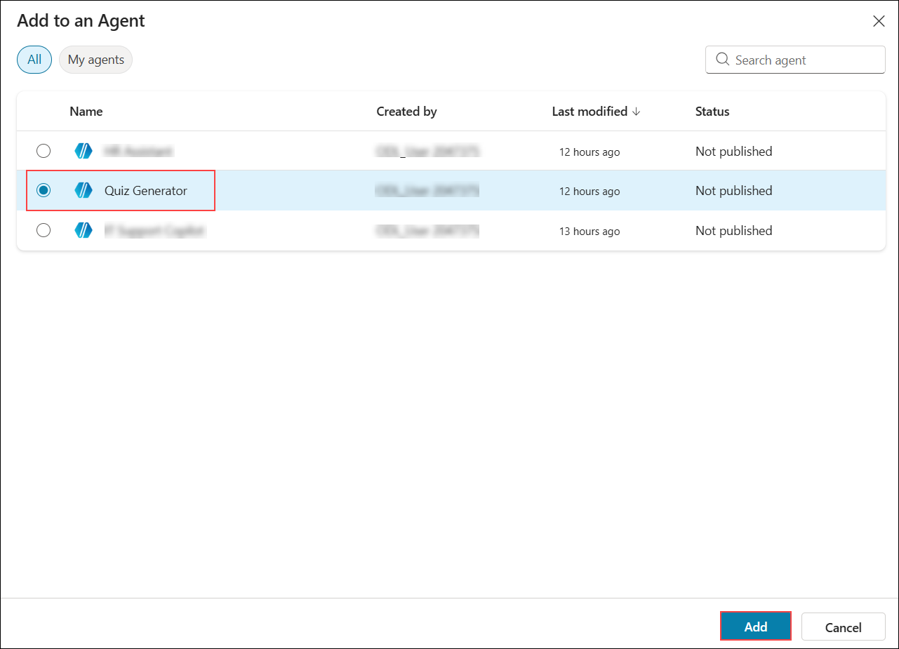

1. Select **Agents**, choose **Quiz Generator**, navigate to **Tools (1)**, and then verify that the **Generate QuizQuestions (3)** prompt is listed.

   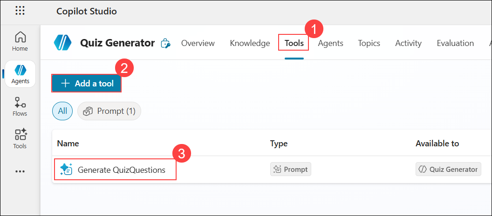

## Summary

In this exercise, you created a Quiz Generator agent and implemented a prompt action for generating educational quiz questions. You learned how to:

- Create a specialized agent for educational content generation
- Configure prompt actions with multiple input parameters
- Write detailed prompt instructions that guide AI output
- Use variable placeholders (`{{Variable}}`) in prompts
- Define structured output formats for consistent results
- Test prompt actions directly before integrating into topics

In the next exercise, you will build a conversational topic that integrates this prompt action, allowing users to interactively generate quizzes through a guided conversation flow.

### You have successfully completed this exercise. Click on Next to proceed to the next exercise.
